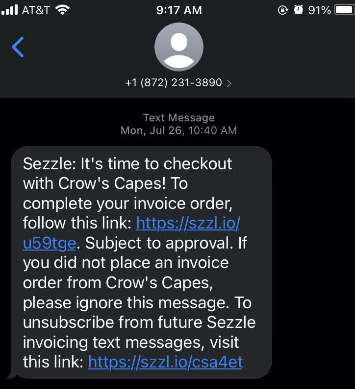
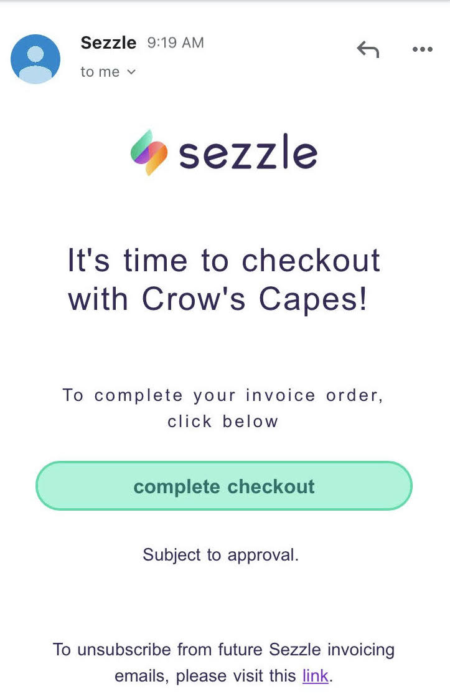

# Plugin integration

### Need help?

If you have any questions about integration, please <a href="https://merchant-help.sezzle.com/hc/en-us/categories/360002649692-Integrating-with-Sezzle" target="_blank">go here for US/CA</a> and <a href="https://help.eu.sezzle.com/hc/en-us/sections/360011033912-Integrating-with-Sezzle" target="_blank">go here for EU</a>


## Shift4Shop

This guide describes how to integrate Sezzle into your Shift4Shop website so that you can provide Sezzle as a payment option for your customers. After integrating Sezzle, your Shift4Shop site will:

- offer Sezzle as a payment option on the checkout page.
- refund Sezzle payments from your Shift4Shop order management system.
- display Sezzle promotional messaging.
- authorize and capture payments.

### Integration Steps Overview

1. [Install and configure the Sezzle](#install-the-sezzle-shift4shop-extension) <a class="external-link" target="_blank" href="https://app-sezzle01.3dcart.com/Home/InstallApp">Shift4Shop App</a>
2. [Test your integration](#shift4shop-live-checkout)
3. **(Optional)** [Sandbox Testing](#shift4shop-sandbox-testing)

### Before You Begin

1. You should have a Sezzle merchant account.
* Please visit our <a class="external-link" target="_blank" href="https://dashboard.sezzle.com/merchant/signup">signup page (US/CA)</a> or <a class="external-link" target="_blank" href="https://dashboard.eu.sezzle.com/merchant/signup">signup page (EU)</a> if you don't have an account.
2. Make sure you have the following Sezzle details handy.

<strong>US/US</strong>
* <a class="external-link" target="_blank" href="https://dashboard.sezzle.com/merchant/settings/business">Merchant ID</a>
* <a class="external-link" target="_blank" href="https://dashboard.sezzle.com/merchant/settings/apikeys">Public API Key</a>
* <a class="external-link" target="_blank" href="https://dashboard.sezzle.com/merchant/settings/apikeys">Private API Key</a><br>

<strong>EU</strong>
<ul></li><a class="external-link" target="_blank" href="https://dashboard.eu.sezzle.com/merchant/settings/business">Merchant ID</a></li>
<li><a class="external-link" target="_blank" href="https://dashboard.eu.sezzle.com/merchant/settings/apikeys">Public API Key</a></li>
<li><a class="external-link" target="_blank" href="https://dashboard.eu.sezzle.com/merchant/settings/apikeys">Private API Key</a></li></ul>

3. Familiarize yourself with [the transaction flow when buying with Sezzle](#overview-of-integration-flow).

### Install the Sezzle Shift4Shop Extension

1. Log in to your website's Shift4Shop admin.
2. Get the app <a class="external-link" target="_blank" href="https://app-sezzle01.3dcart.com/Home/InstallApp">here</a>.
3. Copy+paste your `Store URL` into the input area, then click `Proceed`.
<br/>
4. Check the PCI Compliance box, then click `Acknowledge and Authorize the App` to start the installation.

### Admin Configuration

1. In your Shift4Shop admin, go to `Settings` > `Payment`.<br/>
2. Click `Select Payment Methods`. <br/>
<br/>
3. Turn the Sezzle switch to `On`.<br/>
4. Copy your `Public Key` from your <a href="https://dashboard.sezzle.com/merchant/settings/apikeys">Sezzle Merchant Dashboard (US/CA)</a> or <a href="https://dashboard.eu.sezzle.com/merchant/settings/apikeys">Sezzle Merchant Dashboard (EU)</a>, and paste it into the corresponding field in the Sezzle configuration page of your Shift4Shop admin.<br/>
5. Next to `Private Key`, click `Change`. Then, copy your `Private Key` from your <a href="https://dashboard.sezzle.com/merchant/settings/apikeys">Sezzle Merchant Dashboard (US/CA)</a> or <a href="https://dashboard.eu.sezzle.com/merchant/settings/apikeys">Sezzle Merchant Dashboard (EU)</a>, and paste it into the corresponding field in the Sezzle configuration page of your Shift4Shop admin.<br/>
6. Click `Save`.<br/>
<br/>
7. To restrict Sezzle usage by country, click the `Exclude List` hyperlink under the Sezzle switch. <br/>
8. Click `Add Location`.<br/>
9. Select the desired country, then click `Add`. <br/>
<br/>
10. Installation is complete.

### Shift4Shop Sandbox Testing

1. In the Sezzle configuration page of your Shift4Shop admin, enter the [Sandbox API Keys](#sandbox) from your <a href="https://dashboard.sezzle.com/merchant" target="_blank">Sezzle Merchant Dashboard (US/CA)</a> or <a href="https://dashboard.eu.sezzle.com/merchant" target="_blank">Sezzle Merchant Dashboard (EU)</a> and check the `Test Mode` checkbox, then save the configuration. Make sure you are doing this on your `dev`/`staging` website.
2. On your website, add an item to the cart, then proceed to checkout and select `Sezzle` as the payment method.
3. Click `Place Order` and you should be redirected to the Sezzle checkout page. If prompted, sign in.

4. Enter the payment details using [test data](#test-data), then click `Complete Order`.
5. After the payment is completed on Sezzle, you should be redirected back to your website and see a successful payment page.
6. **Sandbox testing is complete**. You can log in to your <a href="https://sandbox.dashboard.sezzle.com/merchant" target="_blank">Sezzle Merchant Sandbox Dashboard (US/CA)</a> or <a href="https://sandbox.dashboard.eu.sezzle.com/merchant" target="_blank">Sezzle Merchant Sandbox Dashboard (EU)</a> to see the test order you just placed.

### Shift4Shop Live Checkout

1. In the Sezzle configuration page of your Shift4Shop admin, enter the API Keys from your <a class="external-link" target="_blank" href="https://dashboard.sezzle.com/merchant/settings/apikeys">Sezzle Merchant Dashboard (US/CA)</a> or <a class="external-link" target="_blank" href="https://dashboard.eu.sezzle.com/merchant/settings/apikeys">Sezzle Merchant Dashboard (EU)</a> and uncheck the `Test Mode` checkbox, then save the configuration.
2. On your website, add an item to your cart, then proceed to `Checkout` and select `Sezzle` as the payment method.
3. Click `Place Order`.

4. If you are redirected to the Sezzle checkout page, your integration is complete. **Congratulations!**

5. **Warning** Don't complete the payment. Your checkout is now live, so you will be charged if you complete.

### Troubleshooting

If testing was unsuccessful, review the following:

* Sezzle Shift4Shop extension is the most updated version.
* Sezzle payment method is enabled.
* API Keys were entered correctly.
* It is recommended to use the Copy icon in the <a class="external-link" target="_blank" href="https://dashboard.sezzle.com/merchant/settings/apikeys">Sezzle Merchant Dashboard</a> to avoid typos or extra spaces.
* If you have multiple accounts with Sezzle, the merchant ID and API Keys are tied to only one URL.
* Widget script is present on your website and reflects the `Merchant ID `from your <a href="https://dashboard.sezzle.com/merchant/settings/business" target="_blank" class="external-link">Sezzle Merchant Dashboard (US/CA)</a> or <a href="https://dashboard.eu.sezzle.com/merchant/settings/business" target="_blank" class="external-link">Sezzle Merchant Dashboard (EU)</a>.
* Go to a product page on your website.
* Right-click then select `Inspect`.
* In the `Elements` tab, search for `widget.sezzle`.

### Manual Theme Integration

If the Shift4Shop app fails to maintain the widget script on the product pages, or to add the script manually for additional pages, complete the following steps:

1. From your Shift4Shop admin, go to `Settings` > `Design` > `Themes & Styles`.
2. In your `Current Theme`, click the button labeled `More` then select `Edit Template(HTML)`.
3. Find the copy of your theme under `Go to Folder`.
4. Click the `gear` icon next to the `product_items.html` file, then click `Edit`.
5. When the dashboard asks if you want to edit your theme files, click the `Edit Theme Files` button.
6. In the `Source Code` text area, copy+paste the script at the very beginning of the file.
7. Click `Save`.

The script to be inserted into your webpage is as follows:

Template:
```
<script src="https://widget.sezzle.com/v1/javascript/price-widget?uuid={sezzle_merchant_uuid}"></script>
```

Note: Update `{sezzle_merchant_uuid}` in the above script template to reflect your site’s Merchant ID (removing the curly brackets), which can be found in the <a class="external-link" target="_blank" href="https://dashboard.sezzle.com/merchant/settings/business">Sezzle Merchant Dashboard</a>.

Example:
```
<script src="https://widget.sezzle.com/v1/javascript/price-widget?uuid=12a34bc5-6de7-890f-g123-4hi5678jk901"></script>
```

Instructions may vary slightly depending on your active plug-ins. For assistance with widget configuration, click `Request Addition of Widgets` in the widget step of your <a class="external-link" target="_blank" href="https://dashboard.sezzle.com/merchant/checklist">Sezzle Merchant Dashboard Setup Checklist</a>.

### Uninstall Steps

1. Go to `Settings` > `Payment`.
2. Click `Select Payment Methods`.
2. Under the Sezzle App, click the `gear` icon then click `Delete`.

## BigCommerce

This guide describes how to integrate Sezzle into your BigCommerce website so that you can provide Sezzle as a payment option for your customers. After integrating Sezzle, your BigCommerce site will:

1. Offer Sezzle as a payment option on the checkout page.
2. Refund Sezzle payments from your BigCommerce order management system.
3. Display Sezzle promotional messaging.
4. Authorize and capture payments.

#### This integration is only available with BigCommerce's <a class="external-link" target="_blank" href="https://support.bigcommerce.com/s/article/Optimized-Single-Page-Checkout">Optimized One Page Checkout</a>.

### Integration Steps Overview

1. [Enable Sezzle as an online payment method](#enable-sezzle-as-an-online-payment-method)
2. [Install and configure the Sezzle](#install-the-sezzle-bigcommerce-app) <a class="external-link" target="_blank" href="https://www.bigcommerce.com/apps/sezzle/">BigCommerce App</a>
3. [Test your integration](#bigcommerce-live-checkout)
4. **(Optional)** [Sandbox Testing](#bigcommerce-sandbox-testing)

### Before You Begin

1. You should have a Sezzle merchant account.
* Please visit our <a class="external-link" target="_blank" href="https://dashboard.sezzle.com/merchant/signup">signup page</a> if you don't have an account.
2. Make sure you have the following Sezzle details handy.<br>
<strong>US/US</strong>
* <a class="external-link" target="_blank" href="https://dashboard.sezzle.com/merchant/settings/business">Merchant ID</a>
* <a class="external-link" target="_blank" href="https://dashboard.sezzle.com/merchant/settings/apikeys">Public API Key</a>
* <a class="external-link" target="_blank" href="https://dashboard.sezzle.com/merchant/settings/apikeys">Private API Key</a><br>

<strong>EU</strong>
<ul></li><a class="external-link" target="_blank" href="https://dashboard.eu.sezzle.com/merchant/settings/business">Merchant ID</a></li>
<li><a class="external-link" target="_blank" href="https://dashboard.eu.sezzle.com/merchant/settings/apikeys">Public API Key</a></li>
<li><a class="external-link" target="_blank" href="https://dashboard.eu.sezzle.com/merchant/settings/apikeys">Private API Key</a></li></ul>
3. Familiarize yourself with [the transaction flow when buying with Sezzle](#order-payment-flow).

### Enable Sezzle as an online payment method

1. Go to `Store Setup` > `Payments`. <br/>

2. Go to `Online Payment Methods`, find `Sezzle` and click `Set up`. <br/>

3. Copy your `Public Key` and `Private Key` from your <a class="external-link" target="_blank" href="https://dashboard.sezzle.com/merchant/">Sezzle Merchant Dashboard</a>, and paste them into the corresponding fields.<br/>
4. Select the `Transaction Type`.
* **Note:** If you select `Authorize only`, payment will only be authorized and will have to be captured later in BigCommerce. <br/>
5. Select the `Test Mode`: `No(Recommended)`, or `Yes` for testing. <br/>
6. Click on `Save`. <br/>

### Install the Sezzle BigCommerce App

1. Log in to your website's BigCommerce store admin page.
2. In the left sidebar, click `Apps` > `Marketplace`.
3. Click `BigCommerce.com/Apps`.

4. Search for `Sezzle`.

5. Click `Sezzle`, then click `Get This App`.

6. Click `Install`.

7. Check the PCI Compliance box, then click `Confirm` to start the installation.


### BigCommerce Sandbox Testing

1. Select the `Test Mode` as `Yes` from `Sezzle Settings` in `Payments` section of BigCommerce admin. Make sure you are doing this on your `dev`/`staging` website.

2. On your website, add an item to the cart, then proceed to `Checkout` and select `Sezzle` as the payment method.
3. Click `Place Order` and you should be redirected to the Sezzle checkout page. If prompted, sign in.

4. Enter the payment details using [test data](#test-data), then click `Complete Order`.
5. After the payment is completed on Sezzle, you should be redirected back to your website and see a successful payment page.
6. **Sandbox testing is complete**. You can log in to your <a class="external-link" target="_blank" href="https://sandbox.dashboard.sezzle.com/merchant">Sezzle Merchant Sandbox Dashboard (US/CA)</a> or <a class="external-link" target="_blank" href="https://sandbox.dashboard.eu.sezzle.com/merchant">Sezzle Merchant Sandbox Dashboard (EU)</a> to see the test order you just placed.

### BigCommerce Live Checkout

1. Select the `Test Mode` as `No(Recommended)` from `Sezzle Settings` in `Payments` section of BigCommerce admin.
2. On your website, add an item to your cart, then proceed to `Checkout` and select `Sezzle` as the payment method.

3. Click `Place Order`.

4. If you are redirected to the Sezzle checkout page, your integration is complete. **Congratulations!**

5. **Warning** Don't complete the payment. Your checkout is now live, so you will be charged if you complete it.

### Widget Pre-Configuration

1. Make sure you have the `Sezzle` App installed in your store. <br/>
2. Go to `Apps` > `Sezzle`.<br/>
3. Copy your `Merchant ID` from your <a class="external-link" target="_blank" href="https://dashboard.sezzle.com/merchant/">Sezzle Merchant Dashboard</a>, and paste them into the corresponding fields in the Sezzle App of your BigCommerce admin.<br/>
4. Check the `Add Sezzle Widget Script` box. This will inject the widget script into the product and cart pages of your store.<br/>
5. Save the configuration.<br/>

6. Go to `Storefront` > `Script Manager`. Confirm that the Sezzle Widget scripts appear in the list of installed scripts. <br/>

7. Widget is now ready to be configured.<br/>
8. For finalizing the widget configuration, click `Request Addition of Widgets` in the widget step of your <a class="external-link" target="_blank" href="https://dashboard.eu.sezzle.com/merchant/checklist">Sezzle Merchant Dashboard Setup Checklist (US/CA)</a> or <a class="external-link" target="_blank" href="https://dashboard.eu.sezzle.com/merchant/checklist">Sezzle Merchant Dashboard Setup Checklist (EU)</a>.

### Troubleshooting

If testing was unsuccessful, review the following:

* Site has Optimized One-Page Checkout enabled.
* Go to `Advanced Settings` > `Checkout`.
* API Keys were entered correctly.
* To avoid typos or extra spaces, use the Copy icon in the <a class="external-link" target="_blank" href="https://dashboard.sezzle.com/merchant/settings/apikeys">Sezzle Merchant Dashboard (US/CA)</a> or <a class="external-link" target="_blank" href="https://dashboard.eu/sezzle.com/merchant/settings/apikeys">Sezzle Merchant Dashboard (EU)</a>.
* If you have multiple accounts with Sezzle, each store has its own merchant ID and API Keys that are tied to the store's URL.
* `Add Sezzle Widget Script` box is checked.
* Widget script is present on your website and reflects the `Merchant ID `from your <a class="external-link" target="_blank" href="https://dashboard.sezzle.com/merchant/settings/business">Sezzle Merchant Dashboard (US/CA)</a> or <a class="external-link" target="_blank" href="https://dashboard.eu.sezzle.com/merchant/settings/business">Sezzle Merchant Dashboard (EU)</a>.
* Go to a product page on your website.
* Right-click then select `Inspect`.
* In the `Elements` tab, search for `widget.sezzle`.

### Manual Theme Integration

If the Sezzle App fails to maintain the widget script on the product pages, or to add the script manually for additional pages, complete the following steps:

1. Go to `Storefront` > `Script Manager`.
2. Click the `Create a Script` button.
3. Set `Name of script` to `Sezzle Widget`.
4. Set `Location on page` to `Footer`.
5. Set `Select pages where script will be added` to `All pages`.
6. Set `Script category` to `Essential`.
7. Set `Script type` to `Script`.
8. In the Script content area, copy+paste the script, then click Save.

The script to be inserted into your webpage is as follows:

Template:
```
<script src="https://widget.sezzle.com/v1/javascript/price-widget?uuid={sezzle_merchant_uuid}"></script>
```

<aside class="notice">
Update <code>{sezzle_merchant_uuid}</code> in the above script template with your site’s Merchant ID (removing the curly brackets), which can be found in the <a class="external-link" target="_blank" href="https://dashboard.sezzle.com/merchant/settings/business">Sezzle Merchant Dashboard (US/CA)</a> or <a class="external-link" target="_blank" href="https://dashboard.eu.sezzle.com/merchant/settings/business">Sezzle Merchant Dashboard (EU)</a>.
</aside>

Example:
```
<script src="https://widget.sezzle.com/v1/javascript/price-widget?uuid=12a34bc5-6de7-890f-g123-4hi5678jk901"></script>
```

Instructions may vary slightly depending on your active plug-ins. If the issue persists after completing the above steps, look for other available features that allow the addition of a custom HTML code snippet to the site footer. If no such feature is found, the below steps may be followed as a last resort:

1. Go to `Storefront` > `My Themes`.
2. In your `Current Theme`, click `Advanced` then select `Edit Theme Files`.
3. In the confirmation window, click `Edit Theme Files`.
4. In the file list, go to `templates` > `pages`, then select `product.html`.
5. Copy+paste the script into the very bottom of the file, then click `Save and Apply Files`.
6. Repeat the previous step for the cart.html file.

For any kind of assistance, reach out to `merchantsupport@sezzle.com`.

### Uninstall Steps

1. Go to `Apps` > `My Apps`.
2. Under the Sezzle App, click `Uninstall`.

3. Toggle the button against `Sezzle` under `Store Setup`>`Payments`>`Online Payment Methods` to disable `Sezzle` as a payment option.

## Bold Cashier

This guide describes how to integrate Sezzle into your Bold Cashier website so that you can provide Sezzle as a payment option for your customers. After integrating Sezzle, your Bold Cashier site will:

1. Offer Sezzle as a payment option on the checkout page.
2. Refund Sezzle payments from your Bold Cashier order management system.
3. Authorize and capture payments.

#### This integration is currently only available on Shopify.

### Integration Steps Overview

1. [Install the Sezzle](#install-the-sezzle-bold-cashier-extension) Bold Cashier app
2. [Test your integration](#bold-cashier-live-checkout)

### Before You Begin

1. You should have a Sezzle merchant account.
* Please visit our <a class="external-link" target="_blank" href="https://dashboard.sezzle.com/merchant/signup">signup page</a> if you don't have an account.
2. You should generate API Keys using your <a class="external-link" target="_blank" href="https://dashboard.sezzle.com/merchant/settings/apikeys">Sezzle Merchant Dashboard</a>
3. Familiarize yourself with [the transaction flow when buying with Sezzle](#overview-of-integration-flow).

### Install the Sezzle Bold Cashier Extension

1. First you must install the Bold Cashier app to your platform and store url. You can do this from the <a class="external-link" target="_blank" href="https://boldcommerce.com/cashier">Bold Cashier site</a>.
2. Log in to your Shopify admin.
3. Go to `Apps` > `Bold Cashier`.

4. In the Bold Cashier left sidebar, click `Marketplace`, then find `Sezzle` and click `Install`.

5. Click `Allow` to accept permissions and complete the installation.

6. Installation is complete.


### Bold Cashier Live Checkout

1. On your website, add an item to your cart, then proceed to `Checkout` and select `Sezzle` as the payment method.
2. Click `Complete Order`.
3. If you are redirected to the Sezzle checkout page, your integration is complete. **Congratulations!**

4. **Warning** Don't complete the payment. Your checkout is now live, so you will be charged if you complete.

### Uninstall Steps

1. Go to your Bold Cashier `Marketplace` and scroll to find `Sezzle`.
2. Click `Uninstall`.


## BuyItLive

This guide describes how to integrate Sezzle into your BuyItLive website so that you can provide Sezzle as a payment option for your customers. After integrating Sezzle, your BuyItLive site will:

1. Offer Sezzle as a payment option on the checkout page.
2. Refund Sezzle payments from your BuyItLive order management system.
3. Authorize and capture payments.

### Integration Steps Overview

1. [Add and configure the Sezzle BuyItLive App](#buyitlive-admin-configuration)
2. [Test your integration](#buyitlive-live-checkout)

### Before You Begin

1. You should have a Sezzle merchant account.
* Please visit our <a class="external-link" target="_blank" href="https://dashboard.sezzle.com/merchant/signup">signup page</a> if you don't have an account.
2. Make sure you have the following Sezzle details handy.
#### (US/CA)
* <a class="external-link" target="_blank" href="https://dashboard.sezzle.com/merchant/settings/business">Merchant ID</a>
* <a class="external-link" target="_blank" href="https://dashboard.sezzle.com/merchant/settings/apikeys">Public API Key</a>
* <a class="external-link" target="_blank" href="https://dashboard.sezzle.com/merchant/settings/apikeys">Private API Key</a>

#### (EU)
* <a class="external-link" target="_blank" href="https://dashboard.eu.sezzle.com/merchant/settings/business">Merchant ID</a>
* <a class="external-link" target="_blank" href="https://dashboard.eu.sezzle.com/merchant/settings/apikeys">Public API Key</a>
* <a class="external-link" target="_blank" href="https://dashboard.eu.sezzle.com/merchant/settings/apikeys">Private API Key</a>
<br><br>
3. Familiarize yourself with [the transaction flow when buying with Sezzle](#overview-of-integration-flow).

### BuyItLive Admin Configuration

1. Log in to your website's BuyItLive admin.
2. Click `Add Payment Provider`.
3. Select `Connect with Sezzle`.
4. Go to `Sezzle Payments` > `Tools`.
5. Copy your `Private Key` and `Public Key` from your <a class="external-link" target="_blank" href="https://dashboard.sezzle.com/merchant/settings/apikeys">Sezzle Merchant Dashboard</a>, and paste them into the corresponding fields in the Sezzle configuration page of your BuyItLive admin.
6. Click `Save Settings`.
7. Go to `Cart Settings` and ensure the Sezzle switch is in the `On` position.
7. Installation is complete.

### BuyItLive Live Checkout

1. On your website, add an item to your cart, then proceed to `Checkout` and select `Sezzle` as the payment method.
2. Click `Place Order`.
3. If you are redirected to the Sezzle checkout page, your integration is complete. **Congratulations!**

4. **Warning** Don't complete the payment. Your checkout is now live, so you will be charged if you complete.


## CommentSold

This guide describes how to integrate Sezzle into your CommentSold website so that you can provide Sezzle as a payment option for your customers. After integrating Sezzle, your CommentSold site will:

1. Offer Sezzle as a payment option on the checkout page.
2. Refund Sezzle payments from your CommentSold order management system.
3. Authorize and capture payments.

### Integration Steps Overview

1. [Configure the Sezzle](#commentsold-admin-configuration) <a class="external-link" target="_blank" href="https://commentsold.com/admin/setup/billing">CommentSold App</a>
2. [Test your integration](#commentsold-live-checkout)

### Before You Begin

1. You should have a Sezzle merchant account.
* Please visit our <a class="external-link" target="_blank" href="https://dashboard.sezzle.com/merchant/signup">signup page</a> if you don't have an account.
2. Make sure you have the following Sezzle details handy.
#### (US/CA)
* <a class="external-link" target="_blank" href="https://dashboard.sezzle.com/merchant/settings/business">Merchant ID</a>
* <a class="external-link" target="_blank" href="https://dashboard.sezzle.com/merchant/settings/apikeys">Public API Key</a>
* <a class="external-link" target="_blank" href="https://dashboard.sezzle.com/merchant/settings/apikeys">Private API Key</a>

#### (EU)
* <a class="external-link" target="_blank" href="https://dashboard.sezzle.com/merchant/settings/business">Merchant ID</a>
* <a class="external-link" target="_blank" href="https://dashboard.sezzle.com/merchant/settings/apikeys">Public API Key</a>
* <a class="external-link" target="_blank" href="https://dashboard.sezzle.com/merchant/settings/apikeys">Private API Key</a>
<br><br>
3. Familiarize yourself with [the transaction flow when buying with Sezzle](#overview-of-integration-flow).

### CommentSold Admin Configuration

1. In your CommentSold admin, go to `Setup`.
2. Click `Payment Gateways`.
3. Copy your `Private Key` and `Public Key` from your <a class="external-link" target="_blank" href="https://dashboard.sezzle.com/merchant/settings/apikeys">Sezzle Merchant Dashboard</a>, and paste them into the corresponding fields in the Sezzle configuration page of your CommentSold admin.
4. Click `Update Keys`.
<br/>
5. Installation is complete.

### CommentSold Live Checkout

1. In the Sezzle configuration page of your CommentSold admin, enter the API Keys from your <a class="external-link" target="_blank" href="https://dashboard.sezzle.com/merchant/settings/apikeys">Sezzle Merchant Dashboard</a> and uncheck the `Use Sandbox` checkbox, then save the configuration.
2. On your website, add an item to your cart, then proceed to `Checkout` and select `Sezzle` as the payment method.
3. Click `Place Order`.
4. If you are redirected to the Sezzle checkout page, your integration is complete. **Congratulations!**

5. **Warning** Don't complete the payment. Your checkout is now live, so you will be charged if you complete.


## Lightspeed

This guide describes how to integrate Sezzle into your Lightspeed website so that you can provide Sezzle as a payment option for your customers.

Sezzle's Lightspeed App is certified and available [here](https://www.lightspeedhq.com/ecommerce/store/apps/sezzle/) in the App Store.

After integrating Sezzle, your Lightspeed site will:

* Offer Sezzle as a payment option on the checkout page.
* Refund Sezzle payments from your Lightspeed backend.
* Display Sezzle promotional messaging.
* Authorize and capture payments.

### Integration Steps Overview

1. [Install and configure](#install-the-sezzle-lightspeed-app) the Sezzle <a class="external-link" target="_blank" href="https://www.lightspeedhq.com/ecommerce/store/apps/sezzle/">Lightspeed App</a>
2. [Test your integration](#lightspeed-live-checkout)
3. **(Optional)** [Sandbox Testing](#lightspeed-sandbox-testing)

### Before You Begin

1. You should have a Sezzle merchant account.
* Please visit our <a class="external-link" target="_blank" href="https://dashboard.sezzle.com/merchant/signup">signup page</a> if you don't have an account.
2. Make sure you have the following Sezzle details handy.

#### (US/CA)
* <a class="external-link" target="_blank" href="https://dashboard.sezzle.com/merchant/settings/business">Merchant ID</a>
* <a class="external-link" target="_blank" href="https://dashboard.sezzle.com/merchant/settings/apikeys">Public API Key</a>
* <a class="external-link" target="_blank" href="https://dashboard.sezzle.com/merchant/settings/apikeys">Private API Key</a>

#### (EU)
* <a class="external-link" target="_blank" href="https://dashboard.sezzle.com/merchant/settings/business">Merchant ID</a>
* <a class="external-link" target="_blank" href="https://dashboard.sezzle.com/merchant/settings/apikeys">Public API Key</a>
* <a class="external-link" target="_blank" href="https://dashboard.sezzle.com/merchant/settings/apikeys">Private API Key</a>
<br><br>
3. Familiarize yourself with [the transaction flow when buying with Sezzle](#order-payment-flow).

### Install the Sezzle Lightspeed App

* Log in to your Lightspeed back office.
* Navigate to `Apps > App Store`.
* Search for `Sezzle` in the search bar and click on the Sezzle app.

* Click on `Install App` in the top right corner.

* Grant permission by clicking on `Grant access`.

* On successful install, you will be redirected to Sezzle App.


### Configure Sezzle

Navigate to the Sezzle App by clicking on `Go to App` located at `Apps > Purchased Apps > Sezzle`.


#### Account Verification

* Copy your `Public Key` and `Private Key` from your <a class="external-link" target="_blank" href="https://dashboard.sezzle.com/merchant/">Sezzle Merchant Dashboard (US/CA)</a> or <a class="external-link" target="_blank" href="https://dashboard.eu.sezzle.com/merchant/">Sezzle Merchant Dashboard (EU)</a>, and paste them into the corresponding fields.
* Click on `link sezzle account` to link your Sezzle account with your Lightspeed store.
* The message `Account successfully linked` is displayed when the account is verified.

#### Settings

* Toggle the `Sezzle at Checkout` checkbox to enable (`On`) or disable (`Off`) Sezzle as a payment option in the checkout page.

* Toggle the `Sezzle Widgets` checkbox to enable (`On`) or disable (`Off`) Sezzle widget in the PDP and Cart pages.


### Payment Refund

* In your Lightspeed back office, go to `Orders > Orders`.
* Select the order to be refunded.
* Click `Add Credit Invoice`.
* Select the item and enter the quantity.
* Ensure that Status is set to `Not Paid`.
* Click `Add`.
* Cancelling a `Paid` order will also refund the payments for the `Paid` Invoices.
* On successful refund:
* An invoice with the status of `Not Paid` will be created in the `Orders > Invoices` section.
* The Order Status will be displayed as `Refunded` in your Sezzle Merchant Dashboard.

### Lightspeed Sandbox Testing

1. A Lightspeed test store must be used for Sandbox testing.
2. On your website, add an item to the cart, then proceed to `Checkout` and select `Sezzle` as the payment method.
3. Click `Buy` to be redirected to the Sezzle checkout page. If prompted, sign in.

4. Enter the payment details using [test data](#test-data), then click `Complete Order`.
5. After the payment is completed on Sezzle, you should be redirected back to your website and see a successful payment page.
6. **Sandbox testing is complete**. You can log in to your <a class="external-link" target="_blank" href="https://sandbox.dashboard.sezzle.com/merchant">Sezzle Merchant Sandbox Dashboard (US/CA)</a> or <a class="external-link" target="_blank" href="https://sandbox.eu.dashboard.sezzle.com/merchant">Sezzle Merchant Sandbox Dashboard (EU)</a> to see the test order you just placed.

### Lightspeed Live Checkout

1. Installing the Sezzle App in a live Lightspeed store will result in live checkouts.
2. On your website, add an item to your cart, then proceed to `Checkout` and select `Sezzle` as the payment method.
3. Click `Buy`.

4. If you are redirected to the Sezzle checkout page, your integration is complete. **Congratulations!**

5. **Warning** Don't complete the payment. Your checkout is now live, so you will be charged if you complete it.

## Magento 2

This guide describes how to integrate Sezzle into your Magento 2 website so that you can provide Sezzle as a payment option for your customers.

[Sezzle's Magento 2 extension](https://marketplace.magento.com/sezzle-sezzlepay.html) is certified in the marketplace and can also be [downloaded from github](https://github.com/sezzle/sezzle-magento2).

After integrating Sezzle, your site will:

1. Offer Sezzle as a payment option on the checkout page.
2. Refund Sezzle payments from your Magento 2 order management system.
3. Display Sezzle promotional messaging.
4. Authorize and capture payments.
5. Offer instant and delayed capture.

### Integration Steps Overview

1. [Install and configure](#install-the-sezzle-magento-2-extension) the Sezzle <a class="external-link" target="_blank" href="https://marketplace.magento.com/sezzle-sezzlepay.html">Magento 2 extension</a>
2. [Test your integration](#magento-2-live-checkout)
3. **(Optional)** [Sandbox Testing](#magento-2-sandbox-testing)

### Before You Begin

1. You should have a Sezzle merchant account.
* Please visit our <a class="external-link" target="_blank" href="https://dashboard.sezzle.com/merchant/signup">signup page (US/CA)</a> or <a class="external-link" target="_blank" href="https://dashboard.eu.sezzle.com/merchant/signup">signup page (EU)</a> if you don't have an account.
2. Make sure you have the following Sezzle details handy.

#### US/CA
* <a class="external-link" target="_blank" href="https://dashboard.sezzle.com/merchant/settings/business">Merchant ID</a>
* <a class="external-link" target="_blank" href="https://dashboard.sezzle.com/merchant/settings/apikeys">Public API Key</a>
* <a class="external-link" target="_blank" href="https://dashboard.sezzle.com/merchant/settings/apikeys">Private API Key</a>

#### EU
* <a class="external-link" target="_blank" href="https://dashboard.eu.sezzle.com/merchant/settings/business">Merchant ID</a>
* <a class="external-link" target="_blank" href="https://dashboard.eu.sezzle.com/merchant/settings/apikeys">Public API Key</a>
* <a class="external-link" target="_blank" href="https://dashboard.eu.sezzle.com/merchant/settings/apikeys">Private API Key</a>

And familiarize yourself with [the transaction flow when buying with Sezzle](#order-payment-flow).

### Install the Sezzle Magento 2 Extension

In the following section, `[magento]` refers to your Magento 2 root directory.

#### Using the Composer

Go to the Magento 2 installation directory, then run the below commands:

1. `composer require sezzle/sezzlepay`
2. `php bin/magento setup:upgrade`
3. `php bin/magento setup:di:compile`
4. `php bin/magento setup:static-content:deploy`
5. `php bin/magento cache:clean`

#### Manual Method

1. Download the .zip file from [Sezzle's github repository](https://github.com/sezzle/sezzle-magento2).
2. Unzip the file
3. Navigate to `Magento` `[Magento]/app/code/` using `SFTP` or `SSH`.
4. Copy `Sezzle` directory from unzipped folder to `[Magento]/app/code/`.
5. Open a terminal window and run the following command to enable `Sezzle`:
* ```php bin/magento module:enable Sezzle_Sezzlepay```
6. Run the `Magento` setup upgrade:
* ```php bin/magento setup:upgrade```
7. Run the `Magento` Dependencies Injection Compile:
* ```php bin/`magento` setup:di:compile```
8. Run the `Magento` Static Content deployment:
* ```php bin/magento setup:static-content:deploy```
9. Log in to `Magento` Admin and navigate to `System > Cache Management`.
10. Flush the cache storage by selecting `Flush Cache Storage`.

You can now directly navigate from the Configuration Page to get signed up for `Sezzle`. To do so, you need to click on `Register for Sezzle` which will redirect you to the `Sezzle Merchant Signup` Page. If you have the details already, you can simply click on `I've already set up Sezzle, I want to edit my settings` to move ahead.

1. In your Magento 2 `[Magento]/app/code/` directory, create a directory named `Sezzle`.
2. Inside the new `Sezzle` directory, create a directory named `Sezzlepay`.
3. Inside the new `Sezzlepay` directory, extract the files from <a class="external-link" target="_blank" href="https://github.com/sezzle/sezzle-magento2">this repository</a>.
4. Open the command line and run these commands:
* `php bin/magento module:enable Sezzle_Sezzlepay`
* `php bin/magento setup:upgrade`
* `php bin/magento setup:di:compile`
* `php bin/magento setup:static-content:deploy`
5. Log in to your Magento 2 admin and go to `System/Cache Management`.
6. Flush the cache storage by selecting `Flush Cache Storage`.

### Upgrade the Magento 2 Extension
#### Using the Composer
1. Open terminal and navigate to `Magento` root path.
2. Execute the following commands in the terminal:
* `composer update sezzle/sezzlepay`
* `php bin/magento setup:upgrade`
* `php bin/magento setup:di:compile`
* `php bin/magento setup:static-content:deploy`
* `php bin/magento cache:clean`

### Configure Sezzle

#### Payment Configuration

* In the `Magento` admin site, navigate to `Stores > Configuration > Sales > Payment Methods > Sezzle > Payment Settings`
* Select the Payment Mode: `Live`, or `Sandbox` for testing.
* Enter your `Merchant UUID`, `Public Key` and `Private Key`. These can be found at the [Sezzle Merchant Dashboard (US/CA)](https://dashboard.sezzle.com/merchant/) or [Sezzle Merchant Dashboard (EU)](https://dashboard.eu.sezzle.com/merchant/).
* Select the `Payment Action`. `Authorize only` will only authorize payment and requires that the payment be captured later. `Authorize and Capture` will perform both in a single step.
* Set the `Merchant Country` as per the origin.
* Set `Min Checkout Amount` to restrict Sezzle payment method below that amount.
* Set `Payment from Applicable Countries` to `Specific Countries`.
* Set `Payment from Specific Countries` to `United States` or `Canada` as Sezzle is currently available for US and Canada only.
* Select `Enable Customer Tokenization`. `Yes` prompts the customer to allow their account to be tokenized. See [Customer tokenization](#customer-tokenization)
* Save the configuration and clear the cache.

#### In-Context Configuration

* Set `Enable In-Context Solution` to `Yes` to enable In-Context Checkout.
* Set `In-Context Checkout Mode` to `IFrame` or `PopUp` to select how Sezzle Checkout is hosted.

#### Settlement Report Configuration

* Set `Enable Settlement Reports` to `Yes` to enable the Settlement Reports Dashboard.
* Set `Range` to a value based on which you want to fetch the Settlement Reports.
* Set `Enable Automatic Syncing` to fetch the Settlement Reports asynchronously. (Note that this requires `cron` to be enabled.)
* Set Schedule and Time of Day for the automatic sync to run.

#### Widget Configuration

* Set `Enable Static Widget Module` to `Yes` to load the Sezzle Widget from your server, or `No` to load it from the Sezzle server.
* Set `Enable Widget in PDP` to `Yes` when adding the widget script in the Product Display Page, helping to enable the `Sezzle Widget` Modal in PDP.
* Set `Enable Widget in Cart Page` to `Yes` when adding the widget script in the Cart Page, helping to enable `Sezzle Widget` Modal in the Cart Page.
* Save the configuration and clear the cache.
<aside class="notice">
Make sure to add <code>&lt;div id="sezzle-widget"/></code> after the price element in the PDP and Cart theme files once you have enabled the Static Widget module.
</aside>

#### Developer Configuration

* Enable the log tracker to trace the `Sezzle` checkout process.
* Set `Send Logs to Sezzle` to `Yes` to send the logs to Sezzle on a periodic basic. (Note that this requires cron to be enabled.)
* You may download the latest logs by clicking on `Sezzle Log`.
* Save the configuration and clear the cache.

####Your store is now ready to accept payments through Sezzle.

### Frontend Functionality

* When you have correctly set up `Sezzle`, you will see `Sezzle` as a payment method in the checkout page.
* Select `Sezzle` and continue.
* Click `Continue to Sezzle` or `Place Order` to be redirected to the `Sezzle Checkout` to complete the checkout. If your account is tokenized, skip the next two steps, you will not be redirected to Sezzle.
* **[Optional]** To tokenize your account in the Sezzle checkout, check the box `Approve {Store Name} to process payments from your Sezzle account for future transactions. You may revoke this authorization at any time in your Sezzle Dashboard`.
* Click `Complete Order` to complete your purchase.
* On successful order placement, you will be redirected to the order confirmation page.

### Capture Payment

* If `Payment Action` is set to `Authorize and Capture`, capture will be performed instantly from the extension after order is created and validated in `Magento`.
* If `Payment Action` is set to `Authorize`, you will need to capture the payment manually from the `Magento` admin using the following steps:
* Go the order and click on `Invoice`.
* Verify your input in the `Create Invoice` page and click on `Save` to create the invoice.
* This will automatically capture the payment in `Sezzle`.

### Refund Payment

* Go to `Sales > Orders` in the `Magento` admin.
* Select the order for which you want to refund the payment.
* Click on `Credit Memo` and verify your input in the `Create Credit Memo` page.
* Save it to initiate the refund in `Sezzle`.
* Check the `Order Status` in the `Sezzle Merchant Dashboard`. `Refunded` indicates that payment has been fully refunded while `Partially Refunded` indicates that the payment has been partially refunded.

### Release Payment

* Go to `Sales > Orders` in the `Magento` admin.
* Select the order for which you want to release the payment.
* Click on `Void` and confirm your action.
* Check the `Order Status` in `Sezzle Merchant Dashboard`. `Deleted due to checkout not being captured before expiration` indicates that the payment has been fully released. Magento does not support partial releases.

### Order Verification in Magento Admin

* Log in to `Magento` admin, navigate to `Sales > Orders`, and select the order to verify.
* If Order Status is `Processing` and `Total Paid` equals `Grand Total`, then payment was successfully captured by `Sezzle`.
* If Order Status is `Pending` and `Total Paid` does not equal `Grand Total`, then payment is authorized but yet not captured.
* If Order Status is `Closed`, then payment has been refunded.
* If Order Status is `Canceled`, then payment has been released.

### Order Verification in Sezzle Merchant Dashboard

* Log in to `Sezzle Merchant Dashboard`, navigate to `Orders`, and select the order to veriy.
* `Approved` status indicates that payment was successfully captured by `Sezzle`.
* `Authorized, uncaptured` indicates that payment was authorized but yet not captured.
* `Refunded` status indicates that the payment was refunded.
* `Deleted due to checkout not being captured before expiration` status indicates that either the payment was not captured before the authorization expired, or that the payment has been released.

### Customer Tokenization Details

* Log in to `Magento` admin, navigate to `Customers > All Customers`, and select the customer to view tokenization details.
* If the customer is tokenizard, the `Sezzle` tab will appear.
* The `Customer UUID`, `Expiration Date` and `Status` will appear on the tab.

### Settlement Reports

* Log in to `Magento` admin and navigate to `Reports > Sales > Sezzle Settlement`. A list of recent Settlement Reports will be shown.
* To make a quick sync, enter the `From` and `To` Date and click on `Sync`.
* Click on `Download` from the `Action` column to download a Settlement Report.
* To view details of a particular Settlement Report, click on `View` from the `Action` column. You may also download the Settlement Report details from the Settlement Report view.
* You can download the Settlement Report in `CSV` or `Excel` format.

### Magento 2 Sandbox Testing

* In the `Sezzle` configuration page of your `Magento` admin, enter the `Sandbox` `API Keys` from your [Sezzle Merchant Sandbox Dashboard](https://sandbox.dashboard.sezzle.com/merchant/) and set the `Payment Mode` to `Sandbox`, and save the configuration. Make sure you are doing this on your `dev/staging` website.
* On your website, add an item to the cart, then proceed to `Checkout` and select `Sezzle` as the payment method.
* To pay with Sezzle:
* If customer is not tokenized, click `Continue to Sezzle`.
* If customer is tokenized, click `Place Order`.
* If In-Context checkout, click `Pay with Sezzle`.
* For In-Context checkout, the Sezzle checkout will be hosted in the configured mode, `iFrame` or `Popup`. Otherwise, you will be redirected to the Sezzle checkout.
* Sign In or Sign Up to continue.
* Enter the payment details using test data, then advance to the final page.
* Check the `Approve {Website Name} to process payments from your Sezzle account for future transactions. You may revoke this authorization at any time in your Sezzle Dashboard` to tokenize your account.
* If your account is tokenized, the order will be placed without redirection.  Otherwise you will be redirected to Sezzle Checkout to complete the purchase.
* After payment is completed at Sezzle, you will be directed to your site's successful payment page.
* `Sandbox` testing is complete. You can log in to your `Sezzle Merchant Sandbox Dashboard` to see the test order you just placed.

### Magento 2 Live Checkout

1. In the Sezzle configuration page of your Magento 2 admin, enter the API Keys from your <a class="external-link" target="_blank" href="https://dashboard.sezzle.com/merchant/settings/apikeys">Sezzle Merchant Dashboard</a> and disable `Sandbox/Test` as the `API Mode`, then save the configuration.
2. On your website, add an item to the cart, then proceed to `Checkout` and select `Sezzle` as the payment method.
3. Click `Place Order`.
4. If you are redirected to the Sezzle checkout page, your integration is complete. **Congratulations!**

5. **Warning** Don't complete the payment. Your checkout is now live, so you will be charged if you complete it.

### Troubleshooting

If testing was unsuccessful, review the following:

* Sezzle-Magento2 extension is the latest version.
* Sezzle extension is enabled.
* Go to `System` > `Configuration` > `Sales` > `Payment Methods` > `Sezzle` and ensure `Enabled` dropdown is reflecting `Yes`.
* `Merchant ID` was entered correctly.
* API Keys were entered correctly.
* It is recommended to use the Copy icon in the [Sezzle Merchant Dashboard (US/CA)](https://dashboard.sezzle.com/merchant/settings/apikeys) or [Sezzle Merchant Dashboard (EU)](https://dashboard.eu.sezzle.com/merchant/settings/apikeys) to avoid typos or extra spaces.
* If you have multiple accounts with Sezzle, the merchant ID and API Keys are tied to only one URL.
* Cache Storage was flushed.
* Widget script is present on your website and reflects the `Merchant ID` from your
[Sezzle Merchant Dashboard (US/CA)](https://dashboard.sezzle.com/merchant/settings/business) or [Sezzle Merchant Dashboard (EU)](https://dashboard.eu.sezzle.com/merchant/settings/business).
* Go to a product page on your website.
* Right-click then select `Inspect`.
* In the `Elements` tab, search for `widget.sezzle`.

## Mojo

This guide describes how to integrate Sezzle into your Mojo website so that you can provide Sezzle as a payment option for your customers. After integrating Sezzle, your site will:

1. Offer Sezzle as a payment option on the checkout page.
2. Refund Sezzle payments from your Mojo order management system.
3. Display Sezzle promotional messaging.
4. Authorize and capture payments.

### Integration Steps Overview

1. Add Sezzle to your store as a payment method
2. [Test your integration](#mojo-sandbox-testing)

### Before You Begin

1. You should have a Sezzle merchant account.
2. Make sure you have the following Sezzle details handy.<br>
#### US/CA
* <a class="external-link" target="_blank" href="https://dashboard.sezzle.com/merchant/settings/apikeys">Public API Key</a>
* <a class="external-link" target="_blank" href="https://dashboard.sezzle.com/merchant/settings/apikeys">Private API Key</a>

#### EU
* <a class="external-link" target="_blank" href="https://dashboard.eu.sezzle.com/merchant/settings/apikeys">Public API Key</a>
* <a class="external-link" target="_blank" href="https://dashboard.eu.sezzle.com/merchant/settings/apikeys">Private API Key</a>
<br><br>
3. Familiarize yourself with [the transaction flow when buying with Sezzle](#order-payment-flow).

### Add Payment Method

1. Log into your Mojo admin account and navigate to the `Integrations` tab.
2. Select Payment Systems in the dropdown menu and click on `Sezzle` in the next window.
3. Toggle Enable to ‘ON’.
4. Next, toggle Test Mode to ‘OFF’ unless  you are testing your integration in Sandbox. For Sandbox testing instructions, see [Mojo sandbox testing](#mojo-sandbox-testing).
5. Next, enter your Sezzle Public and Private Key within the appropriate fields.

6. In order to ensure consistency between your webpage offers and payment options upon final checkout, take a moment to navigate to your Site Settings to enable or disable those features that you want enabled with Sezzle.
* NOTE: the Hide pay-over-time solutions switch will be automatically hidden for those customers that choose the multi-pay order option.
7. Once satisfied with your transaction flow, click the blue Save Changes button.
<aside class="notice">Mojo will use customer tokenization for upsells. See [customer tokenization](#customer-tokenization) or contact Mojo for more information. </aside>

### Mojo Sandbox testing

1. In the `Sezzle` Payment Systems configuration page of your `Integrations` tab, enter the [Sandbox API Keys](#sandbox) from your <a class="external-link" target="_blank" href="https://sandbox.dashboard.sezzle.com/merchant">Sezzle Merchant Sandbox Dashboard</a>.
2. Next, toggle Test Mode to ‘ON’, then save the configuration. Make sure you are doing this on your `dev`/`staging` website.
3. On your website, add an item to the cart, then proceed to `Checkout` and select `Sezzle` as the payment method.
4. Complete the Mojo checkout process, and you should be redirected to the Sezzle checkout page. If prompted, sign in.
5. Enter the payment details using [test data](#test-data), then click `Complete Order`.
6. After the payment is completed on Sezzle, you should be redirected back to your website and see a successful payment page.
7. **Sandbox testing is complete**. You can log in to your <a class="external-link" target="_blank" href="https://sandbox.dashboard.sezzle.com/merchant">Sezzle Merchant Sandbox Dashboard</a> to see the test order you just placed.

### Mojo Live Checkout

1. On your store website, add an item to your cart, then proceed to check out and select `Sezzle` as the payment method.
2. Follow the Mojo checkout process until you are redirected to Sezzle.
3. If you are redirected to the Sezzle checkout page, your integration is complete. **Congratulations!**
<br/>**Warning:** Don't complete the payment. Your checkout is now live, so you will be charged if you complete it.


## Salesforce Commerce Cloud

This guide describes how to integrate Sezzle into your Salesforce Commerce Cloud website so that you can provide Sezzle as a payment option for your customers. This integration supports sites built with both the SiteGenesis and Reference Architecture. After integrating Sezzle, your site will:

1. Offer Sezzle as a payment option on the checkout page.
2. Refund Sezzle payments from your order management system.
3. Display Sezzle promotional messaging.
4. Authorize and capture payments.

Please contact our team at dev@sezzle.com to request installation documentation for the Salesforce cartridge.

## Wix

This guide describes how to integrate Sezzle into your Wix website so that you can provide Sezzle as a payment option for your customers. After integrating Sezzle, your site will:

1. Offer Sezzle as a payment option on the checkout page.
2. Refund Sezzle payments from your Wix order management system.
3. Display Sezzle promotional messaging.
4. Authorize and capture payments.

### Integration Steps Overview

1. Add Sezzle to your store as a payment method
2. [Test your integration](#wix-live-checkout)

### Before You Begin

1. You should have a Sezzle merchant account.
2. Make sure you have the following Sezzle details handy.
* <a class="external-link" target="_blank" href="https://dashboard.sezzle.com/merchant/settings/apikeys">Public API Key</a>
* <a class="external-link" target="_blank" href="https://dashboard.sezzle.com/merchant/settings/apikeys">Private API Key</a>
3. Familiarize yourself with [the transaction flow when buying with Sezzle](#order-payment-flow).

### Add Payment Method

1. From your Wix store dashboard, select `Settings`, and `Accept Payments`.
2. Choose the `See More Payment Options` link at the bottom of the page.
3. Locate Sezzle in the list, and choose `Connect`. This takes you to the Connect Sezzle page.
4. Enter your API Keys from the <a class="external-link" target="_blank" href="https://dashboard.sezzle.com/merchant/settings/apikeys">Sezzle Merchant Dashboard</a>, and choose **Connect**. Sezzle will now be available as a payment method at checkout.

### Wix Live Checkout

1. On your store website, add an item to your cart, then proceed to `Checkout` and select `Sezzle` as the payment method.
2. Follow the Wix checkout process to the final step and choose `Place Order`.
3. If you are redirected to the Sezzle checkout page, your integration is complete. **Congratulations!**
<br/>**Warning:** Don't complete the payment. Your checkout is now live, so you will be charged if you complete it.

### Troubleshooting
For account connection problems, check the following:

* API Keys were entered correctly.
* To avoid typos or extra spaces, use the Copy icon in the <a class="external-link" target="_blank" href="https://dashboard.sezzle.com/merchant/settings/apikeys">Sezzle Merchant Dashboard</a>.
* If you have multiple accounts with Sezzle, each store has its own merchant ID and API Keys that are tied to the store's URL.

If Sezzle does not appear as a payment option during live testing:

* Ensure that Sezzle is activated as a payment provider on your site.
* Go to `Settings` > `Accept Payments` and ensure that "Accepting Payments" is displayed for Sezzle.

## Shopware 5

This guide describes how to integrate Sezzle into your Shopware 5 website so that you can provide Sezzle as a payment option for your customers. Additionally, it includes steps to upgrade existing integrations to the latest version of the plugin.

Sezzle's Shopware 5 plugin can be [Download from github](https://github.com/sezzle/sezzle-shopware5).

After integrating Sezzle, your site will:

1. Offer Sezzle as a payment option on the checkout page.
2. Refund Sezzle payments from your Shopware 5 backend.
3. Authorize and capture payments.
4. Offer instant and delayed capture.

### Integration Steps Overview

1. [Install and configure](#install-the-sezzle-shopware-5-plugin) the Sezzle <a class="external-link" target="_blank" href="#">Shopware 5 Plugin</a>
2. [Test your integration](#shopware-5-live-checkout)
3. **(Optional)** [Sandbox Testing](#shopware-5-sandbox-testing)

### Before You Begin

1. You should have a Sezzle merchant account.
* Please visit our <a class="external-link" target="_blank" href="https://dashboard.sezzle.com/merchant/signup">signup page</a> if you don't have an account.
2. Make sure you have the following Sezzle details handy.

#### US/CA
* <a class="external-link" target="_blank" href="https://dashboard.sezzle.com/merchant/settings/business">Merchant ID</a>
* <a class="external-link" target="_blank" href="https://dashboard.sezzle.com/merchant/settings/apikeys">Public API Key</a>
* <a class="external-link" target="_blank" href="https://dashboard.sezzle.com/merchant/settings/apikeys">Private API Key</a>

#### EU
* <a class="external-link" target="_blank" href="https://dashboard.eu.sezzle.com/merchant/settings/business">Merchant ID</a>
* <a class="external-link" target="_blank" href="https://dashboard.eu.sezzle.com/merchant/settings/apikeys">Public API Key</a>
* <a class="external-link" target="_blank" href="https://dashboard.eu.sezzle.com/merchant/settings/apikeys">Private API Key</a>
<br><br>
3. Familiarize yourself with [the transaction flow when buying with Sezzle](#order-payment-flow).

### Install the Sezzle Shopware 5 Plugin

In the following section, `[Shopware]` refers to your Shopware 5 root directory.

#### Using the Composer

Go to the Shopware 5 installation directory, then run the below commands:

1. Open terminal and navigate to `Shopware` root path.
2. Run the below command for the adding the plugin into your codebase:
```composer require sezzle/shopware5```

#### Manual Method

1. Download the .zip or tar.gz file from `Sezzle's` github repository.
2. Unzip the file.
3. Navigate to `Shopware` `[Shopware]/custom/plugins/` either through `SFTP` or `SSH`.
4. Copy `SwagPaymentSezzle` directory from unzipped folder to `[Shopware]/custom/plugins/`.
5. Log in to `Shopware 5` Backend and navigate to `Configuration > Plugin Manager > Management > Installed`.
6. Find `Sezzle` from the `Uninstalled` list and click on the `+` button to install the plugin.
7. Once installed, you will see `Sezzle` under `Inactive` list. Click on the `x` button to activate the plugin.
8. After successful activation, you will be able to see `Sezzle` under `Configuration > Payment Methods`.

### Upgrade the Shopware 5 Plugin
#### Using the Composer
1. Change the version number of the `sezzle/sezzlepay` inside `composer.json`.
2. Open terminal and navigate to `Shopware` root path.
3. Run the following command for the updating the plugin to a newer version:
```composer update sezzle/sezzlepay```

#### Manual Method

1. Download the .zip or tar.gz file from `Sezzle's` github repository.
2. Unzip the file.
3. Delete the contents from `[Shopware]/custom/plugins/SwagPaymentSezzle`.
4. Copy the contents of `SwagPaymentSezzle` directory from unzipped folder to `[Shopware]/custom/plugins/SwagPaymentSezzle/`.
5. Log in to `Shopware` Backend and navigate to `Configuration > Cache/performance`.
6. Flush the cache storage by selecting `Clear shop cache`.


### Configure Sezzle

#### Payment Configuration

* Make sure you have the `Merchant UUID` and the `API Keys` from the [Sezzle Merchant Dashboard (US/CA)](https://dashboard.sezzle.com/merchant/) or [Sezzle Merchant Dashboard (EU)](https://dashboard.sezzle.com/merchant/). You must be registered with [Sezzle (US/CA)](https://dashboard.sezzle.com/merchant/signup) or [Sezzle (EU)](https://dashboard.eu.sezzle.com/merchant/signup) to access the Merchant Dashboard.
* Navigate to `Customers > Payments > Sezzle > Settings` in your `Shopware` Backend.
* Enable `Sezzle` by checking the `Enable for this shop` checkbox.
* Set the `Public Key` and `Private Key`.
* For testing, enable the Sandbox mode by checking the `Enable sandbox` checkbox.
* You can also verify your `API Keys` by clicking on the `Test API Settings` button.
* Set the `Merchant UUID`.
* Set the `Merchant Location` as per the store origin.
* Check the `Enable Tokenization` checkbox to enable customer tokenization in the Sezzle checkout. If the customer agrees to be tokenized, then future checkouts for this customer will not require a redirect to Sezzle. See [Customer tokenization](#customer-tokenization)
* Set `Payment Action` as `Authorize only` for doing payment authorization only and `Authorize and Capture` for doing instant capture.
* Check the `Enable Widget in PDP` checkbox to add the widget script and the `Sezzle Widget` Modal to the Product Display Page.
* Check the `Enable Widget in Cart` checkbox to add the widget script and the `Sezzle Widget` Modal to the Cart Page.
* Check the `Display errors` checkbox for showing up `Sezzle` related error code in the web URL on failure.
* Set `Logging` to `ERROR` to log only error messages or `ALL` to log all messages, including errors, warnings, and notices.
* Save the settings and clear the cache.


####Your store is now ready to accept payments through Sezzle.

### Frontend Functionality

* If you have successfully installed the Sezzle plugin, then Sezzle will be included as a payment method in the checkout page.
* Select `Sezzle` and continue.
* Once you click `Complete Payment`, you will be redirected to `Sezzle Checkout` to complete the checkout. Note: If your account is already tokenized, skip the next two steps as you will not be redirected to Sezzle.
* **[Optional]** On the final page of Sezzle Checkout, check the `Approve {Store Name} to process payments from your Sezzle account for future transactions. You may revoke this authorization at any time in your Sezzle Dashboard` to tokenize your account.
* Finally, click on `Complete Order` to complete your purchase.
* On successful order placement, you will be redirected to the order confirmation page.


### Capture Payment

* If `Payment Action` is set to `Authorize and Capture`, capture will be performed instantly from the plugin after order is created and validated in `Shopware`.
* If `Payment Action` is set to `Authorize`, capture needs to be performed manually from the `Shopware` backend. Follow the below steps to capture.
* Go the order and click on `Sezzle` tab.
* Enter a value in `Amount` field and click on `Capture` to capture the payment in `Sezzle`.

### Refund Payment

* Go the order and click on `Sezzle` tab.
* Enter a value in `Amount` field and click on `Refund` to refund the payment in `Sezzle`.

### Release Payment

* Go the order and click on `Sezzle` tab.
* Enter a value in `Amount` field and click on `Release` to release the payment in `Sezzle`.

### Order Verification in Shopware Backend

Merchants should always check the payment status and amount of all orders. The following steps ensure that each action has been completed as expected.

* Log in to `Shopware` admin and navigate to `Customers > Orders`.

* Proceed into the corresponding order.
* Payment is successfully captured by `Sezzle` when:
* Current Payment Status is `Completely Paid`.
* `Capture Amount` equals the `Auth Amount`.
* Payment is only authorized when:
* Current Payment Status is `Open`.
* `Auth Amount` equals the `Order Amount`.
* `Capture Amount` equals `0`.
* Payment is refunded when:
* Current Payment Status is `Re-crediting`.
* `Refund Amount` is equal to or less than the `Capture Amount`.
* Payment is released when:
* Current Payment Status is `The process is cancelled for a full release or Open for a partial release`.
* Amount will be deducted from `Auth Amount` and should appear in `Released Amount`.


### Order Verification in Sezzle Merchant Dashboard

* Log in to `Sezzle Merchant Dashboard` and navigate to `Orders`.
* Proceed into the corresponding order.
* Payment successfully captured has a status of `Approved`.
* Payment authorized but not captured has a status of `Authorized, uncaptured`.
* Payment refunded has a status of `Refunded` or `Partially refunded`.
* Payment released or not captured before the authorization expired has a status of  `Deleted due to checkout not being captured before expiration`.

### Customer Tokenization Details

* Log in to `Shopware` Backend and navigate to `Customers > Customers`.
* Select customer to view tokenization details.
* `Sezzle Customer UUID`, `Sezzle Customer UUID Expiry` and `Sezzle Customer UUID Status` will appear under `Free text fields`.


### Shopware 5 Sandbox Testing

* In the `Sezzle` settings page of your `Shopware` Backend, enter the `Sandbox` `API Keys` from your Sezzle [Sezzle Merchant Dashboard (US/CA)](https://sandbox.dashboard.sezzle.com/merchant/) or [Sezzle Merchant Dashboard (EU)](https://sandbox.eu.dashboard.sezzle.com/merchant/) and check the `Enable sandbox` checkbox, then save the configuration. Make sure you are doing this on your `dev/staging` website.
* On your website, add an item to the cart, then proceed to `Checkout` and select `Sezzle` as the payment method.
* Once you click `Complete Payment`, you will be redirected to `Sezzle Checkout` to complete the checkout. Note: If your account is already tokenized, skip the next four steps as you will not be redirected to Sezzle.
* Sign In or Sign Up to continue.
* Enter the payment details using test data, then move to final page.
* **[Optional]** Check the `Approve {Store Name} to process payments from your Sezzle account for future transactions. You may revoke this authorization at any time in your Sezzle Dashboard` to tokenize your account.
* Finally, click on `Complete Order` to complete your purchase.
* `Sandbox` testing is complete. You can log in to your `Sezzle Merchant Sandbox Dashboard` to see the test order you just placed.

### Shopware 5 Live Checkout

1. In the `Sezzle` settings page of your `Shopware` Backend, enter the `API Keys` from your Sezzle <a class="external-link" target="_blank" href="https://dashboard.sezzle.com/merchant/settings/apikeys">Merchant Dashboard (US/CA)</a> or <a class="external-link" target="_blank" href="https://dashboard.eu.sezzle.com/merchant/settings/apikeys">Merchant Dashboard (EU)</a> and uncheck the `Enable sandbox` checkbox, then save the configuration.
2. On your website, add an item to the cart, then proceed to `Checkout` and select `Sezzle` as the payment method.
3. Click `Complete Payment`.
4. If you are redirected to the Sezzle checkout page, your integration is complete. **Congratulations!**

5. **Warning** Don't complete the payment. Your checkout is now live, so you will be charged if you complete it.

### Troubleshooting

* `Sezzle` plugin creates logs of `Sezzle` action.
* In the event that `Merchant Success` and `Support` teams are unable to resolve any issue, the Merchant may request that these logs be forwarded to the `Platform Integrations` team for further troubleshooting..
* Logs are named as `plugin_dev-<current-date>.log`. To facilitate troubleshooting, we recommend sending the` core_dev-<current-date>.log` as well..
* Logs can be find in `[Shopware]/var/log/`.


## NopCommerce

This guide describes how to integrate Sezzle into your NopCommerce website so that you can provide Sezzle as a payment option for your customers. After integrating Sezzle, your NopCommerce site will:

1. Offer Sezzle as a payment option on the checkout page.
2. Refund Sezzle payments from your NopCommerce order management system.
3. Authorize and capture payments.
4. Offer instant and delayed capture.

### Integration Steps Overview

1. [Install and configure the Sezzle](#install-the-sezzle-nopcommerce-extension) <a class="external-link" target="_blank" href="https://www.nopcommerce.com/sezzle">NopCommerce extension</a>
2. [Test your integration](#nopcommerce-live-checkout)
3. **(Optional)** [Sandbox Testing](#nopcommerce-sandbox-testing)

### Before You Begin

1. You should have a Sezzle merchant account.
* Please visit our <a class="external-link" target="_blank" href="https://dashboard.sezzle.com/merchant/signup">signup page (US/CA)</a> or <a class="external-link" target="_blank" href="https://dashboard.eu.sezzle.com/merchant/signup">signup page (EU)</a> if you don't have an account.
2. Make sure you have the following Sezzle details handy.
#### US/CA
* <a class="external-link" target="_blank" href="https://dashboard.sezzle.com/merchant/settings/business">Merchant ID</a>
* <a class="external-link" target="_blank" href="https://dashboard.sezzle.com/merchant/settings/apikeys">Public API Key</a>
* <a class="external-link" target="_blank" href="https://dashboard.sezzle.com/merchant/settings/apikeys">Private API Key</a>

#### EU
* <a class="external-link" target="_blank" href="https://dashboard.eu.sezzle.com/merchant/settings/business">Merchant ID</a>
* <a class="external-link" target="_blank" href="https://dashboard.eu.sezzle.com/merchant/settings/apikeys">Public API Key</a>
* <a class="external-link" target="_blank" href="https://dashboard.eu.sezzle.com/merchant/settings/apikeys">Private API Key</a>
3. Familiarize yourself with [the transaction flow when buying with Sezzle](#overview-of-integration-flow).

### Install the Sezzle NopCommerce Extension

Go to <a class="external-link" target="_blank" href="https://www.nopcommerce.com/sezzle">https://www.nopcommerce.com/sezzle</a> and click `Get Extension`.

### Admin Configuration

1. Go to `Configuration` > `Local Plugins`.
2. Click `Upload Plugin or Theme` and select the downloaded zipped file per the instructions given.
3. After the extension has been uploaded, click `Install`.
4. Under `Configuration`, go to `Payment Methods` and then click `Configure` under `Sezzle`.

5. Click `Edit` from the `Payment Method` list.
6. Copy your `Merchant ID` from your <a class="external-link" target="_blank" href="https://dashboard.sezzle.com/merchant/settings/business">Sezzle Merchant Dashboard (US/CA)</a> or <a class="external-link" target="_blank" href="https://dashboard.eu.sezzle.com/merchant/settings/business">Sezzle Merchant Dashboard (EU)</a>, and paste it into the corresponding field in the Sezzle configuration page of your NopCommerce admin.
7. Copy your `Public Key` and `Private Key` from your <a class="external-link" target="_blank" href="https://dashboard.sezzle.com/merchant/settings/apikeys">Sezzle Merchant Dashboard (US/CA)</a> or <a class="external-link" target="_blank" href="https://dashboard.eu.sezzle.com/merchant/settings/apikeys">Sezzle Merchant Dashboard (EU)</a>, and paste them into the corresponding fields in the Sezzle configuration page of your NopCommerce admin.
8. Set `Transaction Mode` to either `Authorize` or `Authorize and Capture`.
9. Save the configuration.

10. To restrict Sezzle usage based on billing country, go to `Configuration` > `Payment Restrictions`.
11. Choose the country you want to restrict for Sezzle. Please note that Sezzle is currently available for customers from `The United States` and `Canada`. You may wish to restrict all countries where Sezzle is not available.

12. Integration is complete.

### NopCommerce Sandbox Testing

1. In the Sezzle configuration page of your NopCommerce admin, enter the [Sandbox API Keys](#sandbox) from your <a class="external-link" target="_blank" href="https://sandbox.dashboard.sezzle.com/merchant">Sezzle Merchant Sandbox Dashboard (US/CA)</a> or <a class="external-link" target="_blank" href="https://sandbox.eu.dashboard.sezzle.com/merchant">Sezzle Merchant Sandbox Dashboard (EU)</a> and check the `Use Sandbox` checkbox, then save the configuration. Make sure you are doing this on your `dev`/`staging` website.
2. On your website, add an item to the cart, then proceed to `Checkout` and select `Sezzle` as the payment method.
3. Click `Confirm` and you should be redirected to the Sezzle checkout page. If prompted, sign in.

4. Enter the payment details using [test data](#test-data), then click `Complete Order`.
5. After the payment is completed on Sezzle, you should be redirected back to your website and see a successful payment page.
6. **Sandbox testing is complete**. You can log in to your <a class="external-link" target="_blank" href="https://sandbox.dashboard.sezzle.com/merchant">Sezzle Merchant Sandbox Dashboard (US/CA)</a> or <a class="external-link" target="_blank" href="https://sandbox.dashboard.eu.sezzle.com/merchant">Sezzle Merchant Sandbox Dashboard (EU)</a> to see the test order you just placed.

### NopCommerce Live Checkout

1. In the Sezzle configuration page of your NopCommerce admin, enter the API Keys from your <a class="external-link" target="_blank" href="https://dashboard.sezzle.com/merchant/settings/apikeys">Sezzle Merchant Dashboard (US/CA)</a> or <a class="external-link" target="_blank" href="https://dashboard.eu.sezzle.com/merchant/settings/apikeys">Sezzle Merchant Dashboard (EU)</a> and uncheck the `Use Sandbox` checkbox, then save the configuration.
2. On your website, add an item to the cart, then proceed to `Checkout` and select `Sezzle` as the payment method.


3. Click `Continue` then `Confirm`.

4. If you are redirected to the Sezzle checkout page, your integration is complete. **Congratulations!**

5. **Warning** Don't complete the payment. Your checkout is now live, so you will be charged if you complete.


## Shopify

<aside class="notice">
Download the Sezzle Shopify app from <a href="https://dashboard.sezzle.com/merchant/settings/ecommerce" target="_blank">Sezzle US/CA Dashboard</a> or <a href="https://dashboard.eu.sezzle.com/merchant/settings/ecommerce" target="_blank">Sezzle EU Dashboard</a>.<br>

When configuring the app, use the API keys from your Dashboard account <a href="https://dashboard.sezzle.com/" target="_blank">Sezzle US/CA Dashboard</a> or <a href="https://dashboard.eu.sezzle.com/" target="_blank">Sezzle EU Dashboard</a>.
</aside>

This guide describes how to integrate Sezzle into your Shopify website so that you can provide Sezzle as a payment option for your customers. After integrating Sezzle, your Shopify site will:

1. Offer Sezzle as a payment option on the checkout page.
2. Refund Sezzle payments from your Shopify order management system.
3. Display Sezzle promotional messaging.
4. Authorize and capture payments.

### Integration Steps Overview

1. [Install and configure the Sezzle](#install-the-sezzle-shopify-extension) <a class="external-link" target="_blank" href="https://www.shopify.com/login?redirect=authorize_gateway%2F1041436">Shopify App</a>
2. [Test your integration](#shopify-live-checkout)
3. **(Optional)** [Sandbox Testing](#shopify-sandbox-testing)

### Before You Begin

1. You should have a Sezzle merchant account.
* Please visit our <a class="external-link" target="_blank" href="https://dashboard.sezzle.com/merchant/signup">signup page</a> if you don't have an account.
2. Make sure you have the following Sezzle details handy.
#### US/CA
* <a class="external-link" target="_blank" href="https://dashboard.sezzle.com/merchant/settings/business">Merchant ID</a>
* <a class="external-link" target="_blank" href="https://dashboard.sezzle.com/merchant/settings/apikeys">Public API Key</a>
* <a class="external-link" target="_blank" href="https://dashboard.sezzle.com/merchant/settings/apikeys">Private API Key</a>

#### EU
* <a class="external-link" target="_blank" href="https://dashboard.eu.sezzle.com/merchant/settings/business">Merchant ID</a>
* <a class="external-link" target="_blank" href="https://dashboard.eu.sezzle.com/merchant/settings/apikeys">Public API Key</a>
* <a class="external-link" target="_blank" href="https://dashboard.eu.sezzle.com/merchant/settings/apikeys">Private API Key</a>

3. Familiarize yourself with [the transaction flow when buying with Sezzle](#overview-of-integration-flow).

### Install the Sezzle Shopify App

1. Log in to your website's Shopify admin.<br/>
2. In your <a class="external-link" target="_blank" href="https://dashboard.sezzle.com/merchant/checklist">Sezzle Merchant Dashboard Setup Checklist (US/CA)</a> or <a class="external-link" target="_blank" href="https://dashboard.eu.sezzle.com/merchant/checklist">Sezzle Merchant Dashboard Setup Checklist (EU)</a>, click `Download Shopify App`.<br/>
3. Click `Get the App`.<br/>
4. Click `Install App`.  <br/>
<br/>

### Configure Widgets

1. Within the Sezzle app, enter your Public API Key and click `link sezzle account`. <br/>
<br/>
2. Once your account is linked, click `add widgets` to add widgets to your shop. This process may take a minute. <br/>
<br/>
3. After widgets have been added, navigate to a product page to confirm that the Sezzle widget has been added. <br/>
<br/>
4. If you ever need to remove Sezzle widgets from your shop, click the `remove widgets` button within the Sezzle app. <br/>


#### Note: If the Sezzle app is unable to automatically add widgets to your shop, one of our team members will automatically be notified and will work to manually add widgets to your shop within 7 business days.

### Install the Sezzle Payment Gateway

1. In your <a class="external-link" target="_blank" href="https://dashboard.sezzle.com/merchant/checklist">Sezzle Merchant Dashboard Setup Checklist (US/CA)</a> or <a class="external-link" target="_blank" href="https://dashboard.eu.sezzle.com/merchant/checklist">Sezzle Merchant Dashboard Setup Checklist (EU)</a>, click `Connect Sezzle to Shopify`.<br/>
2. Click `Instructions`.<br/>
3. Click the first hyperlink on the new page to enable the gateway for your shop. If prompted, select your Shopify store.<br/>
4. Click `Install Payment Provider`. <br/>
<br/>

### Admin Configuration

1. In your Shopify admin, go to `Settings` > `Payment Providers`. <br/>
<br/>
2. Under `Alternative Payment Methods`, click `Choose Alternative Payment`. <br/>
<br/>
3. Search for and click on `Sezzle`. <br/>
<br/>
4. Copy your `Public Key` and `Private Key` from your <a class="external-link" target="_blank" href="https://dashboard.sezzle.com/merchant/settings/apikeys">Sezzle Merchant Dashboard (US/CA)</a> or <a class="external-link" target="_blank" href="https://dashboard.eu.sezzle.com/merchant/settings/apikeys">Sezzle Merchant Dashboard (EU)</a>, and paste them into the corresponding fields in the Sezzle configuration page of your Shopify admin.<br/>
5. Click the `Activate Sezzle` button. <br/>
<br/>
6. Installation is complete.<br/>

### Shopify Live Checkout

1. In the Sezzle configuration page of your Shopify admin, enter the API Keys from your <a class="external-link" target="_blank" href="https://dashboard.sezzle.com/merchant/settings/apikeys">Sezzle Merchant Dashboard (US/CA)</a> or <a class="external-link" target="_blank" href="https://dashboard.eu.sezzle.com/merchant/settings/apikeys">Sezzle Merchant Dashboard (EU)</a> and uncheck the `Enable Test Mode` checkbox, then save the configuration.
2. On your website, add an item to your cart, then proceed to `Checkout` and select `Sezzle` as the payment method.
3. Click `Place Order`.

4. If you are redirected to the Sezzle checkout page, your integration is complete. **Congratulations!**
5. **Warning** Don't complete the payment. Your checkout is now live, so you will be charged if you complete.

### Troubleshooting

If testing was unsuccessful, review the following:

* Sezzle Shopify extension is the most updated version.
* Go to `Apps` > `Sezzle`, then click `About`. If there is an option to upgrade, do so now.
* Sezzle gateway is activated.
* Go to `Settings` > `Payment Providers` and ensure "Sezzle is active" is listed under the `Alternative Payment Methods` section.
* API Keys were entered correctly.
* It is recommended to use the Copy icon in the <a class="external-link" target="_blank" href="https://dashboard.sezzle.com/merchant/settings/apikeys">Sezzle Merchant Dashboard (US/CA)</a> or <a class="external-link" target="_blank" href="https://dashboard.eu.sezzle.com/merchant/settings/apikeys">Sezzle Merchant Dashboard (EU)</a> to avoid typos or extra spaces.
* If you have multiple accounts with Sezzle, the merchant ID and API Keys are tied to only one URL.
* Widget script is present on your website and reflects the `Merchant ID `from your <a class="external-link" target="_blank" href="https://dashboard.sezzle.com/merchant/settings/business">Sezzle Merchant Dashboard (US/CA)</a> or <a class="external-link" target="_blank" href="https://dashboard.eu.sezzle.com/merchant/settings/business">Sezzle Merchant Dashboard (EU)</a>.
* Go to a product page on your website.
* Right-click then select `Inspect`.
* In the `Elements` tab, search for `widget.sezzle`.

### Manual Theme Integration

If the Shopify app fails to maintain the widget script on the product pages, or to add the script manually for additional pages, complete the following steps:

1. Go to `Sales Channels` > `Online Store` > `Themes`.
2. Click `Actions`, then select `Edit Code`.
3. In the `Code Explorer`, go to the `Templates` folder and select the `product.liquid` file.
4. Copy+paste the script to the very bottom of the file, then click `Save`.
<script src="https://widget.sezzle.com/v1/javascript/price-widget/initial?uuid=12a34bc5-6de7-890f-g123-4hi5678jk901"></script>
5. Repeat the previous step in the `cart.liquid` file.

Note: If you have additional custom product templates, step 4 will need to be repeated for each file, or the script added to a global file, such as `layout/theme.liquid`.

The script to be inserted into your webpage is as follows:

Template:
```
<script src="https://widget.sezzle.com/v1/javascript/price-widget?uuid={sezzle_merchant_uuid}"></script>
```

<aside class="notice">
Update <code>{sezzle_merchant_uuid}</code> in the above script template with your site’s Merchant ID (removing the curly brackets), which can be found in the <a class="external-link" target="_blank" href="https://dashboard.sezzle.com/merchant/settings/business">Sezzle Merchant Dashboard (US/CA)</a> or <a class="external-link" target="_blank" href="https://dashboard.eu.sezzle.com/merchant/settings/business">Sezzle Merchant Dashboard (EU)</a>.
</aside>

Example:
```
<script src="https://widget.sezzle.com/v1/javascript/price-widget?uuid=12a34bc5-6de7-890f-g123-4hi5678jk901"></script>
```

For assistance with widget configuration, click `Request Addition of Widgets` in the widget step of your <a class="external-link" target="_blank" href="https://dashboard.sezzle.com/merchant/checklist">Sezzle Merchant Dashboard Setup Checklist (US/CA)</a> or <a class="external-link" target="_blank" href="https://dashboard.eu.sezzle.com/merchant/checklist">Sezzle Merchant Dashboard Setup Checklist (EU)</a>.

### Uninstall Steps

1. Go to `Apps`.
2. Under Sezzle, click `Delete`.
3. Go to `Settings` > `Payment Providers`.
4. Under `Alternative Payment Methods`, find `Sezzle` and click `Edit`.
5. Click `Deactivate Sezzle`.
6. Click `Deactivate Sezzle` to confirm.

### Inventory Locking

Our Shopify integration has an optional feature to prevent overselling while a customer is checking out with Sezzle. To enable this feature, please reach out to our Merchant Success team at <a href="mailto:accounts@sezzle.com">accounts@sezzle.com</a>.

### Shopify Sandbox Testing

Sezzle offers an alternate sandbox payment gateway that can be used to test your integration. If you would like to install this gateway for testing, please reach out to our Merchant Success team at <a href="mailto:accounts@sezzle.com">accounts@sezzle.com</a>.

## Prestashop

Download the Sezzle module from <a href="" target="_blank">the PrestaShop Marketplace</a>.<br>
- In your PrestaShop back office, go to `Modules > Module Manager`.<br>
- Select 'Upload a module' , and select the .zip file that you downloaded on
your computer.<br>
- Go to `Payment > Payment methods`.<br>
- Find 'Sezzle', and select 'Enable Module'.<br>
- The plugin is now ready to be configured.<br>
- To learn how to install the plugin after you've downloaded it, you can also
watch the official <a href="https://www.youtube.com/watch?v=nG3VSMQ593s" target="_blank">PrestaShop video tutorial</a>.<br>

### Configuration
In your PrestaShop back office, go to `Modules > Module Manager`.<br>
In the Payment section, find Sezzle and select Configure. Fill out the following fields:<br>
- Live Mode : Enable or Disable for testing.<br>
- Merchant Id : Enter the Merchant Id that you got from Merchant
Dashboard.<br>
- Public Key : Enter the Public Key that you got from Merchant
Dashboard.<br>
- Private Key : Enter the Private Key that you got from Merchant
Dashboard.<br>
- Payment Action : Authorize and Capture for instant capture and
Authorize Only for just authorization(needs to be captured manually
from backoffice).<br>
- Allow Customer Tokenization : Enable to offer returning shoppers a
faster checkout experience by saving their card details.<br>
- Enable Widget : Enable for showing Sezzle widget in PDP and Cart
Page.<br>


### Payment Capture
Payment will be automatically captured during the checkout process.<br>
- Payment Action as `Authorize Only`<br>
- In your PrestaShop backoffice, go to `Orders > Orders`.<br>
- Select the order for which you want to capture the payment.<br>
- In the `Payment` section right below, enter and below information
and click `Add` <br>
-  Date<br>
- Payment method<br>
- Amount<br>
- Change the Order Status to `Payment Accepted` if capture is
successful.<br>


### Payment Refund
- In your PrestaShop backoffice, go to `Orders > Orders`.<br>
- Select the order for which you want to refund the payment.<br>
- Click on `Partial Refund`, enter the amount and click on `Partial Refund` right
below<br>
- For Full Refund, you have to fill up all the order related amounts in
respective places.<br>
- Change the Order Status to `Refunded` only if full refund is
successful.<br>


### Payment Release
- In your PrestaShop backoffice, go to `Orders > Orders`.<br>
- Select the order for which you want to refund the payment.<br>
- Change the Order status to `Cancelled`, and click on `Update Status`.<br>


### Upgrading the module
If you are already using an older Sezzle PrestaShop module version earlier and want to use the latest version, proceed as follows:<br>
- Uninstall the existing Sezzle module.<br>
- In the Upgrade drop-down menu select Uninstall.<br>
- Manually remove the /sezzle folder from the /modules folder(if not removed during uninstall action).<br>
- Install the latest plugin version as described in Installation step.<br>
- Configure the latest plugin version as described in Configuration step.<br>

### Reinstallation
When you reinstall the plugin, the plugin takes care of most of its configurations and functions except for the items listed below. We recommend that you follow the steps here to make sure that when you reinstall the plugin, it won't pick up settings from a previous installation.<br><br>
<strong>Order status</strong><br>
- The plugin keeps the `Awaiting Sezzle Payment` order status<br>
because existing orders might still use them. If you would also like to remove these statuses, first make sure that these are no longer in use.<br><br>
- To check if the status are is in use:<br>
- Go to the `Orders` page in your Prestashop admin panel.<br>
- Filter the orders for the `Awaiting Sezzle Payment` order status.<br>
- If there are any, move them to another status that you would like to use.<br>
When there are no more orders using this status, you can delete the status from your order status list. - Configurations<br>
- The plugin keeps the `AWAITING_SEZZLE_PAYMENT` configuration fields in your database in case there are still orders in your system with the corresponding statuses. If you have already removed the status, you can also remove these leftover configurations.<br>


## WooCommerce

This guide describes how to integrate Sezzle into your WooCommerce website so that you can provide Sezzle as a payment option for your customers. After integrating Sezzle, your WooCommerce site will:

1. Offer Sezzle as a payment option on the checkout page.
2. Refund Sezzle payments from your WooCommerce order management system.
3. Display Sezzle promotional messaging.
4. Authorize and capture payments.

### Integration Steps Overview

1. [Install and configure the Sezzle](#install-the-sezzle-woocommerce-extension) <a class="external-link" target="_blank" href="https://wordpress.org/plugins/sezzle-woocommerce-payment/">WooCommerce extension</a>
2. [Test your integration](#woocommerce-live-checkout)
3. **(Optional)** [Sandbox Testing](#woocommerce-sandbox-testing)

### Before You Begin

1. You should have a Sezzle merchant account.
* Please visit our <a class="external-link" target="_blank" href="https://dashboard.sezzle.com/merchant/signup">signup page (US/CA)</a> or <a class="external-link" target="_blank" href="https://dashboard.eu.sezzle.com/merchant/signup">signup page (EU)</a> if you don't have an account.
2. Make sure you have the following Sezzle details handy.
#### US/CA
* <a class="external-link" target="_blank" href="https://dashboard.sezzle.com/merchant/settings/business">Merchant ID</a>
* <a class="external-link" target="_blank" href="https://dashboard.sezzle.com/merchant/settings/apikeys">Public API Key</a>
* <a class="external-link" target="_blank" href="https://dashboard.sezzle.com/merchant/settings/apikeys">Private API Key</a>

#### EU
* <a class="external-link" target="_blank" href="https://dashboard.eu.sezzle.com/merchant/settings/business">Merchant ID</a>
* <a class="external-link" target="_blank" href="https://dashboard.eu.sezzle.com/merchant/settings/apikeys">Public API Key</a>
* <a class="external-link" target="_blank" href="https://dashboard.eu.sezzle.com/merchant/settings/apikeys">Private API Key</a>
3. Familiarize yourself with [the transaction flow when buying with Sezzle](#overview-of-integration-flow).

### Install the Sezzle WooCommerce Extension

1. Log in to your website's Wordpress admin.
* Ex: your-website.com/wp-admin

2. In the left sidebar, click `Plugins` > `Add New`.
3. Search for `Sezzle`.
4. Click `Install Now`.

5. Click `Activate`.


### Admin Configuration

1. In the left sidebar, click `WooCommerce` > `Settings` .
2. Select the `Payments` tab.

3. Click the `Manage` button for `Sezzle`.

4. Check the `Enable/Disable` checkbox for enabling Sezzle.
5. Check the `Payment option availability in other countries` if you want to allow Sezzle outside of `US` and `Canada`.
- Note, Sezzle operates only in `US` and `Canada`. Be sure to check this option.
6. Set `Merchant ID` as received from the `Business` section of <a class="external-link" target="_blank" href="https://dashboard.sezzle.com/merchant">Sezzle Merchant Dashboard</a>.
7. Copy your `Private Key` and `Public Key` from your <a class="external-link" target="_blank" href="https://dashboard.sezzle.com/merchant/settings/apikeys">Sezzle Merchant Dashboard (US/CA)</a> or <a class="external-link" target="_blank" href="https://dashboard.eu.sezzle.com/merchant/settings/apikeys">Sezzle Merchant Dashboard (EU)</a>, and paste them into the corresponding fields.
8. Set `Minimum Checkout Amount` if you want to restrict Sezzle based on a minimum order total.
9. Set the `Transaction Mode` as `Live` for production and `Sandbox` for sandbox testing mode.
10. Check the `Show Sezzle widget in product pages` checkbox for adding widget script in the Product Display Page, which allows enabling Sezzle Widget Modal in PDP.
11. Configure the installment plan widget under `Installment Plan Widget Configuration` settings
1. Check the `Enable Installment Widget Plan in Checkout page` checkbox for enabling installment widget plan.
2. Set the `Order Total Container Class Name`. Default is `woocommerce-Price-amount`.
3. Set the `Order Total Container Parent Class Name`. Default is `order-total`.
12. Check the `Enable Logging` checkbox for logging Sezzle checkout related data. This is helpful for debugging issues, if encountered.

13. Click `Save Changes`.

### WooCommerce Sandbox Testing

1. In the `Sezzle` configuration page of your WooCommerce admin, enter the [Sandbox API Keys](#sandbox) from your <a class="external-link" target="_blank" href="https://sandbox.dashboard.sezzle.com/merchant">Sezzle Merchant Sandbox Dashboard (US/CA)</a> or <a class="external-link" target="_blank" href="https://sandbox.dashboard.eu.sezzle.com/merchant">Sezzle Merchant Sandbox Dashboard (EU)</a> and set the `Transaction Mode` to `Sandbox`, then save the configuration. Make sure you are doing this on your `dev`/`staging` website.
2. On your website, add an item to the cart, then proceed to `Checkout` and select `Sezzle` as the payment method.
3. Click `Place Order`, and you should be redirected to the Sezzle checkout page. If prompted, sign in.

4. Enter the payment details using [test data](#test-data), then click `Complete Order`.
5. After the payment is completed on Sezzle, you should be redirected back to your website and see a successful payment page.
6. **Sandbox testing is complete**. You can log in to your <a class="external-link" target="_blank" href="https://sandbox.dashboard.sezzle.com/merchant">Sezzle Merchant Sandbox Dashboard</a> to see the test order you just placed.

### WooCommerce Live Checkout

1. In the `Sezzle` configuration page of your WooCommerce admin, enter the API Keys from your <a class="external-link" target="_blank" href="https://dashboard.sezzle.com/merchant/settings/apikeys">Sezzle Merchant Dashboard (US/CA)</a> or <a class="external-link" target="_blank" href="https://dashboard.eu.sezzle.com/merchant/settings/apikeys">Sezzle Merchant Dashboard (EU)</a> and set the `Transaction Mode` to `Live`, then save the configuration.
2. On your website, add an item to the cart, then proceed to `Checkout` and select `Sezzle` as the payment method.
3. Click `Place Order`.

4. If you are redirected to the Sezzle checkout page, your integration is complete. **Congratulations!**
5. **Warning** Don't complete the payment. Your checkout is now live, so you will be charged if you complete.

### Important Note on Order Fulfillment

Before shipping the order, ensure that the Order Notes in the WooCommerce interface show the order status is **Processing** and include **Payment approved by Sezzle**. When these notes exist, you know that the customer completed the checkout at Sezzle, and you will be paid for the order.

WooCommerce will create an order regardless of whether the customer completes the checkout at Sezzle. Check the Order Notes and do not fulfill orders where the Sezzle checkout is not completed.

### Troubleshooting

If testing was unsuccessful, review the following:

* Sezzle WooCommerce extension is the most updated version.
* Go to `Plugins` > `Installed Plugins`, then click `View Details` next to the `Sezzle WooCommerce Payment`. If there is an option to upgrade, do so now.
* Sezzle extension is activated.
* Go to `WooCommerce` > `Settings` and ensure the switch is turned On.
* `Merchant ID` was entered correctly.
* API Keys were entered correctly.
* It is recommended to use the Copy icon in the <a class="external-link" target="_blank" href="https://dashboard.sezzle.com/merchant/settings/apikeys">Sezzle Merchant Dashboard (US/CA)</a> or <a class="external-link" target="_blank" href="https://dashboard.eu.sezzle.com/merchant/settings/apikeys">Sezzle Merchant Dashboard (EU)</a> to avoid typos or extra spaces.
* If you have multiple accounts with Sezzle, the merchant ID and API Keys are tied to only one URL.
* `Show Sezzle widget in product pages` box is checked.
* Widget script is present on your website and reflects the `Merchant ID` from your <a class="external-link" target="_blank" href="https://dashboard.sezzle.com/merchant/settings/business">Sezzle Merchant Dashboard (US/CA)</a> or <a class="external-link" target="_blank" href="https://dashboard.eu.sezzle.com/merchant/settings/business">Sezzle Merchant Dashboard (EU)</a>.
* Go to a product page on your website.
* Right-click then select `Inspect`.
* In the `Elements` tab, search for `widget.sezzle`.

### Uninstall Steps

1. Go to `Plugins` > `Installed Plugins`.
2. Under `Sezzle WooCommerce Payment`, click `Deactivate` then click `Delete`.

## Zoey

This guide describes how to integrate Sezzle into your Zoey website so that you can provide Sezzle as a payment option for your customers. After integrating Sezzle, your Zoey site will:

1. Offer Sezzle as a payment option on the checkout page.
2. Refund Sezzle payments from your Zoey order management system.
3. Authorize and capture payments.

### Integration Steps Overview

1. [Install and configure the Sezzle](#install-the-sezzle-zoey-extension) <a class="external-link" target="_blank" href="https://www.zoey.com/apps/sezzle/">Zoey extension</a>
2. [Test your integration](#zoey-live-checkout)
3. **(Optional)** [Sandbox Testing](#zoey-sandbox-testing)

### Before You Begin

1. You should have a Sezzle merchant account.
* Please visit our <a class="external-link" target="_blank" href="https://dashboard.sezzle.com/merchant/signup">signup page</a> if you don't have an account.
2. Make sure you have the following Sezzle details handy.
* <a class="external-link" target="_blank" href="https://dashboard.sezzle.com/merchant/settings/business">Merchant ID</a>
* <a class="external-link" target="_blank" href="https://dashboard.sezzle.com/merchant/settings/apikeys">Public API Key</a>
* <a class="external-link" target="_blank" href="https://dashboard.sezzle.com/merchant/settings/apikeys">Private API Key</a>
3. Familiarize yourself with [the transaction flow when buying with Sezzle](#overview-of-integration-flow).

### Install the Sezzle Zoey Extension

Go to <a class="external-link" target="_blank" href="https://www.zoey.com/apps/sezzle/">https://www.zoey.com/apps/sezzle/</a> and click `Get App`.

### Admin Configuration

1. Go to `Set-up` > `Payment Methods` > `Sezzle`.
2. Click `Configure`.

3.  Configure the extension as follows:
1. Set `Enabled` to `Yes`.
2. Copy your `Merchant ID` from your <a class="external-link" target="_blank" href="https://dashboard.sezzle.com/merchant/settings/business">Sezzle Merchant Dashboard</a>, and paste it into the corresponding field in the Sezzle configuration page of your Zoey admin.
3. Copy your `Public Key` and `Private Key` from your <a class="external-link" target="_blank" href="https://dashboard.sezzle.com/merchant/settings/apikeys">Sezzle Merchant Dashboard</a>, and paste them into the corresponding fields in the Sezzle configuration page of your Zoey admin.
4. If you want the widget script added to the Product Display Page, set `Add Widget Script in PDP` to `Yes`
5. If you want the widget script added to the Cart Page, set `Add Widget Script in Cart Page` to `Yes`
6. Set `Payment from Applicable Countries` to `Specific Countries`.
7. Set `Payment from Specific Countries` to `United States` or `Canada` as applicable.
8. Save the configuration.

4. Click `Advanced/Refresh Your Store`.
5. Installation is complete.
### Zoey Sandbox Testing

1. In the Sezzle configuration page of your Zoey admin, enter the [Sandbox API Keys](#sandbox) from your <a class="external-link" target="_blank" href="https://sandbox.dashboard.sezzle.com/merchant">Sezzle Merchant Sandbox Dashboard</a> and set the `API Mode` to `Sandbox/Test`, then save the configuration. Make sure you are doing this on your `dev`/`staging` website.
2. On your website, add an item to the cart, then proceed to `Checkout` and select `Sezzle` as the payment method.
3. Click `Continue` then `Place Order` and you should be redirected to the Sezzle checkout page. If prompted, sign in.

4. Enter the payment details using [test data](#test-data), then click `Complete Order`.
5. After the payment is completed on Sezzle, you should be redirected back to your website and see a successful payment page.
6. **Sandbox testing is complete**. You can log in to your <a class="external-link" target="_blank" href="https://sandbox.dashboard.sezzle.com/merchant">Sezzle Merchant Sandbox Dashboard</a> to see the test order you just placed.

### Zoey Live Checkout

1. In the Sezzle configuration page of your Zoey admin, enter the API Keys from your <a class="external-link" target="_blank" href="https://dashboard.sezzle.com/merchant/settings/apikeys">Sezzle Merchant Dashboard</a> and set the `API Mode` to `Live`, then save the configuration.
2. On your website, add an item to your cart, then proceed to `Checkout` and select `Sezzle` as the payment method.
3. Click `Continue` then `Place Order`.

4. If you are redirected to the Sezzle checkout page, your integration is complete. **Congratulations!**

5. **Warning** Don't complete the payment. Your checkout is now live, so you will be charged if you complete.

# Canada In-Store

## In-Store Direct API - Canadian Merchants

### Overview

The integrated POS checkout API enables merchants to send a Sezzle Checkout link to a customer via text or email and then receive payment updates on their POS when the checkout has been completed.

<div style="display:flex;align-items:flex-start;margin-bottom:10px;padding-left:28px">

<div style="display:inline;width:20px;"></div>

</div>

The customer can click on the Sezzle URL in the text or email to complete the checkout:

Customer experience for new Sezzle users<br/>
<br/><br/>
Customer experience for existing Sezzle users<br/>
<br/>

## Direct API

### Checkout Steps
1. Merchant creates Sezzle checkout
* [API Link](#create-a-session)
* Set order `intent` to `AUTH`
* The customer checkout is texted or emailed as set in `send_checkout_url`
2. Sezzle returns order uuid and checkout URL
3. Customer receives Sezzle URL via text or email to check out
4. Customer completes the Sezzle checkout
5. Merchant receives order-complete notification
* you may either poll ([API Link](#get-an-order)) or subscribe to webhooks ([API Link](#create-webhooks))
6. (optional) Update the order reference
* [API Link](#update-an-order)
7. Capture the payment
* [API Link](#capture-amount-by-order)
7. (optional) Expire the checkout manually
* Delete the checkout if the customer has not completed the checkout and the merchant has canceled the order
* [API Link](#delete-checkout-by-order)
8. (optional) Refund the order
* [API Link](#refund-amount-by-order)

<!-- # Marketing
### Partners & Integrations

<a href="#plugin-integration">See here</a> for integrations

## Add payment icon to footer

>### Shopify small payment logo

```html

<ul class="payment-icons list--inline site-footer__icon-list" style="display: inline-table;">

<li class="payment-icon">PASTE THE PAYMENT LOGO CODE (sezzle_shopify_purple_small.svg) HERE</li>



```
>### Shopify standard payment logo

```html

<span class="methods-of-payment">

PASTE THE PAYMENT LOGO CODE (sezzle_shopify_purple.svg) HERE


</span>

```

### Shopify
See a general explanation in <a href="https://shopify.dev/tutorials/customize-theme-add-credit-card-icons" target="_blank">this link</a>.
It can be that this doesn't work for your theme.
Then you will have to hard code it.

### Hard code
#### Shopify
1. <a href="images/sezzle_payment_logos.zip">Download the icons</a> and unzip the sezzle_payment_logos.zip to choose an icon to use.
We recommend sezzle_shopify_purple_small.svg in the svg folder.<br>
You can preview the .svg file by opening it with your browser.<br>
2. You open the .svg file in a text editor like notepad and copy all the code.<br>
3. Go to: Online Store > Themes > Actions > Edit code<br>
4. Open the file: footer.liquid.<br>
5. See this code where to paste it in, and save the page.
6. Right above the image you pasted is class="payment-icons list--inline site-footer__icon-list", you should add after it: style="display: inline-table;<br>
Like in the example.

If this doesn’t work, the payment logo needs to be activated in another part of the footer.liquid file.<br>
It’s recommended to use the sezzle_shopify_purple.svg file.<br>
See the code on the right to where to paste the .svg code.<br><br>

#### Other websites<br>
1. Download the payment icons <a href="images/sezzle_payment_logos.zip">from here</a> and unzip the file.<br>
2. Upload the image to your website and copy the image url.<br>
3. Copy/paste the image url in the code you just put in the text editor.<br>
4. Copy/paste the full code wherever you want it to show in your website.

>### Other websites

```html


```

## For Business

<a href="https://sezzle.com/merchants" target="_blank">See here</a> merchant information from Sezzle (US/CA).<br>
Sezzle (EU) doesn't have a merchant page yet, for questions <a href="https://sezzle.de/contact-us/merchant-support" target="_blank">go here</a>.

## Brand Assets

Here are the most common logo assets you’ll need to start promoting Sezzle as a payment option.

<img src="data:image/png;base64,iVBORw0KGgoAAAANSUhEUgAAB9AAAAMCCAMAAAAGX618AAABRFBMVEVHcEw4J1g7LFs4J1ddTGw4KFhDOF84J1c4J1c4J1g5KFg6KVo5KFg5KFg5KFg6KVnml3v+o1YtzZcXwotMsrETw4a+UMGL683/hTLtWIP/nB12Ycj6wXCI78/+zWf/lE3/cQC9V83/bwH9W2z/qBX+h275m4c4J1cNwYMTxYoFvHoayZH/WWj/YWykRdCtSs+cQNH+Z3AfzZfJWsyUPNK0Ts79vj/+dXf9w0v+qQm7Us7/awD+bnP9fHr+ujT/pAAjz5z+rRT+sh//cgD9x1XCVs3+tilO3rSD7cz/iAD9g35E26862KpX4Lj/YgAp06KLN9Mm0p+N79Ex1qb/nwD/ggD/eAB76slf47z/fQD9y1/9ioFz6MVm5b//jQD9zmf/mwD8j4SX8tZs5sL8lIf/lwD/kAD/kwD8m4r903P90W391XnZ94l+AAAAJ3RSTlMAoCe3CY8XzfblVDZzgGRGK05Ez8GLyrRyvcLVmGvQxpt11djf3ryiw3yLAACnL0lEQVR42uzdy3IaRxgG0NjGiu3EscqJyyuv2esJtGOqgFIJFmgBG3j/d4iAuXT3NIjEkplB58hPMLjqq69v/2+/XYjr74PfAICe5/li8d1XAIDe57lEB4Ceu3qM80KiA0Dv83yb6MUP3wIA+mqwKBUSHQB628+/L5b7gv7479r3AIB+5vlyuajW3IviyhcBgP4ZfA/jvChcRweAfuZ5nei7SHfUHQB6mOePykgv9hyMA4Ae5nkV59Wiu4NxANAvu37+mOfLYBN9ZhsdAHrXz7cFfVltoe8ifTazjQ4Afernm7Khh8fct5FuGx0AepPn+zivK3qz5j4rLLoDQF/yfFM19HAL/THNLboDQE8Mfmw2TUMP76HvGrpFdwDogx+7fr6JE73aQn+s6DOL7gDQi36eNPTqHvps/2fRHQB60M/bDb0+5b5r6LNrnwkAut3PV5t2Q68ifbZP9LWKDgDd7udVnkeJXjTH3Gc7zsUBQKfzfLVZ5Rp6kOi7THcuDgC6nOerVaaht/JcRQeAHuR5+x56Ea+5r698LgDopK+rh6ShL4KX4hZhQfdeHAB0Ns93snvo1UtxdaSvXV0DgE7m+cOuoG+SPfRqEz1ecXd1DQC6nOf1JvoyWXJPT8XN1io6AHQyz5uG3rwUt4inp1YNfa2iA0AH83yrtYe+OHxvTUUHgE7m+ao85L7KvBTXOuX+2NAddAeATrl+eGgaengRvfVQ3HbJvW7o7qIDQKf6+XSb5skeeu5lmbihrz0XBwCdcTWdRgU9eVmm9VJcUSX6eubjAUBn8vyhWnF/aJbcl8t0Dz25h75LdBUdADqT548NfVrn+SZ6zD2Zh95cXNstubu5BgBdyfMyzuMl92QPvbm0VoQFfe3mGgB0wWDaBPrq4SF9Ke7wPPQy0lV0AOhGP98tuafvyjQvxS3zcb4uK7pvCABn7+f/THeJXlf0p6et1ffQd6fc1+uvviJAR/zx1+c37969ef/nl4GP8TrzfNo+5J7MQ1+0F9zLhm7NHaATvrz/OKx9ePNJpr++PG/W3MuHZU6ch14muv8yAB0o578PEx//8lVeU56P9gV9eqih1/PQi/Y89F2cu4oOcH5v3w0zfv/Dl3kd/hmNppVozX2Vm4eeHaA6s+YOcH5fPgzz/vRtXkee7wv6Ls2n6Zm4U+ahlxXdpwQ4q78O5flw+MbXuXzfR9NRU9EfDpxyPz4PfZ/ozrkDnNPn4RHvfJ/L7+f7OB+VaT49uIf+xD10a+4AZ/VpeNR7X+g15HnS0KuCvsrOQ19k5qHPrLkDnNcfH44H+tBh94v2bTQaNQvuyTH3TX4e+sGG7j13gLMZfHwiz4cfnHW/+DyfjspDccm1tVVmHnrRXnRfu7gGcHafh0+yjX7x/Xyf6cFLcWFDT+ahh3keXkT3WBzAOV19eDrQh198p8vP83jNfRVOZ8nPQ58VuTV33xTgPN6fkOfD332ny/RjPNr+BWfimoa+OrSHXhxZcbeJDnAmg1MK+nBoF/0if/wf+zQvG3oU6ft56Pm33Os19/CUe5XoNtEBzuLTSXnu6tqF9vNxlej1obh4Hnrd0DeZPfTolHvNJjrAWbw5LdCtuV9uno/jTfST5qEXrXnoNtEBzuvjaYE+fOtTXZqv43HT0OuKfsI89KLcRY/moTcl3QhVgDN4e2Kee1zm0gy+7uP8Mc/HyUNx0wPT1lrz0GdRQ694zh3gDL6cGuiffatL7OdlnDfX0OuX4sJr6Ok89NZA9HV4zt2pOIAz+HRqoDsVd5F5Hp2Ki++tHZuH3joVN3MqDuC8/jw10D0Wd5F53r61lt9DP2Ue+kygA5zPe4H+KvN8Mh5Pqkgfl8PWok30/TX0+B76kXno4csyjrkDdDnQ3Vu7rH4ex3kyDz29h76J76E3p9zjt9wrV74wgEDnV/TzyaRJ9NE4nrYWD0TfRfpyc+ihuLKhRwXdqTiALge6JfcLyvPxLs8n8Sb6KAjzdA89jfR9ogfDWaJIF+gAGjov7u0kKOjBU3HZhr4JG3r7pbjgkLuGDiDQ+cV5Pq4SfRQ+FBc39Cf20I+ciXPMHaDLgW7J/TJcTSZxQ89E+qE99HQeetjQw7dfBTqAhs6vyPNxuYueq+jxPfTNsYbe7KGv44ruOwMIdH5BPw8aejhtbXTqW+5hQc8MUBXoAN0N9A8C/RLy/O/JfBLuoY/HaZon01Oz89CL1lvuuzxvIt28NQANnZfM8/mRhp7fQ8/OQy8zfVZkp615WQagy4HuUFzvDbZ5Pq/z/LQ99NWBeejpcJawoK+vfWwADZ0XzPP5fNI+5V7PQ48ivVpyPzYPPVxyDxu6iegAAp1fkOfNHnp4Ji4ah769h/5Q5Xmzh15W9OaUe/D068zLMgA9CHRL7j3P83/mjybzYM09fSjuyT30RXrMPT8PXaADaOi8aJ6HK+7JKfddmo/ap9xXmXno7VPu8TV0gQ4g0HkZ+zyvC/okPBTXnof+UM9DTxp6fSpukRyKM24NoCeB7h56z/P8bl5FelzQ02Fr2zSfNm+5l3l++KW43HAWgQ6gofMieX4X5XmY6Jk99Pa9tfY89EU6D11DB+hJoDsU11/f7sqCPgkT/cBslqqhR3vorXnoyVvuyUtxAh1AQ+e5Db7d3VWJPm89FTcq76GH89APNfQqz4tg0d2SO4BA51f18/n+3zbN59FDceGKexno1TX0I/PQwzwvnHIH6FegW3LvbZ7f5Rp6bsl9FD0ts2vom/w89GxDt+QOoKHzonk+b5+JCxv6ODzlPs1MW3t6HrqGDiDQefF+/pjocaSPJ+Fb7mFBf0ims+TmoRfBS3HRAFWBDtD5QHcPvZ95fn9XJnp6yj3zlvso9/Jrbh56NG6tfSTOcBYADZ1n9eO+Kuj1ovvBeejTdDrL4XnozUNx0Tz0mfGpAD0IdIfi+tjP7+uGfteazTKJzsS1jrnHK+6beDhL0RrOYh46gIbOixh8vb+L87w5FZer6ElDPzAPfZk/5R7PQ7/y9QEEOs9km+dVoJf30IOC3n75NdlDPzAPvfWWe5E55e7jA3Q30C25966fbxfc78M99ElQ0cOGnuyhx9fWsvPQi3TaWrzm7vMDaOg8Vz/fuYtOuYdb6PtN9Obl1+Ax98wx97qhL8s4Xxybh+7zAwh0njPP26fc63voyUX04ExcfMg9mYe+iKezZBP9u+8P0NlAdw+9Z3l+Wwb6fXLKPTObpXkpbhSNWzv6UtziyDx0gQ6gofMseX57u0/0u+SUe+5UXL3iHk9bWwWR3p6HXhybh+6hOIAOB7pDcX3K86qg39+3bq3ND99Dj+ahH5u2Vr/82iy5e/kVQEPnhfO8ect9kkxbG2WeiptW19Bb09YWB59+nXkoDkCg89x5vltwv40TvXXKfdK+tTZ6uqHnV9yTU+4DPwJAdwPdkntPXN1u3edOuU+iY3FBRc809Ojt12X6Utwiuba2y/OZW2sAGjrP5O1tVNBPbujth+LC2SzNY+75eegzt9YABDrP3s/beX5XXlsLCno6P7WZzXJw2lquoLfX3AU6QIcD3T30fuT537e5ht7cWmtdWzv4lnv19GvwlvsiuIdeHH4pziF3AA2d58nz26Shh5F+aNjaCfPQm1Nxi2Qeenhx7doPAdDhQHcorjd5vovz2/RUXJnmySZ6tOI+OtTQM/PQj5xy90MAaOj8bJ7flBX91IY+zhyKmx54yz3YQl8cvoduCx1AoPMTBn/f3NQNPVvQ60tr4zrRR+2HZZJj7sk89GVQ0PMNXaADdDrQLbl3P8+3/fwmLuj3rZfi5klDf2Ie+iozD704eg/dmTgADZ2fzfN0Dz0/D7055V7PQ5/m56HXZ+LCl+KaOM/dQ7/yYwAIdP6vxzy/uWkSvXUPfbvqHr4U19xDTzbRk4a+SfbQl8k99Pa9Nb8FQJcD3T30zvfzXZ7XZ+LieeitTfRgyb2p6P9lHnq5iV73c1voABo6z9DPb+J+fnv0kHt9KG7UbujxPPTNgXnoTUNPK7otdIBuB7pDcR32bdvPb5pN9Pv2PPS79pm4SdjQm2voJ81Dr/fQWyvuRq0BaOj8L4NvNzf7hh5GelzRkyX3XUeP99Cbgh7OQ29NWyuX3BfJvbX6VJwVdwCBzs/0812cl3neest9Pr9LT7mP41Puo//S0Ft53jR0K+4AHQ90S+7dzfOqoLcPuceb6JPMvbX2cJZpe35q0tCjRE/uoV/7QQA0dH4iz8NN9Pumo2efigvjPLiInnkorr629i9759KTyNpF4QaK+1U7J+JJn3yXjgopHciECSYmDjSAMWkGmqADPhnw/3/BV9f33fu9oCJIVbmW6Zzp6ZKuh7VvyzTlTsNZYoeOXwgEQRCADn2G59dR0d24hy6G4mQe+lS/FHerp629xuksvOKuXor7X5y2hhY6BEFQwoGOPfTk8tylBn3ATrmvyUO39dDVtLUXdsvdcldGNNE7+JVAEATBoUOb8NyVBffYodvy0KcsbW1qnnJ/Muenqg5dXJbhJXf8SiAIgpIOdAzFJZLnKs7J1tq1voeuO3R2Kc6Qh85a6PLya2jRlcuvfzDjDkEQBIcObc5zV3XopInOL8VN7Q79/taYh2655f6o5qei4g5BEASgQxvq0B24zKJf2/LQ/U30B+LQxVmZNT10OhRH8tCpQ9da6BiJgyAISj7QUXJPmJxD1w147g60oTg1D32mHnMnSJ+sz0N/teShq8dfUXGHIAiCQ4c+4c9d49qaJQ99Ki16dMv9VrvlzvPQX1SH/kxuv7Jb7ohChyAIAtChTXju+3PXHXCLbt5Dn2n5qfoe+jvy0B+f1Sn3P2wTHRV3CIKg5AMde+iJ5DmlOa24q3no8dqalod+Sw/LGPLQ+aE4OeUeOXR2WAYjcRAEQXDo0Md57sYVd4NDt+Whi621qZnoWh46OxUnTrnre+h+zR0GHYIgKA1Ax1Bc4ngeenS5tHa9Lg+dn4qbEI9+q6yt8bS1F2rQrXvoAdE/PBLndDoHQp0OOvAQBEFw6N+Q5/FIHKm5D6xpa7OH6Ja7IT81suj33KG/rLksY+ih+3trzjv/90udg+6v05MrofHVONT85PS067Edv2IIgiAA/Rv582htjXl0zaIre+gz7a7MrZyKs+ehP8cO3Zqe+j6D3jn4dXwyHA6vhqOhpLnH8xjpHtR9nXhcd/CbhiAI2gXQUXJPivIU5y7j+RqHztfQp3INXbTQjXnory+8hy7CWeK1NYn0NwBcOugeeygf+TQPfiKcx0iXmvtQX8wXJ6fw6hAEQXDo2ffnA2HR9VvuSh46mYlTWugimyU26FoeuqGHfmequK8z6M5B97eP8lgS6BHOY6TPwx9PY5/p88UCUIcgCALQM6mS6/KKuyFtzY9bM/bQhUVnt18na/LQBdKfzWPuIm3NbtBLB8cU5jHOh4YeOmd6YNN9pv8C0yEIgrYGdOyhJ0P5n67bJwV32UO/Np1+JT30iObqIvpEDVtT0tZeX/U89DvDWZl/bN78eDQaDYM/gudDm0EnLA8Nuofz4L8nYDoEQRAcesZ43neZRzc6dCWcZfZguOVOptz5UJw5P/Uth+6spfkoaJ6PmEfnTFcsOiF6qOVJF0yHIAjaBtAxFJcAlX4aCu7u23noMj6V8Hw6obfcLXnoL7ZLccoeusGgd7qjWENi0E0093keNdG5R18sYqQvPZ0e4CMAQRAEh54Jnvf9gnufIJ0Goq/JQ19zy11PW3srD/1OMP2PcOiaQffM+aX3I4iuOnTSQ5dra3PaQ1/MqUP3kO5TvYvrMxAEQQB6FnjeZwadldzX5KGrOJ/Qy6+WHjrNQ5cOnR9+FQ5dMehO9/elgHlM9JjnFoce19uFP49b6DHOl4FLX6KbDkEQ9Dmgo+S+bzk/+4pBD3lO/bklD11MuU9n9rQ1ex76M3fowaU4evtVueLudANz7iP9khj0ER90J5voGtLHZC5O1NxDont/ToF0CIIgOPRU81yluavcfX0zD12Gs0xIHrrq0E1j7oFFf1QuxYk89EMF54FGsuLOS+5XhpI7G4hjS2uC52EfPRCQDkEQBKCnnucE6iwP/XpNHnoUiD6lcWtT65Q7H4p74bdfn9Xbrx7TjyjOLyOcM4NOHfrVkF+KGytld4n0Beuhy6o7kA5BELQ50LGHngCe913eQ1eyUwf2PPQ1M3HxLfd7cVnGkIcuw1k4ztWJuIPflOfmHjo/FKfSnE65E6IvF4Tmy+VquQLSIQiC4NBTqJ99Ty5vog8M4Sxv5KGTmvtUPRQnTrnreejK1pqMWwscupiI68Q4j6Gu9NBH8rCMynR+yX2sl9wDnnOodxHfAkEQtAHQMRS3X38uCu58E53moQ/W5aE/mPfQJ9oeujDo5Jb7K78U98gcelxw7xx7EL+QMNccOhmJUwy6zE/lXXR6WIb20Ff+z2p1gr10CIIgOPT0+fPAortsC912y11LW1On4qbGW+48bY300J/VKXcxFef9dML/x4PLC08C6SMC9aEy5n7FHbrfRydIp0PupIseOnRWdV+h7g5BEASgp0l/9SOD3lccOi+5D0jYmnL7VY9DV0vuguhPAudPWg9dzUOXBffOcUBzgnOf5pf0VJx5EV2LQyfJLNpMnEB6ZNG9PzDpEARBHwQ6Su77kvNXnxn0vsvDWVxJ8w0cuhq2Ro+/ipq7LLhzpHs8Dwvu3cCdh0yX/fNLXnMfmcJZxKQ7OSwTMX2hTcUthDsXTIdJhyAIgkNPkT8P5uFEvb2vWPSBwaJf81vu0qHPdIc+MeahGx16lLYm9tDvfJx2fl9cxPX2CzIUF1t09a4Msehyxv1KLbir6SwLWnNfSaLDpEMQBAHoqeF5ZND7fX3I3RV76ORO3LWathY7dC0PfUIq7rfRGvo96aGb09bE4ppfcD+IcM5prq2tUYvOHLp6KY7lofMxdzoUF9XcfZOOcXcIgiDsoaeE5264s8Z76APlVtw1j1tjU+6BRZ/KMXd9bU3NQyeX4pQ8dMnzox8/nOOLcxPRac09bKGbDsvoR2WUHvrcaNB9qEc0D9TBBwWCIAAdDj0l/jxy6NKiD1xtD30wMIezGONZJtpUHM9DX+PQxVCcI8rtsuguaE5wHv0ZGm+/2g/FsVtxy8WC4ZwU3VerLj4qEAQB6BiKSwfP3b425T6g59xZeOq789BlOIuWh/4iD8sol2Xu4i5658dBbM9DljOHrhyWUdbQh5a0tfnYsIWuOPSA5lwou0MQBKDDoSea5z2KdLaHPnB5fuq1kqCq3HK33H6N01nuLQ5dpLMYLsX986Mb8FyU3EnNXRlyDy6/jmTJnU+5kzx0eVhmMddr7nQqbsXL7ph2hyAIQAfQU+HPJc7pVBytudO0Na3kHvbQTXnoyh46d+jCoMd76M/yUtyRc3x+cS4sOptyH9HFtSFvorOCu3Do5FicKQ+dZrOsoiH3Fbfp33fa3cm3a61Go1ks5nwVPTUbrVq7nkfdgqlU956T95AK5ViFgve8Gq10PSqnViyUq5UUqVwotnfzLOpN77dZTZMKudbuPmvZLrnn43+/hQL559ts1dLwz9c59P15jzfR1Z01V8H54NqUhz4jNfeZls6iXIp7YpfiaA/9UZbcPaQfdX6fn0ueXwYOnR9zXzvlbsxDn495zZ0inZ5yZ1Pu35fopVrDf7WvnWYt5Jqtdv6bkzxf89771Yp8LIZH5b1pG7V64l8MTqtQMf8FEq7y9jlWL1bP0qhKsQSH/pHPfN3791uuvjG377/oSsn9Sxxq9XY9bc1V09Y2yUPXW+j3ypR7lIfOLsU9ejynBXdlzH1E8tCNe+hX1mwWdvlVHpZhM+50IE7q17diebPwgbeZ75Fa9W9o2J12I1eufORB5RpJfi200omwECLbfa75QnofRWVHBYvMAf2D7znva3mxlkT74hz2+j3u0LXrrwPXZcfcrXnokUM35aHLQHRyKY6GrSlT7mJv7eAi8OcS6WxrbcSRrqStGWruvIn+Rh76Sv4oo3HfxG82Cpu91n1afSOq51u58oboySXyrfCjXj5Ls6r1Lb4hi5VUP4vGXoGeij30eiO34Xuu0Ezaa06pt7t9/Zb7wHXfm4duHHOnM+4hz29J2hqbiVMuxXkG/T8xzs0GPay30z10i0Mf2x26QnQlmsXk0L/DsLvTLn7ype592tvZh3qplvukl63mWklz6q10M8x7plt7oqVyyh/FWQsOfe2X8cLnPuyVcrOenL/OYb/XC0vuPX4njkJ98Pk8dL63xtLWXp5MaWuRfoU4D4rusUGnTB/Ze+hXWjyLdQ+dT8Xxsns4FLf8XkQvffZTLv89J+nTvv23QbOcxcdUPEu9tjWLVa+m/lFU8vv8iCR5KM5p57bz663masn4Tn7o4bzX02biPpGHbtlDJ5fibgXN38xDv/N4fn5+rsy4s5G4EUlb4x103aEbLsWN9Tx0/fSryaJnmejt3FYNWiV5DnQ77/rmVl/21WJSmJ47y4C240vrlTN8ucmmQ3dq233NFRLwljvsCYNuXFwzhK2tz0OfPTy8mYdudOivRod+FPM8RLocdGdTcdyhj3gg+jscOs9DNzH9O1Xd881deJJyI2NMz+9i7jkZTG9kgefbAUmpmolnUQfQVW2Z5lGPseXsmefSoPdkwX3zPPQHw+HXKc9muSUO/emNHvoRwbm06JfK5Vdlyt0y46479DG7/GqeiVOvynCiZ9B31nY30FvIjk93WjtrrO7/m0+7kgmInW2h0OyUs/Eoiii57/7beFSNbO+X5z2t4C4M+gZ56DO96C6zWSKLfq/moVt76JE/F0gXLXS+iM6m3PnqGstbMxTdzeks7PTrmqr73//Nmkdv7fYFVinUsvDE2rmdIm+v74TMmNKtUKyYkUdRhUP/km/j4cPe11fyQ+LNe8bo1I/noROcz8yn3AXRn9hM3Ctz6AHQFZ6f87C1C763ZqW5dlaG5qGP5zaPzsbczfr75iZTRHe+YvO4Wsyn/Sl9gWsrN/b3wcoKxLZgDfOVrDyLEoAef19t7v4tV8nto3OW7/Vihx5AvUcX1zbLQyc9dFMe+oQelpF56C+06P4sLPqRxDnvoJv21qhBJ2V3voeuX4qz5qEvlEPuSyPPb27+DZx//EVbS+9T+orXQfhOaO7pa34pMxD7PElyWXkUO2iip3MPvZ77oo93ufb1PO/3aPu8Z70U98E89JktD/3WcsudTLlHt9x9gy78Oam4n5twrp5yN0/EXfGJuLE1D52V3Jf2evu/bm6yRPTaVxZaqymdkMvnvpB2ldxeahnZgdin68z1zDyKs/begJ4kh97+yot/5a8dkCv1etKhB6Pu/2fvanrbVpJgJFEkRUpinh0nm+zBiwRBLFoC9gEGfJB10sGw5AgCFhbWyL4HGMkh//8XrMTP7pkefZBDcoYmY+SQSxKKYk1VV1fxWe6S+tAfk6C4JYPnENF/YoYO8DzaWwMMncl+FWW5I4q+mPFJcXQf+svLCx/9+ovi5/PpfFoLRC8927K4jOmawHlwVQDpht0Aev3ONlUCujKmOK9sh2OvxMGZeQ7B/Gq0NykuZx86M0Pn+tARnkcm9w9fEJjjnbVwgD5J4Rz0oYsZ+kKcFMcN0OMp+u/EFkfz8x2m/0N/tX1QwVtcN0g3W1VAXavsm+TUB8RyI0mvPveimaGXDucBpA9LxvMY1IHR/TpPHzrrcl9CTE8hHTH0v4i2tQ8fxzxDn5DhMrgP/RYP0eEMHRJ0lOXO9KFHheh7y1ku55uIoM+n07eN2q6TppztC1NVnnfZ554asdK8LvcaKe6v3uXuVlWvU84sPcHzEVfMMuLw/NQ+dJqhb3F8iQl6anPfQTrqQ//wngFzyNEBPeeH6BDPZ0SW+0zI0FM8P9iH/vtyk/Dz7a/PWiO6UeErXBdIN/oVkjV7UOYsrkasNO+rdNCIFTWR3M0qj6mWWx6ek6DOU/Tj+9ATl/sjqFs71IfOzdA/rL+MeYYORuhwhn5HZLnfUqp71M5CJcXxfehgE52PitvhecTQA4qu8/JaxVHVWkC6Y1X7Ou6Vt5feblhpcnXqcy+8CgG9coZeyUSxzLmZscVzH62s4Rk6Kbmf2IeOGPoj6XJP+tDx1tr2Z/2eRHO4ho4tcWwf+l26iA4vLinu+D50jOebeUrRd9e/tMXzfuUeKOVn6dWXYdvfOmXdoxrJzLnHl1ZtbkURmKoNoDvVi04Fj9LPEzhPc+KuBNEy2frQU4IO+1OXSyy5oz70mKH/3PLzNT9Bxw2q3OIaEy0DgmUAQeez3I/qQ2cV9y2eb4DkHnB0TY1xphIkpNdXWOGo/HgfYXpJ96g+nrhe7htWn+mDVyGgV7yHrsYrrlDdHeH5SBj9en2NkmWy9aGj9lQQ5c73oScz9P+t12sCzpHeDvEctq0xQ3TsiZvxa+iLY/rQGVfcZQDnCUefTgOSruUY3VPlldVTNmrGVYamWaWET/UbEEuu2tyK1psKAb1aht5XZguzW9SJ/GKH4z4W3PmkOEzR8/eh3xP9qd/JGfo/16ziDuLiKIZ+J5qhzzCkL5DNfbGAWe4H+tABSb983gCGHtrcp3qO0R2FVo47SpamG0rFoHaNBtBLBDGjNlqFWSmgV2iKa6s0Nem5BeG5H8C5z2nurCdOSh86SHOPp+jf6T70FM9ZxV2Q+wr20Jk+9HRrDeE5Tn4NPXGLH8f0oTN6O2ToIZ7rOEZX7N3dUm+U7iomulrFGwiHjeCeXHWJ2ClG/tKAofcV+wSLWFc5u0IDdMIVB3LiRhL60JdcH/r9dzFDD/Cc8rgHA/QxUt339KEzFF2ULIMV93196DGqR/wcM/QA01d/aIbnynVw2H3F7tDAfn23yGsE97rN0FtvXiegm+ptKcg/kZ8F/NwnTO5XyBInoQ/9P8wMHcD5vbAPPcDz9ZiS3DlL3ETch56I7jN2Dz0NlgnI+eKoPvSEon+N8Jwn6LqJ7oaKASKWSrq7UnJdql8WrGO0GxBLLqsWt6JnVgzoFUnujornMdkncvMcorlAc5fUh/6Istzvl3CITvSh/9xBeojn78ek5D5GnrjJ3j70hKAjV9xx7Sx8H3pM0C+fnzfPAZ6nDH0eM3StRHdD0R3brjKnIkdRwdUu1j9oNiCWXPUIzSvqeVGboRuqfnhyT+RbPMcD9BEVK8MGxWXrQyckd7JsDbSthXhOe+Imoq01cR86EyuzwOUs2OR+oA/9V8jPQzzfcHvoU81Ed0NZ8qGK313hUvBBof9xqwGxWvkJWm9eI6C31X2MZXrjLvyAnmNP3BXDz5MCVUl96GzZWqy5c33oMZ5zW+jx4pqIoqP5+Z4s9xnRznJUH/qvSG9PAB1srcU29y2gayO6GypnYHUUiI4zlQ4JK1R2HzQgVie1omdWDehV7KF7KtsfbGkpM2cBmPt4DT2pW+P60Ee5+tBBIXoM6fdLMss98sQleE7HysBqFqi3wyj3O7Y6FYa5L5hyluP70EPF/evTM8/Qp4ii6yK6q60l2pWTdFdxO1SvQK9BuwGxOqkVxX2XFGboqh9KJQ0WzSvfjym6z2e5cz7361x96HxQXBr+SvWhp3hOm9whprPJMsI+9BlRt4YoOnTF0X3oMUP/+hngOUHRV7tfb7XA8+631/HAZ5Zald9XKvLMYzUgFl/6L+W3FHiLlG2KM9TP4LekHDnPCTBn6XmcKUMFy2TpQ0+30AM8X4r70FM85wEdj9CDlTU2y53uQ+eW1nZ4Hg3Rj+xDj1bWtnj+hCR3lPwaMfTpZx3wXIPXlGU2550DZ57ijjMNiCXQoPviWs9U4GtSMkM3dTiRytDYLgJ67nOy+4gtRKeS3LP2oUeaOy5bo/rQAZ5TW2tjbgv9mD50rLnDtbUfi2P70ANPXMjPAUOHkJ7A+XS10iDTXYu07k5lHN3QxNvcKuwOWQ2I1YWiO29eHaC39TiE2bmDEs4COGfscCD7lbXEjdDeWtY+dJQTJ7S5Yzxfj+m1NUE1i7gP/ZbpQ2dyXxN+vq8PPUqVCfk5z9ADPAeQrr4vztUj/6pV0e0xtYGzws48XgNiNaHohYrdakruni7xfnmnZsZ5OED3r3xedWdt7vEMXUYfesrQRX3oW4aO8PxGzNDHhM19Tx/6jLW5c5B+uA89QPXPTyGeA1PchjO57xi68hTd1OUV1W1uT1VzCa33r1vN4aYMwV1Rhj7UKK43X8bMRQLlIZj7IoqeVrPI6UNnk9zxCD3U3BGeE2voOMydnKGTfeghP7/dnyqzvw/9twDP50zbWozoU8Upuj4v6ypS49paMbJeQQt+6qYUlA9iOovuxW6LqAjoevk/8nCWM9+PLO7IFzdKZ+hc2RrMlsnThw4L0cks95/v1gcAncV07HLf34fOrKHPUCH6oT70UHLf4nmI6Jvn582etbWdz13x1TWNnnirwfMyrDV1uA9Fgpi+ckXBUreCe+i6nb5y+GDOQzDnBfcdnAvKWbArLm8fOlhau8d96Aye84A+CctZJmR56oE+dNyeCik6wdHpPvQdnj9jij5Hprj5NNlb2yL6W4XxvK1TgdSw7LvjaodjttvciYKtFxosQQmeDVMNQC/vZK5fJlLmM9cFJuhMeyp2uV/DvjVpfegBQacY+l8snosYOiO7M6K7sA+dZeiQoP9ABJ3uQ3/59BQTdLSIznjcE4auMkXXS0vtlTy9cDWsyyyMo+upuhcyNe7qCehFn4eVM8Vp+DnZGe+NGaM5hHShzZ1n6Hn70CNEv2fW1gKGzuE5zdAnrMl9guD8T8EMPaDoAjQHfWt7+tBjPH9iZujI554S9C2km8oCumaPvNPgeWVzdFNLYlrME9PX8cnoKPMyKYmh65lZnElSMiKC7qeSuy/OibtO69auJfShP8K1tTBYBjJ0Hs9Jhj6JGlSJOnQxQ48V91t+Dz3eW1sc6EOP+DlH0eckRQ8YuroU3W3eSfWbGxeF6GrWT1bzwLT1O93Y5isDdF3zkLIg+hleWPNR29oVvYkurw+dr1tLGTqF56TLHY7QEUUn+tCxy53pQ58J21NJwf0TCecpQ5+CxbWYoa9UNbrr9lqyS7yRprY+sMIQ3ejr5hEsDsQ83UYQxRtQ1JLcHV2/vlkQ/VzMzwGaM4trsvrQH7ks95Shk3i+j6GPI3rOJcvscbnjdpa0nAX0s3B96Bw/x5A+T4foc7C0FjF0VSm6fs98eZq71ptaxdXTud1e87hELL2v0yNSAogqxdD1nJdlRHSwspa63H1Re+o1jH4d5e1Dx1nuS0jQv//3O4nnB2foEUWf0H3oIoa+iDl6Gv4Kk+LIPvRPDw9PD/s8cUyyTMTQV2o64vTjoOWFy3S+aXwVGiBiut6wP+iX+rP9zVYQxMy2NxyUf2U4SNjm6wL0ttaJfoMTX+QJQfeTnbW9rrjrEdPOkqcP/RFq7jhZhubn6/W/x4JFdGH2690el/utKCjuYB/6yw7PGYa+SWbo1BB9B+fKxsVpGJFR2hBd62y0b7alfOBwCfbNnvmmlleWVdOhQh9RCXvopuYlOqd9XBc+Dn31+WaWAMyv9rjcs/ehLx/ZLPckKY7E85v1zfsDWe58rEwa5R7B+R0g6KTifkwf+qcdPY8IerqInsD5hmlbSwn6SsXSNR0f+l5J92bwTfOrVTMQy2LfdOqJ51nEo1IOwuowdH36F0RnnlOaWoyUncd16AxHDyCdjX6FQ3QpfeionUXIz29EDJ1pWxPvocP+VLYPnbW5p3vofB/6jp8/pJD+hAg63FqbAo6+ihD9j1pwnuofdK21i57V6vaHjue57bbrep7TH7Q6VjHDvm6tMCyLo6FTUzzP8HDabaVeKEV/MgVF/9hWpzUYOo7nht9fZ9jvtjrF0KJTPrELILhf4Tz3FMwJU9yIK2fJ0oeO69ZgroyIn98Q5SwJQR9DxX1C9qHfpjP0MFgGZbnPSMGdGqAHeI7hnEiKm86ZGfpK0XAZUxKQWJ1u39lBlGmYptnePurbJ33Q7ViFPOmlqKjyzYK9zsARfkXbXr8ln1IM6wRiGRQTuxHcS34WlGHoHflQ3up7oufJcJ2BfFg/YV7kI4bOd61xrrgRu4eerw99CfvQl7HNXcTPd4h+c2iEPpmI+9CZPXQQLMP2of9IKDrVhx7iOUD0J2yKY3Nl4Ah9pWC4jARV2eoOXX5Ym/yJsUWqrmQCWsZtlGyQtbrOEf9qwxt05P69Xn1AzLVf+YFGA8FdHUCXKz3anb57hCOlPZR8KD/aBnPhU6EyPsZybIlL4VxGHzo9Q39Hy+0hon+hZ+hjiOWTfX3oqG3tlkmKQ5K7qA/9MoLzGM8Zij4H7SyR5A7W1lS0xeU8U9ot5zhwNVyZj7pm3oLesXcpAnWZS2Hl6KyN4F7uNVT3QVBEcpepr1kD7wR7qTmUeSY/0gZjnHMjdGptjS1oYW1xWfrQKYYeXRQ/38F5xNC/CEfoVJa7uA99xkA6k/2KNXcU5n758Dci6M9P0BOHs9yh4p5Aumq2OCcnmp9moza9gRRQL2OGLk2ws1sZSLI76JV+xm8E90Zwrw1Dl1c3ZQ1OPwkZTkva33/c53bmcwzdJ6pZUB86I7hn60MHins6Ql9GDH2f3k4BOm5mISxxTFLc3a0wKY5sRGf70C//TvGckdz5tjXCE7dSrnMtB2z1+pneljLOryW43CUZ4uyOkxVPXVnvhJpY3RvBXQfBXRFAlxUI1etmbTkyhpIowVHNiWAH/YrBdK4PfcRN0TP0oUdD9Edoi+PrWYRwHv58HIttcaIC1T8Jk/uMIugRqqOkOMbjvsNzzNATlzuL57APfQUkd8Vsce3s59Yc20Bm3vNrR0n0IG7SMBdDNByrxDN+I7g3gnuZgF7oHrqUAXombQ2+XeXIbMcY4yBBj3bQmWSZpA8dTNG5JPcT+tA5TxzqQw8g/d0eOA+ujyRBh3AO8ZzpQw9N7nenZLkziJ7i+dMD4udk3RoQ3SGkq6W5Z33ue3mXe41hHqwaFI4eMr6JloQNaFdGtE0txuiN4J4eiJXWKlRg6J6Mb003/9cm32vu+HOpgSxxcaYMY3OPID02ul8Dgp6/Dz01xe360Pfz8xjP/8/eufW0kWxROLiN28YGRtggER4SHQZhG2wcCekoyol4OE8wHMIIeECREC/A//8H03bf6rKrui7dXbt8uq3M6zixXavW2pePd+izlM8CroqT8dB/sttfaUWHeOiRnlMO/VqRh05MrWHL3NtmPrS7XUZZ1iJS7lf9D1OCjAYltZe3Nu3Dgp7/ZfRWE7jbBO5hfe8OQVNcCQ2t3c2SboNl4HsKDUxnSj9jfvfrhNoWl8XtDGtNh4f+i4en3hI9cf87kqj5PSzo8OLXmQIPnXHoCjz0L+8vhEOnS+gyHjrBT0WXuZtdZMOyDJ/p/bVy2po9cnGjxDtHx76Y7n8ZvQnc/QjcUTh06+p1b7vEcKcESS86TfYZOef3yhAGnetxN+KhA11xt6k/X754Pc/2yWQO/eD8XD64RgPRlXnoN2yfO8BDX+l57tCv2bk1IQ/9jimiY8rcNyu5Lmp92QOE8mTdIRuUfH62rBMD3/efbuMWMeyB+wDjoRIi+rJUkEASj3UvTFHERqt5Hrnno+iTMd/lngFUOdhaMQ89UnLAoRNTa0ewmFPPAcxOZXjosUPX46HTDv2G2vya+vPEob9Qc+gqPHRysQyuzN0gmeqWvajEQNIrTtxtO2R7Fahn3/Y9+V1ObgJ3XwJ3BJG7bUNrUMFvZWD5nuQrnPcEBp1z6BxBlZZzDR66ZG5tpehHwn64RNQXoEOnLPo3aZe7mIcOhe4MneXL+3vs0FODfq3MQ0/m0PMHz24Zgx73KhjbupIeYDmR6rnep0GrXV3Q79C9Cdx9CdzdO3TLAnqvmtWKHcuQbVc9cacDd3oSfcI6dK7RXZWHTjj0B1bO/+L0/JLpb08k/VzNouvz0IlNcSseOrNX5uQj0fNroiXuWpWHHs+h/8CXuQ+wGL1+gMig23XIBpUdnpZHgs+hexO4exO4uxf0DYzXceuQTRa6t1k5T2lrLD+VnURnd8uo89Afcoee89BzRT+Sj6ut1Dx6LY4Fe2UofurMkof+m2tzP3lfGnTKojNz6HIeOu3Q79C0HGuHd2Flwa1Glali62U1sdarVDZ3rd6av6F7E7j7E7g7n0PfxXkdX54sVtHfpmLiPp4KZ9bGYwC2xixz1+Gh/1qpObf5FfLn1LRarujHxXtlDHnoPJ0lb3Jf+vM4cr+mLHqs5kU89DsSiI6Koao9tNar8OveHvRwCJNNR01Q8XuzMun+ZtBN4O5P4O7aodvcx7tVRxlWN3Jx6D7kA/fpGGx0p4voZ0mfO+nQ9Xno/O7X4rx9kTj0w0IeungOXcZDpxw6y0M/+fh4z0roxODakxYPnXi+IjkcdO+y3WrBXR21geuKo2ObDvft6j+zrW4VJwLuZ4BfxGoL3A0UYVDze3TbFGdxH+9Vvt7iU9viRi4M3ZnEfUq1udM89DEwt1YiDx3Uczhtj9R8wQn6LHPoWVMct8vdmod+8mck6B9J5H7NDqIr89AJTf+Xpwdl5SdDK3AvmuaFrl4tgtkKyz8RmsC9CdzXxKFb3MeDWmpSO+ZvUHD+tvdgOeckfZysiWPxLBO6hq7GQxdvijti03awHy5+aTl0mof+7//IeejMKveUh57peebQyRr6szoPnVR0JAfrBr6TYavIgVTdrL2D/DywuuQPvBSxJnD3KXB3LOjG191uXT+OvnHsLtpkPOR74oiwfUoYdGgMHd7lrsRD/8U49Ftez+/pTTKMQV8ciBw6hGbR4qHT+NR8lXuk5+9xCZ0cQycc+lMRD53bLIOmiB4iPBna8tx9s+r/vfGvbbu+z21Q9onQBO5N4L4ekbsxDbqGuD37FI332AncDJi4w41xE6ArbkLT1hR56A9E5v5AZO5HXNwe6znX4L78IxxEB9vctXjoLD/1JtPzD9KhXzM1dBUeOtfljmUSXS/82azpXcly9x00h5HTjHe3W+6JsG6Bu59JxHoE7k4duvF9PKz1CmicsYG3jj1Izbl+uHRNHLD7tUweOrgfjpDzBSHn0TOH18qQa1/NeOi5Q/9NWvRYz5OmuHd2EJ2cWpPw0O8oHjqerrgWVncnWqFS/a/OtALXrXnI2zi263snYqEXIlbLs+VHVuFQ0E2zq7Dm6Mq0cw/8F9uXO/R882tOUBXV0DV46IlDv6UU/a8RuLmdq56niftiIVwVB3W5a/DQmWXucRk98udvH2+JoL/Qu9xhOIuMh46uK24LpUFfXbS3AWHt1eC7DK/O3dr7x1u9Ek+EJnBf28B928H7dDeH3jG8jwe1NzWZtupAxmE4habWWIPOodbSTXFUl7sGD51tc192xY244XNg9jwT88igM4PoswSeCi6K0+Kh33BqvnxSPc8zd5KHfk1F7qo89NWDopapd02s95TsbDPOLNyp4UfXR19/y/+BwvJOhCZwbwL3tXDohgWzDQdNyobjp8CgSmcqmVqjVD0z6Owcelk89JF8e/ty12tsz3NNPz4HkejUapmZCQ+drKGnfe6f36KHrqFzDl2Bh87X0HF0xW3gPhr620FiSXobg3quE2Yi2XPiCA0V3bPRteD/IISoMHB3UmFx1hTXMtRzJx+nYR8MH7nswXKeD61N6RL6mMenGvLQ2Tn0EcRWo5vhKDGfR69D2aK4WMxnlJyr8tCpGnrszz+v5PyNqqGb8NDTGvoPZF1xAX7b0+60Wp3aJMhsaaSrlaqGiu7VhHYTuHsXuDt06GYFs01HH6iZR+cu5O19oUNnx9AhOWdWuWvw0B9+MZI+Ana9stVzIm5fQJtlzmU4dC0e+k+2LS7256vM/Z1YFcfx0J+fCnjokEP/6p2g9z+t/xP648/NFb3XBO5ePgZqFbpJY1wJessjf26u6Nz3eyjy54yi80B0CWytmIfOyjnfDxeL+T2p5mQ73Hz1OlCArc2+GfDQWXpqoudvRJf7C8BDf34q5qHzXe44uuJ09KDb/rT2j5FB7zq86ZgpukcWvQnc/Qvc3UXuRgY9aHv1mfIWHdj7SvFTp+zcGk9nmYgsuoyH/sCE7iN+dztVPL8kxTxX9AMBDT1d/cptllHlof+kN8vcfH59fcskPVssw/PQ6a44kIcOSbpvgr6u56StQe863Y9u0uve9ceie7EXrQnckTh0I4MeOjUqgxIs+h6s5myPO2DQMx762RlVSFfkodMOfQSh1cj6+QLy5/P5HBpbYyz6zISHfkPS1n7/jvT8lXToH8AY+jU1hy7moQMOHUWbe8+LYAq3QXdsd/smqZ0vje5N4O5j4O5M0E0Mumuk8Ka9Rd+fii063eaewNDHTBGd2+WuxENnaugjKY4ly9sXrJ4v5sdau19NeOiRot+s9Px1VULPHDrMQ39W5aHTiv4HgkNC57zc/LT2T3jqoX6Y3EJ8SVuawN0qnO1jV6ly59BNDHqv5eF3nDERQzht59GpuUEfS7rctXjomUMfSeL2bFqN6m+P7Xn05xgw6OK1Mso8dBq3ttTzSM5fY4f+9iHhoT+p8tDxza35EN/VaHY9apC1i6U9sehN4O5l4O7KoRuY3a77Tt92aGvRp1NZEZ1uiuMi9zNmDt2Ehx4puqAfTrBPZp6/oucQGELPRf2bZA5dwkMn8Sy/Y38eS3rs0OMud5iH/qzIQ2c0HcHcWruJMn0NNW3ftxci1gTunn43nTTFdTxl7Jrc1cj33SnsiJuyi2U4SbfioUeCPuLtOb28PVHzS8afz3lB55a5r9R8pstDp3Frn1M1Z7rcQR66aPcrw0Nnn6+eCfraO3SDAwGHHzS54/swg9gE7n4G7o4cukF/GQ7G7q7d93xPZNBFY2s0nYWeQ9fhoadd7qSepw1xwPJ20qBncfvyOQDH1rImdxseeqrnj4+5Q08lXcBD5xbLiHjorKgjEPQmcrdM7JAk1wa9Yx60ODaBu6eBuxtBN8Cs9ZCwhLetbmv74iZ33p7TU+hnhJxPjHjoq2fEZe33fNjOyDnh0A8KHLqwiF7AQ88s+ufH15Wgv71Sci7koT8r8tDv0A2iN01xxIHgsSrqGzj8XHSTBHVdL52+FYNcRO4GvwE0MVVgc/TsF9TQqb64tCduLF7+qsxDT7vcRwz6nCmgL9j5c1LMV8+5YBIdHFtT56GnDj3y54miv2ab4oDFMgQP/UmFh45xs0zXu3gKkyEM2x6f+OiLzcGpzx+I60zWbU3FhUMPPb7+6ScwxIV8KCmhT3k1Fzl0Yx76sHA7HE1XWzp0UtMvqDZ3dlPcbMbuclfloaeB+5fHTNBji17EQ39W4qHzFh3BF0nne7Tui2VCn/Nd/bwR+8dpEriv6XJigzDZcZ7mQND1Z9YwOZQtiwv5UFRCJybRedzaRLj9VY+HfjuUtMNdMrteieHzXM7n8CD6eS7nwk1xUh568vqyknMyco+73N+5Xe4ZbS3WdD0eOg5Bb1a/WhwIqDyuvonbRf1xNIG7v4G7kzl07Q6YXsfrzzj/lxPKOTuFPsma3Akx5za5a/HQKX/OLYdbcPRztnweK/qhDJ1KOnQtHnrs0b9cPa4cOpG4f7zRm+I4HvqzEg+dc+gIBDJYHwWo/UAIPX//uNvimsDd38DdhUPXTzFwAQ30Q/f0I+7Acg4tiuN2xZ0RBt2Ih575c2CZTDKsdilT86WcX7Bza/SquG/MZhllHvqqKS7y57Gi05JOdblfv0hhayIeOsbdrxv+pHjoYs2+538B1G1xTeDuceDuoiluy/P7uP5fIL2Q7xUk7nIeerJXxpSHPmTnz8nyuai9nQ7cL+YXB7ya53JO9rlr8dBXeftVrOdJCT1Z/fpBrX7lxtATRS/gofM19D88s3W9dc7ct7w3uNp/A8Rtcb6NaSEL3J3/Uut36IHn93H9v0F6Id+TyTm4/HUCrH414qH/us0nz+HyOQM/59P2C07Q49CdA6jq89BXen6V+nOuy13MQ2cz9/+Cq9z51TIIBH3gcUiF4+eE5+n3PPcoTeC+JoG7A0HveH8f72gPoyfH8b50rQzU5J5b9LMcoMrB1op56A/DI9ae33O9cLk/n1PbZBJFj17RA3S5k8vc6bUyqjz0xJ+TiTvh0KU89KciHnpSQ0dHZ9k9bSx6/HPqem1vO1sbBk1kaDP3HR9FrAncHUbuA7/v462BwRU2kAk6ucp9yjt0dlEcU0FX46HfHjGwVB6uxsFYFrSYJy+gzT2W9DhxZ3bFKfHQI0Ff+vOrWNFfyRJ6MQ/9uYiHfhcDVNE59Jbn11pnEhLiOg1MEKp4M/cmcPc7cHfg0EN/v/rt3c2e0c83GTvan0o3xYFz6GOWhz5hq+gqPPSjRM2hbjhuXI2Rc9KfX1xI2txnXE+cEg996c+/rwJ3InN/Y3jo6S53jof+VMRDBx06Btxa1yjlaRJ3NH6wvx2emj7hmnwYTeCO7btZt6B3fP3mm0VryRMvnh5OZbvcx4yos01x3G4ZNR7634meX4J5e+Gy19ygx/85BPQcWhSnw0M/+X7FOfRksUzSFZfS0Bkeem7Qi3jo+By69s12TRVdN3HHsZOivbXRO7V5cGbuW36KWBO46wt6WXPoAyMp9DJo5wLToUDL+Zk1on4+pmBrzDJ3NR76EV0+V5g+JwroaTtcYtEPhUNrtEHX4KEneg4MrREOHeShk4ou56H/wCfoG020aZK491GcBt1Tywfl9awJ3A2cLrJGl7odeuCfQe9v9mx/vnHmPhR2uQO73NOuOKrJfcKwWYp46Et//veRgK22SFvigOnzBRu3J4n7BYRnoVbLaPPQU3+eKfojzUMnmuJe+F3uajx0jA5dv/0o6KzhwRl4ZtD7m+FpCU+wBp9FE7gjXP9Uc1NcxzODbhW0s5/1UBWeSsBZWDaLLg89q59fAny1RRy3Xwqnz7NmuPzhWWvnGT/1Wz6IrsxDP/nzilb013wOvZCH/qzGQ0fp0FsGFmCwdgenLmjNqUG3Dtpx75ZpAnfvA/faHfqOTwa9jGiNzNyn00Ie+pSJ3MdcCX1C19DlPPTIoaf18/uiba9ziK4WB+6kph9LHbo2D/3kz++poD+Sc+hvZfLQUTr0T/+wd209bSRNFF+wsTFms4YoLA+Jko0IGBuTz1Zkk0/ESCDlJWIlZyXeeFny///Beu5dl55x256ZmtkeeE+we+r0OVV1zjpnq1k2E9jDwhDbxvaqgUzNvVFYELOCe26AXikMQd+StBZ82zpA5/PQyUxcsIbOe7nr89CV/jkyk9F2z0dUbI8Y+kQB9AHqoa+Th+7g+e3tFGjuuIcera2Fe+gRogNI1+ehy7N+XUvgdN7Dbv0/XDnzus9sMtFeFCgsXhBJel93UQX3zCX3ljkMFltaC55qLEOnQ3E0D70fuL+eG+Shnz5iwR3tqxG9fQTIORbc0VQcMxZnlIfu8nOkuPst9Gc+D51h6H8n5qETii6iDnXXvRx2StRLb8ovCClUA4mLa1ZwL4HgnjVDN7z55NIyrG5XWlO0Bq3czhjLnH/CW2uEoifnoft6+xiHn4/C5XMVzpHazoD5kqBPTmgTndtaS8pDD/DcEdzRlPtC20OnZu7BHnpsHvoPiXnoa3gmRg3YWrsk1KghvSA0umlUA+c7tIK7FdwLD+hmpqk5DI5sX1pTtjsuYik6jVqDeeikh56Qh/4t4Of6tFRmwH3Ebp8riP6aS0Qf8HFrcXnoPp67cK5I7s8L7BQX5aF/T+ih6/LQKaIXkZ2id6NSCkzvii4IqVWDQLMrtuDesoK7NME96z10s/cjY7vLdKQ1pWMRK7djZxkyEncOXGVWyUM/Avz8EZu9hvzcHWznw1ggmE8AoA9gMguciUvIQ3c76D6eo7W158gpDuehhy30MA/95wp56JSgv5fx7h1syPFqnWrRa2dFbEGoH6ZYDeTJ1VZwj775NW5xcpyZM2XohjsqWR6YalrSmvLxXcRRdN5ZBs7Foby1+Dz0b0e8ebsL5yj73BfcR9Qe7goj+oTmraljcYOV8tCdDrrLz1VEX4D8VC4PnfTQUdgam4fOTMUJAfTq5seqVekUuqy2ZBaERsrVQBwcWsG9HIJ7xkNx+8YYWAJpLQHQXSwPJPc459cAzlfNQz9C4edjTfj5MIpXU8DcR/Mh4ufLnw98HDrR2+Py0B2K7uH5NJpy16WtveAeumoUp9HcVUz/QTj6OyEv33ZOXat2cFjQMTmzFnqrNNVAHKBbwb0cgnvGDN1MY8xmAiZVoT0J0D9pmujn1Fimf06s3OPy0L8dATR/hMPt49EK2+eAoU88TF8+J0yCKqe6J+ShK/ycDsX9w+ehf4/S1r7H76GjIXekuUsB9O72zteSqhcQ1c2E3gxcRtfOXyo2oFvBvSSCe8aAbrZ5m0GDMAtpLfr4eqs00dGUO3WWoWFrXB76kTZeDYefU3e4Idw99/F84jP0E4DmIGrNIA/9j+l8GkD67S2zh87loYdT7j9Rfip1ioN56Iiiv5FSPLZ8+Fq13e5+kYjTrigIya4aCBuKs4L7ZoJ7o4j//21I7i1TCCyDtBZ9fL3EPHTG+hUbv57rKDrIQz9S2ufjMclWg3DOjsNBud3vny8fZRF9EDD0S9XM/XqVPPQ/5tMpT9F1eegvkKGb5aEjhv6qwNWjVLDelFMQqllWA2Fra1ZwL4vgni1DNxsCSlVxT32GlbvQ9mKd4lw4v9DEoUd56P0+aKTzeehHrDvcaIy31bTu7YSgT1yG7jxgb20w0C+tafPQ///FwXMF0lE2yyKKT/2FptxdSA/z0J9WzUMXGIe+xhthDOviRXgjQnyQYjXYzbYanIkyljksOohZwT0fQDdrGaZXjLKV1rynvZOYh35BKbq6u9ZX+ui6PPTPsH/Ow/lYYecjPA7H4Hk4Ducjus779RrL7l91PfQ/5nOA5/F56C8vWi/3VfLQmR66HJyrpHzsWk3JvXWz+8x+eaqBKMm6bgX38Fljk7TVKCSgb2MPfVfCDXY/Y2lN6Zgdaxk6HYpTEtH1U+5MHvrnEM/xttpYYyYz5NfVhkhu98DceT5AYxnjPHQXz6chnk9v4/LQVUT/jp3iwin3uDx0xlmm2ApfeUR4o1msVGbcqx2nGuQB6G0x34IV3Dd6Hds7hQT0bQCs0UxcGgJbHtKaUo2O9QxdF4hOndwjis7loTuQHs63s1ks+mk4Bs0juV15Pmh84pDqrstD9/j5nEjuS0T3m+gLZ8pdyUP/Fe/lnpSHTrJZ3gt6/yoZnkFxsG7EhyrlqQbOHULMF2EF9xIJ7tkOxbVyPTM5SWuKRBXD0CmaM0PuZMqd5qF/jvg55/YKwlKH2ByO3VabgJG4yWQWjrkPQoJ+GYWtDaCXO5OHvsTzedhCv1Uk98VioU9bi/VyT8pDR2Pu7ySpzlmfyWalIwbVjW74280bbbQr+VUDSZq1FdzLJLhnytAbOd5gq/kI7XBHJY6h827u5+eq/yvcQ2fz0F1+TsxefbdXVXAfEvN2Lo4l2D4HFP3kkiB6RNGvk/LQPTyPGLoy5A621rg8dFVzXz0PnfTQ3xTyBSwhqhthyRYrZ7VTO8v5EbO0ZgX3SHBf44rX3vnvArqRtlPb3p+Yq7Sm/jW/x+jtPphfYIL+CS2hn/f7YCoO56EfMVEs4zFk5wE/R1B+Rc3hHCAHeD4DY+4D5Pt6rWaiM3noAZ5DwT2U3BPz0AlDf3oC3q9MHvqP4EfikLt7zc3rbO41d9v50ot6Hi10AdVgu+XNCu5WcM9Hcu/ksbSWq9CO7nFV3YA7k4jOLKLTsTiah95T9tVQ+zxqoA+VEXd1wJ0j6KSDPpu9VoxloPtrUh761y9v5wFBDyF9Cq1fn1Uvd28mTttDfwowPSEPHWWz/CbqDWzneTBblW5+XLGaeenMW2gPL1NSbNbWEdwr5cTzUgjumTJ0I3FxKyfem2EVcx+vJ6enwj10DUPX56H3XCgnDB2Ptw+5/jmahUO7aj4/d3+0DB17uWOnOB/PNQz9doG93BPz0EN+rs9DZ9bWhL2Cecu/rUpOTL2d7Q1fgNCe5sSvFdyt4J4toBu9ThufGhnSmncfD0iQfgudMvSgh4421+Ly0P/qcelqgdo+joHzYCTuig7EQXru/Mw+oKQ1dQ891inu7fwugPO5OhU39Qn6LfKV8SFdn4fuY3pMHvoPOub+Ttgr2BBAGpsHh9nX6U6GN/x9MdXA+bSlYKIV3KOnFIJ7pnvoJp/Yhv9aoytDWkPkoqeFc6S2u3COJPc+cXLHeegBnpPdc5TGQtfVKENX+flV2D93fkNA9yBdmYm7jslDV/HcG3OfUi93vIdO89B9p7gwD/0pOQ+dhK1JA/R8RffoDa+06zJrz6Y3/Ea7IgjNreBuBfdyMPS9jI6NFKGdTh/04iX3C25xzQf1vkLQ+Tx0p38esPNHON7OwHlithrh5y6eL+F8MjuBeejIKk6bh/7WgfO7ecTRQ1+ZKRiKg5Ae10OPfGVi8tBvsK/Mq+K+hGkjTa2bZY2qZXHDr3Zqe6LKgRw8L3wQyRafajkE9yyH4oy21tbtmAkS2sMPLuIWx/GKe9REP8e+Muehr4w2D71H3WTGIZiP6b4aCWOhcSwTpYM+C35mAaCTPHQPzAeaPPQlnt+FcM4xdDWc5R+Stsblof9EXu5sHrovuEeQLq8HWJdzA11iemafTzP1G/7+bvNM2rMnRrO2gvtGgnttp9CAvjFD30/93EiZYdXhOb+3Bibd6ZD7Jzzjzoetqf1zIrcnt88BQQ/F9ivKzx2KfnIJN9GVIfeBjqF/fXvnwPndHDJ0JhD9WdlbcxD9JTkPXe2iEzjHc+7vBb6FDUm30L1KRhTS5I82HyOrCxPaA4orBhKt4F4+wT1LQDfqFJp/WIJmWHV4zgA64ucqmOM99DBAlYSt9V1+HmL5o8YcLrZ9HusmMwvw3AP110oe+qXq+zoIGTrJQ1/i+fwu6qErS2uIoZvkoT/pGPoN7KHfSPWJi267sm6izU4W1crkf9Q1rgZ7ZyLrQaN4pd8K7oUR3LOU3E2y1kzDguUJ7f7fAetQPT4Q/YJYudMR9z7qoHsU/a/eKe6es2Gp1Blu6IerITuZK2QmM/Px3H3u4daah+rXzOZaBOkOP3fxPOqhY6u4BUhb21oeOllEfyXyPTyUdnJrqdN0ox6cCa/dz9kWcuV6kO8d8qw0IGYF9zwYuomqYfKPNWRKa+6Xjk07enFYTpfWYDgLXlpT8tA9POe94cYwLFXB9KuAoA85LxmktwdoPlPH3BFD1+ahu3r73d1c6aETxT3ycl+Ea2sJeeg/V8hD9xvoklvoxvfdjGh6yuKwka/MqtSwLrcanDU7gs6eFdyjp2P+UYjVKrID9N00rj9ipTWH45CCWD+OG3Onbu5wCx17y4R56J+/nT4mEvQQziE7H6JktSuNnYw/4A4AHeWhD7R56C4/VzX3qV5zfwaSe3we+tOKeejSW+hCEf2smSojMxElVpPsql2x1eBsr3JYzMJvBfcttIDkfa+b76GbmBKtFucjcYY1PPwH3Ok/XpGhK3noMD8Vmbl7mrvDz2kYC+qe4+Z5NNwO/eEmpH+uDrh7zwnooeus4kIr948PCM+9Ifd5AOd8Hvqzx9D/iclDVxFdk4dOFtHf7FhENzjGKc68mwzVrODkLldod8z4DoUJQ1ZwL6XgniVDN5lZS55plSytnTU7GoPs6sVFEkfXNtH7/py7ytBdUP98Srzhgng1Zb4d4zmzfR5GpdLtc0Vvv5/dn/B56Nd8HrqP5wqiT9mpuAWxlnEZ+suvOC/3xDx0PBP3245FdBlT2SZ/brPI1eBgX9xRK0cQSW6C+16j+IC+8Z3E5Ah1Cyu0x5tz1GNMZTjjV7yJTvPQl7+nJFsNZrF4arvfOh/FbJ9Pgun2qwndPp+EeB4Buk/QLwFDH6A89ADP/S30OzAUp+ah35I49BW83JPz0G/AHvp7yaWlLfJU16r5F9K46tPoFrQaWMHdCu4FZugmgN4uqrS2myCt9fQBqgGu47E4BcvhWJyfh07m4UYkjCWYbh9hMxnNPBwecAfPveIs44N5MOU+AATdM3/9+Ofd3UMMQydGcXDMfQt56IChvxNdXPZF8sy9g3regF4pptDeFjqBaQX3kgruWQK6Sa06LKa0lkxljhPS1lg0V41liJf7KTKHG+EO+pAunwfDcEMSlQr6555zOxDc792f13BrDQSiwyb6149/PtxBio6m4lSGbpyHjig6k4cehK3diF5ai9imTHhqpVHNDzYF9PqhFdqt4G4F95wkd5N3j30XqiWQ1n5nZ+IYgh410RFJP4e+MmH//JFfPh+S9fMrxhuOy0pVBuIUcu7g+f9eX15C0Z3poXt56Es8fwha6BFFV4fclR46MIqL8tB/vcR7uf+dnId+IzU6ldbaXZkHPAXd3eQvPbBCuxXcreBeWIZeLZfQHtdEv7jQu8rA/jmm6M6I++mYJejYu13pnrP0nAlLneFhuAjR7+9VM3dlE12h6F4P3cHzQHFXh9zZPfRbVXJfLQ893EPX56H/uFGd3N/JLzEyG+lne21BgG6Fdiu4W8E9Z0A3qVONIgntRtJaT2vljvbQGe/XPrGWOSXtcwjnQ8rQY7LVJhN+/3wC9Pb75a+yiK6mrYE49Gsfzx8eSA8dcHTFKW7B5aG/xOSha2bilDx0RNB/KwJpqMk86ZUt41RlPUCvS7WFlC60W8G9/IJ7lnvoZ+sBesmktWO9mfsFzUOnPXSVo/v7aiGkE3Ye7qtx6+dgvH0CGfqM7p4HeruD5x6goz30a8DQnQa6q7dTwR2krSlx6EHcmkke+s/kPHQV0t8Xo8x0ZZ74VjV3QJddDTqF0KXLE0RiBfc8Gfo6gF4+aa0aOxQH89ABRe/TvLUjoLePxhTPh2i83UVzbQM9pnseEnRXcYeL6JyzjNNB/+L2zx8Chj5X49am3Jh7YP6K8tD1e+g/Udgan4euUPQ3BSk0DZkkfbuyu7HkXrVCuxXct/qs8ZrVdkoC6Bv/If+yd3U9bSRbEBt/YGMbFkO0bKQkCopEuGCIbHOBjYhIYqT7cpWHsBJvvDj5//9gbc9M9/nq8ceMe6bHPYnymkDwqak6daqWldwLGhbRFdCcQbo6Qz+l3SyAoR+S/fkV88NN9XYa3m4MkyFtLLpcTavtwQI9AvSLc1Se+gn73D9/nvFzvUMX21NhlDtaoYO2tV/GPvRno+b+7RveoYeQ7g7RaOYTu9pZAboX2jMU3LcLiuerCO7logC63R16cT2sRzG2uFOhD53lymh+zq/PyfE5s7fzuNdhGPcqhL1igh7w8xDRj2VXnKbonwN+/vioN+igneX2AWnuiqB/YQQd96ea+tD5HToyuSuG/s6hYVNp5RLAStkAeiPPQnvZJRDzgnuRBfe8AnqBpbUD0RF3hi1x8X3omp8PiN4+wNfnKBxOs3OutlO9Xbw+V3AuM/QLZIn7/NfjfYTnnKHPcuKCpLgZmt+yu7WF+tCNrjjYhw4k9z+cmje1dh5RbLuSBaB7oT0twb04zd9ecHdHci+ytBZ3tnbGGfop09xnee6HYh3LVUwdiwjnvF0t8MJRO5xen0+f6BD9AiTFBZJ7RNH/q/Ec3K19fQBRcQaGnnofetC29rc7lrics/Ttmgf0YBpUd53DMC+462eF6oSdcnEA3eodepE9rEemFToBc1yfGvahRwz9kNjbr+i5GrLCQTMcqlfjaTIay2F4O4LzyfMKZr+eC4r7X/f3j0RyB33oYIn+5TZBH/rzQn3oKifuT/eGTqWTv49NPSVS2nZ7GpRdBDEvuBdbcPeAbl9aOzBcohvCZbArLoD0j4ek+lxMh8MbdCG9nbnhxK5UDekK0/t9BOfn0BV3ofCcS+7L9qEHmru5D/1pkT50nfxacXLw5M8el5Lq3vLTwAXBvVNMPC+m4G7zDr3u6uc3bWmtKzB0AcyJ4g4tcYdSmgw1uPcM/JzGyRBDHANztkAf9aOoOJz8qo/WpnguMPQZnH/Vhejxfej6EN3Yh65c7uY+9P+HkrtjljjMJfJm8E4H0Ttuonl1z10Q84J7wQX3vLatFVpak7JlYvrQT3Ef+seAn7NrNRL2SgNlQjgnB2u0W03h+VBvzwmaT/G8PxL70EOG/vntfQDo9xFB521r+A49iooT+9Dj7tCf5/eh60b0fYfHz16+jj5S8bo33RsHjgrtCQT3nYIK7rUVPk+trSIBeuI3tW33XsbXI62V5ag42swi362R+/Mrxc9Nx2qwiqUnuNtxPByC87tAar+jaD75faLbU8+VKS48Qg/4OWPoOMwdWeKkPvQX3LYWm+U+rw/dbYIeTqBcHXKmMdv2HHu3LzUdB7eyF9yToFF9q1CAnvjLKbn1+V2jh7WLqtDP4OXaGYHzCNNBkjvm50Laq9SWyttYhsL+nEa3qywZaIibrtBV9itpZ5ki+pSf3yvN/eujaYf+QHbouA99nFofenSHvu/8EKo0S7nB9BR0512X3u1dFtq94L4xgrtNQHfpSmW90tpBTFJcDEMPCPohdsNFcD6AarvMz4WsV5wmQ+NkRjDtNeLn/SlH759wyT0sT30bonk8Q8fBryv3oT8/o+xXqQ89QvR3hRhElb1qPlZXKYy3sjPv9m4L7V5w3xzB3abk7sqVyvqltYo5zD3mDj0g6d0BeXg+XK8ntJ+D/flQLEulx+f8+jz0w81Q/TgMlgnwXNviIn6OXO4K0sEd+i3IfpX60F+Ay924Q3+OMD2mDz2KldkvzjTKRSZy8uO1ihvToFMQUPOC+wYI7jYZuhOmVjvS2pEQKgMVd5AUR+7QZ3j+A0K5Ftwjqf2Kl6vx+HZ6fM6yXgV7+4yb9xWgs6u1GT+/NjH0B1jNQs7WboEnLqhPHY8X6UNX/Nzchx5i+rtiTaRas1rPWH5PHuvecGAaVArzI+MF9w0Q3G0Cev5NrdaktdoCDP0jrWeZMvQubldj+e1SuZpJb5fP1Ya0LBXz834oux+LLnfNzxWkA5c7TJaJXO5QcZ9J7i8/IUMfg3YWqQ89xPQF+tD3izeWKrutTKn6XgYQ44X2VZ/iNX97wT0JoCe/Q8+3B8autNYlDJ3Fucsm9+5gEF+uRuFcDIe7lLJeAyTncH4HrXAhQ5/8PuZ96BOC/vY6IOiIoYNCdIjnQq5M5HL/ic/Q4/rQnxfqQy8cQQfDaa9VyggYE4vu+b17Sda/5AV3L7hvAEOveWlNPQdz29Z0OcspwHMhu31ArtUEQxyFc6mNBQruI1x+rrbn/egXZeghpL+9vmYM/REzdBoV90WHuUdtay+0D/3X3Dv0uD704Aq9slXkp7LbqW7bJ+ttW7PHC+1ecPeCe8ofquT/vTltZ8lEWkMUPQJzQtDpEr1Lw+E4QSddLCxMZnhJw2QUPR/yqlRkb9dgHjF04on7NOHn99d0hw6SX2GwDM6V+cKi4kDyK9+hP/2PtK1xgk4w/c+tDXisw3rSMZdHm6xL1eZrFtzLxfyY1Fb4iLTc+fLsMfQ8emAyk9YOxIYWvEQnins3vlyNZcP16P58CANlLqEbjhF0Hiej8Fwx9AuyQ5/w80hxhy73R03QYa4MP1uT2tamiP5rfh863KJLFP391uY8NmE94Ut+008DL7h7wd1ZQM/byixTaa0Lc+KIxz10uSPF/T/dHwNTt5qcDkfNcGK5GqfnI/FYra/X57PnmJWtRXhOXe4zOI/JftUMXS/RF+1DfzYxdNKH/sfWpj2VcrNdWr8PPhmb3fXTwAvutp8V3iKd0iosSu65WpllLa0diBt0c9la98dgXruaZuiXMqaLx+d3pI1FLmPRiB5A+rHuTw009xDPr/UKnbWtScEyfIf+Mv01Tq8PvTCZMivDem4pesVPAy+4e8HdWYaem7rEXEhrXRoUR+rWcDVL97UJza9ixPaeeK12ifn5kGTDRWh+B+PhIKKrO/QZnAcUfYrnDNF5H3poirulmjvuQ8eeuJg+9KcF+tAnT7EdcQuJ8Osi68lO1xp+GnjB3QvurgJ6PsoYGqV8SGsHjKALdWtRkrvG86iMZYDoOQ6Uie9KNVelYoIO1+eQnEeS+wVIlgnwXO/QH6U7dJzlrhV34opjWe7mPvTnmD50vUPfCEfc/KnerK6h3WXb9nRNfRo0i/+65wX3jRHcbd6h5+FuLU/SWlfXs7C6tY+6Ef1U5OeD2CoWqY1Fioe7I6A+Ev3tkRUuYudkhz75/UHDOWfo3ORODtHNfehTej6O6UOHiG7oQ/+7uCfoq6F6ylx918bw8UK7F9wzE9zbbn2JFhl6xndreZPWyqhAVapnUUv012Z6zvBchHOG5hrP74QuljsaDafv1foA0KNgmQ/XNxGiL8bQsSeO9qEHO3TF0H/9jstyn9+Hvu9xnCjwrRRd8Ima0Tt+GuRTcG8V9HuxQuNn3bEv0aIpLsuoxzxKa0cIzM9O+Q49wHPFz41hr0Y87xG9/ZL54Xg6nHytpjA9eE50rMz5Bwjn83boUHRHUe64Dz0sRJ+f5T63D33zHO4LTflOSqmxieJBd/00WP+zwl7DC+7659s1EccmQ89KYcuptFajFP0Uq+4RR39Nrs8HRjSf2dsN7FxW26XycykbboT4eT+sT52B+gTPFaJDPOfJMsIO/Ut8H/rvxH3oXnA3w2krjaV6IjK346eBF9y94O4qoGehsOVZWlMUnQS545i41zhLhsN5fNirOj/nhjjmhjOkvRJDHGboJwrPrzVDf5wGy4D+VEjRyQ6dlLMs14dOKDrvQ3+/4Q73efJ78ibWRHOh7qeBF9xzLbg7Nz9sSu5lL63hp8tt7qxvDeH5AF+fM7n9smden/M2FsEOd8eqz0cgTkY/5xFDD/D8JiLojKF/fQR96BFFBzt0kCyD+tDHpG0tJsv9n5g+dC+4z332qskwvWxj+nih3Z7gXi/ot2ITBHe7DN2uwuaAtHZADtFRHzrFc3Z9Lp6f0y6W4SVPh5tJ7iQdjpWl6phXgaC/ivT2k5sbwNCBzV3sQzdFv6IlOpLc5+zQ1R26oQ/dX6wtxtOTaO9tuzPWC+1rFkW94O6w4G4Z0K3dne5sO1FmXDmCfehS3Rrg52iB3uPd50KazFDKe5W6WJje3o8Ed2KGQ4Cu8fyG3KHrpDjjHfoDPUT/CSn6GGa5m/vQDZ64oA/9m1+gLz7t2ivT9CSDoeyngRfcveCeBaDv1C3+ZRsjrdW0x/2MLdE1ntNrNR0PJ7WrofW5HN7Ou1ho2GsYJkOu1dDV2nR/PsNzAOeKn0OKHneHblihR4L7vD70p5g+dL9AX+rlsrPqQjsJWDaKOQ1qe512tdrq7Gb8E+gF9w0T3C0zdAsKW72awf9CrdlptVudveUNNwewQ5URdCOe96jBHVyr9aS4V74+vzP3sfRnf6g2FoGhB2fon97cMEQXJffH0BOn+tB1Uhw8QzdEy5jv0J9I2RrqQ//mL9CX/XiuBq9JKF2pgNNgF5oS6lmKA15w3zTB3a4pbt1ZcZlIa5UmiOlolJYNtz7C/PyM6+0zJ9yAuNuvxPT2eWEyIabj9fmIt6vpaDgBzNXV2skbCuc4+nWG6agPXTH0aZj7bZwpLjpD19GvUh/6s1Fzn0ru3hC39M9ye5Vd+rZdyMm30F7pMOTYzoro1bzgvmmCu2WGvs4zlWyE9lqVfmgarWX+GZUKsLkTl/thCOfY3A4E96vYLhYhv513q43upP15XxN0GdJnivuMnyNMvyeIzpNlNKKD9tRbIcv9ZTzm/ammPnR+hz7h594Qt8JTXkGkbST5+wq2dpNFju1saK8X3NWzSo+Imy5Ku4BeXZu0tpfFN69Sld6BG0u95R6AXJkzeLF2iMNkBgukvVKGTrfnqlsN96uNhDIW2H4+kjxxF1Rvh564eylX5iuIiSME/RaY4uDZ2u/4PnSjK84b4lZ+ViDpeVuiZyK0z17vTTxwp+kFd9cE96qbX6pVyX09hWuZeVh3TYLD9jLL9KMzprgrfi60pS5YxsLW51KajKS34zIWWXI/BvzcyNAVRY/u0B/QDv2BRcWpPnTgilu5D90b4lb+jC6N6EmqNkuFmQZbW+UY2ChZ/3n0gvsGCu62GXol7Uv0nVIzs+injvmLaSwjGHSjrDimt2s4HxjX50JXqj4/Z3Y4HCYjhLf3SfG5YYUu6O0oyz2IikMMHSruD8ASp87W4N3aeKE+9GdTH7o3uCd5T21Y5DLNokyDed836wDhBfcNFNxtA3q6S/RGNctq83bsv20Jja2msl81rB+ayljo+rzH7e1D4fic15/LXSywj8UE5/1XMzz/boB0ukOPb1u7pX3oMCnu95w+9CdTH7rH80TItGMPB2o7KU6DXH/XLDeeeMFd08jNEdwt36GvVBVgmiIZh0W053y/lpguB8wTdyjGt/P1uUJyztARnEvHaqqM5U6Ih4sl6Mfnb75HeH59I12tSZ44EhXHytaEo7XxnD505XLHcP7t/b5HZYtgkMQVl1LYVPbRMfPXtCWr/5wVXpTaBf1x3iDB3TpDT8fVmoOOhbkzb5lUgukaHbjizg6h3D64mtuuxqtYSDacQnPM0PH+fEG9vd+f4Pl3xNBZHzqNilOIDii6FC1DID1k6L/js9xxH/oU0z2e2x2BST6MyV/xsxXal9AebW6oveC+kYK7bVNcGpp7tkL74qpkY4kp00WOOMzPBTS/0uvzEMx7l1hvZ+HtmJ+PmNzO6tXMeH78dsrPv8twDtrW7mOv1hicR8EyoA590Sx34HL3/DwDfpdE6y4XYBos+F5iUdL2gvtmCu7WGXrSw7V6Oxc/dpVF3kuWkNgqXbVFx/x8gMLb0fr8UjhAH4ZpryQdjvDzkebn6Po89vRcb9Dffp88gKBLfehohS7Us9xiWxzi5z9p29oyfej/eH5uYaGUos09ySt+PTcZ7YuFpltbo29MLtp6BPeGwxYc24C+67TQvty8W4K41E6pH042w/WE7nPub+fhcKyORZDbjeXn+HnzL3vXsts2skQlinq/7AlGCAaBcZnF+K7iAXxl2FrYcCAZyD4JEC2usnEC+f8/YCRKZL+Kj67uZreoZj4gNEXW6XOq6pwEzxOODuahE37+AuI5lLYmn4f+4wfj/bpn6N89nldO0UfmvyWXq0F5hXvg1u3Uo2vsBXebkjvWScIVaU3iPC71jfxx5Of/fcfwc0ZupyGdyj7/xNrDzee0O1wM5Qc4n2cL7uxsey5D//uI58t0xD2rh85J7lQPPcZzorpDRnEHSP+dn4f+I8H078Qpzhu+Vg8JSgplcOrVoFF++a7r1u0gR3684O4Zuprm7lqYcdlqJ3Mg/+MwD/cutXvl+bnI0CG3V9a/fVGufZ6y8wK1PcFzWnIna2uPEEMnQ3GFe+hMfGq5HnrKz9Mxd4/nFjBBbX5bWnNvByeLGpXcuRfcleCmH57FH6wL0KUlkL5L0ppcsZNRNcKYo7+jw9X+l2n2SuR2cBoOHHDPtoe75SfcV2XwfMlvoTM9dGYoLi8PnR2L28E57xSXl4d+xHTSQ/d4rkuEqm4+Wlpzb50ualRC/rzgriS4T0/6L654Dx2jubsmBkmoODJHkfDPWG8/hqtB4edkuv0GMHsV9tUW80Rsp8bhxOXzWzqOpYCi/71cH+A85edwIHrhHhttps://github.com/jeffreySezzle/test-category/blob/main/Merchant-Guide-v2/jpg?raw=trueK0Na6F+JlXtRHjoXn+rxvGHjM1WrDfKa+8CtRxWUHzjoV3A7XnA/X8HdAkOXF0G6p/rIZIWsP9/B22rC+nlqKSOgOT8Qt4CyWBYsnFNye4Hi/vd6yTN0hqDfMeEsj4D3q5iHLni/MlPuBXnoqa/MD8/PNV/d6r7Q7omLoi2n2IkX3M9YcLcwFIeYc3crMkDiPC770CLYTYbPVrvJbJ/PGX7OT7cnWamc4E7k9gKGvsPzdULRWae4ezLkfpfJ0ME89Ccum4VJWyMzcXAe+jfWy93juSWUUuSd49NmUVKMeGL8ds7KF80L7vYZurzm3uucR6ULw4gbh4PMXo8D7jdsWuo8XUAn3XPA7RXKSiWz7QV6+3qdMvQlzdDv83ron5m0tZw9dDabRSoP/QDpPgDdFi4oAjpizt0hiViOERs/imDSbrzgXhfB3Qqgy+sgLk3ByHkwSR5Fwojj54DafgNsqwlye9w9F9rnOfPtJfrn65SgUzPu92wgel4PHcpDfzpsrQF76D9FPBfy0Jm0NY/n1tRK1c5w95SF0ZZTpcwL7mctuNuQ3DHeMu6I7oFZU8wwAr3b/+Gm2zPkdpadi4K7COel/eFuP6zX6wTPuR76vbiHzlq55+Shc0PuyDz0HaJ7PD9Zho7xc2+68pwk+wVdh362mgvuGA+z6cn/1RYYOuJA7ozPcCh57/Its4gKPxf84QiacwNxHEVfiNvnKZwvhPH2VYn98yjB8zWjuHNha3QgOs/QwT30lKNzeeg/mT30rDx0qofu8dwi8VStDZhoMEcm3WXbtIYB3QvuSoJ78/T/bBuAPj7dU6TsARgxAxNRcJ4VrgbMtwsEfcG5vXLb52Rb7bYEQ4+u1hRDv6cYOr+JTiR3fsodykOnnV/FPPSD5p6dh05a6B7PTxnQMZvTbpzxpRXurlu3U4eusRfcMX92T+ObiDF7dOO1kw4xwgy1DmlzOEpvvxGjUqnd8xthGE5YVhOyzw84vioW3C+ujnC+5o3i4Dx0mKHHcP6ZzUN/4BR3Pg+dRvQvolPcEdE9nmu/ZKQo5XYcZhzZiTO+9EnELKB7wf3MBXc7DB1zIHdCYgt6VQB6IyDtcyBcjXWHA7bPF1DznDOHY+zbC6+LuIG+ZqfiluJQXNpDJwz9c6ZT3DPv/XrMW9t7xb3SeejZe+g/juav//H4q12w7FUJ6KjINQf0UXmt0Sige8GdvL/dk3yhKgR0neOZmAO5A2ZGiJcEdwzpzP7JmG4H7GT48XYxWw0IV7tN9s9vizF91nm/3jAjcUIe+n0Jhs6lp/IEPc1Dh9PWsrzcv3k8t09w1CshIr/bgensgVug4QX3sxfcLTF01IG8b30bvVXd+XeWMd4u7J4frF5v8rbPhWU1JlttVWQnEzUuN+s1oeiA5n7H99DpFnoWogNOcfTWWqk89Fhz93hu4JpUjAqoEEbLqt0UMctn0ljGC+5nL7jbAnSMNmT95UN8Lz30LUef2LDUzGG4G4Gd0+NwK7KttuD21VJmnk/Qo0bnapMy9DXP0Jnw1JSiv+yNZVLNPV1bo/fQhWgWVB563fC8M52M2+PRZGi70DYrpsqj65NT7YYIPDepcJ9b8rcX3J2R3HEU3fIjR+W+KpSLT59AOOf31cQGOq+3g9vnKT8v0NsvGo0Ez2FEvxMgPdtZhraWeXh4gPfQaS/3w0xcnpf7txrh+bTZp4ZQRzYVKakWug7aGaIoet/iqHuAueOeuYOaF9zVBPfOmf3peqc5UD0zq+/fqOob7sw4ROfk9jlA0OHwc277/Lb8NNxsV38+bFJAL5hypyR3Jg89FdwzGfoDNeXOrK0V5aHXB8/DkVCQW/b407RysXJ8fVqI3uk7xkkQAmLfC+41E9ytATruQG5xDAZ3AlF7SyIWz/nuObB9ntU9Z7fPqY21gu3z3U1csnguau60Udyj4BT3wjrF0VNxz3yAKmUV90o5xeXkoX//qy41aAJ+EC1beCWHDjrIDcZcxiKx6nQtFAQvuHvBXReg9zTvW6AIrz0P2CnqblWf2cWMtW7/lJl9nkafz+n+ubisRo/DFdLzi/3HcbXZbPgeepyHvhSc3Ok8dHAojt5ao4xlHsQW+s/XUnnof9WEYgRZ85Y9O0dYOXTtV1qJ+G/MCqIj8dzc0lroBXcVsacugrs1hi7ZpLON6FPc3ar2FsMwSrLPQTsZrnvO7qutCENfQO3zQnoeg+UHgufwGjpF0R/ZPHRRc4d66PQWumgt8zuvh14bPB/mVONu4HJV0FgaAmRFsKG6BziB0eCMuxfcydd0ukbCVX66umOCcD0zO4iO09t1TMCEO5J+ww64z8m62g2/fc7I7RleMuUoekzPY8E9xvME0ZdLLm/tjslPZfPQH3nrVzg9FQpneRXS1oA89Lrg+SC3AvUmld+QpPzdrrgUWUf0IRLPzUGoF9y94G6XoSOHSqwIRdizhxa5NIx4gi7Gqy2okbg8es6uqxV1z1PBPcHzPUFfc0NxXNaasIfOMfSSeeg/qTz0Xxl56F8+1gTPC+WfVtV6YNPKGRtdEfpDx36wynmgF9y94G4b0LG0t/rjFJo5aAKcYMaYvd5wXjLsAjpH0IXmeSm1/UjP94L7Gy25s05xS8D6VUhby+ih03no8B56YR56XfC8hELYr1YRlHWJmNquCL1KR5TRt2kuC90L7l5wty25I3fR41up8l0MW9fWz+PTmbivxqA54PXKG8TdrlZ0+nmO5J7CeePyCOdkyp3C9HtBcwen3GljmYw8dIail8xD//KxJqfqcuSqWeErL82Udf0SIboiVNmIG6OPHcZaAxjBfdqo5XXmgrtNho6cHK94UAhfZHSegMIoyx0ujT/PZeeU22tx8nkjBY+rt5Shb2Avd2ENnZ9yL5GHzknuMaS/kpk4OA+9Lnhellz1qyvAsifYrgMVoboTTxN9i8Y0bi+4e8HdBUBvoLlvdeUt6DpyHo8hXeyep9Zwc2i8fQFuq+WmpUZUYfzwFsM5Jbnn76FnGcvk5KGL1q8/Gck9Iw/9/x8vavL9lcewZseximAAG/AVoaL1tRCP5+Y07rMNIgHq9ZkL7vb20LFPP7mdajQ27HqKiSPwHtLnfBrL4jAQx9Jzwe312D5P7GTKwXnj4u3tjemhM74yolMc4+X+QnXRC/PQH6A89J8Hhv4K5aHXBs9lIKxfybi7fId46kRFqGTQYIhvCpjDDS+4k+vcBXe7DB09blYVYZn0HDqPh41OxE3DLSiCnmveTrT2VeHmOUXQN0eGTiE6gXQgDx1g6GAeOszQvz7xe+gxQ/8l5KH/qg+ey5lUVmAcJ4/nWu3JVSqCedl9rHDeMDYRhxHcawZiXnBHfEEtR97F6mT3joIAaOg8Hkaz+Xyes38e76mx5u1Hu1fSQYcxfcbBeUzQY0hfi+mpzNYaMBT3UpyHTqWnQvGpr685Xu61wXNpjbltuPyMLCOVUkUwvL8WKNBzgxNxXnD3grsrDB2/AXKobkbfy4FKbTG3oXKAdDLeHsM57/bKds9XhZ3zHZwL/9FVqrhvNsT5lRD0pZiH/ggGoucjOjUU9/RVHHOH8tDrg+eBfC0ehS5UA+rS2wgYXLtaEhTkumuDKRRecFcS3Ft1ewZ2AV1lCmZ/T+ZO5ArTL0bP43vqHLFOr8I0HMPOOadXENMjACIv32KGLjrFcRSdhKce0fwuzUNPKLqQh/7MEHTe+rUoD70+eI460JprpeMkKc2velMN0U110lW659cGTdy94K4kL9VNcLcsuaMzlox30idK0t+10fGlMKHpGfvn0MpaTgcdIOcJQU8ZOreHToWzMHnolJu7OBRHW8tQYWsP8B46lYf+u7Z4jkSv/sQID532XYAqNdHd0KBBR/GY4QV3L7ifB0NXldjM8JVpV7GmmP/dwmi2YOF8BcA5sW7PWEAXOucsQT8ydCqcJScPHWyhMyNxYh46ZeX+xFi/Zuah1wnPG2izU/2QjsUs7esmQ8WKcN3TPWgQjhVph7kD/jknf3vB3UVAV5XYdjem+wUNWqqHjGp0nD2m59PzW7qBLvLzTDRPCDrbQ4+d3PPz0CEz96w89GdxbQ3MQ//F5KFf1opTuINaWEmq17FXkip6OBNVzcBPuHvB3TlA75kC9I7y53Ld1SmcdNqqx/Eqj8AXCaivSAc9wXQqXA0C81yqe7l92zJr6IexuJSi30NLa+zWmhDOwqatUWbuHEPPzkP/Ui88V3FG28OEvtd+gJakDMCDggOsfkgPR+r1yRxutD2IqQjukxo+B+sMXbGqaYb0QB3OK3VV3FHszhHUs7bPRTjfgXnYaOSKtldbSnLPd4pLKfpjqrrzzq8vUB76M+mgP+TmoVNT7vXCc/V+01hLb3aigKBDR2qzCOlNDc9Gw+ne5AHfC+5ecEcDesv+LRiH9GFLx51UPXMShnumHs1mqxUTlkom3FPRfTaLYmYeFtzj5TZm6JsDRU+m3GM0X7N4zuahM74ywlAcZSzzLM7EZeah/0p76DXDc8WtzcPbporpwViFgpo55o90VITrXmug9ikGTR1wbtDDHQFiXnA32S3yDF2XxKaDrgy03EcvsPZbhjtY3+H6jMH0I5DvkDzm5eWuq+2W7qGToThxcY2zcuet4ohTHL21Bq+tPYF56GTM/dJXIfDLbE+xwBUOFI+whkTL1rWeq99GKwidkZ6yZPCA7wV3L7i7COioCFtYRcAP/w7bfT33MHLhV+1c7K5o929/yX/DF9st3UOn89DX/Bq6gOd3nFMcvbX2OSc+9StrFSfmob+v3cc30fTe78joaCj96gejluqH1zMEVprO+HHdGiEwrDPRdgN9Ywd8jOA+aNTz8oK7Q5K7ei+R7pxhjuRqsqObr0mYyvHy14ftluqhM3nofH5qhuaeSu6f6Sn33PhUNm1NzEOvH55rGR+hxlbbg9LgEUyaOiDLmJoc9DU+GUkJQ8NBh/pVjPWsveDuBXdHGTrKVD/7SNycyPxW4XDc1Vg76mDaECYEfYfnVB76ck1nswhr6IzgDni5xzNxB0in99BTPCczcWAeeg3xXGVtLRPVm6PBMO/970xHbV2AZbAoDnt6n0trXOqkPxy1+lr/44n9yu0F9/MR3F0BdPVtdP5MPijz7obTcUtr4egHdXgn3m+3DEWnJHcqaw3KQ08g/aXAy51yinvipuJEp7i68vPd+3dt6Op1W63meDQZDKbT6XA4nA4Gk8m43er2tb7uJttLEyOHnWnmB/ove1ey2ziyBEVS4iaRsm6NgWH0wYD/QJAvatgQ/AU+6WJfGg8S///+tJHMWiirxVqTGZg5D6ZMVVTkEhFPS8WXgd6NFyq4t7hj5AJpwd2BPfT760c/kXpQ5OH42u83Uf37Tacovoknls4leehSp7hz/3zZpdC7vNxfGefXTy6a5cLov3D++rIXs1D7wev1EJ3oeusEk2KW59MwjuPw/NYpAuVXgW7aoII7FdxdVugq/GU6pMrkIFTmh5/veByHpx9weVAqen6/OF7Ai93uItG/uEX0DZyKu5aH3ir0n/LQ25I7F6Da5KEfS+6/hv7rcxKaq5bRi+/Q2ICj5G8quPe7UnTXKKap97/fAscn8dgW3PdyX5kVs7XWGsvA+FTBKe7cQ4dF92YkjrV+bffQ6x76b6y/vqnXdKW7IZF4fh9kbo0YUMEdf8HdHYWuctTdErBUtKpd00Nvh+LYmvuKrbmL3q9Nfuq7rOYOw9b+gKk4IZzlROl/f+P9+WUef++6PcfGceb1faDRkeKut05iC1FQlPrO4q4IYmtnEUxm84EQuiKbDWuIkKQSnivu+52Yh8710DfSPPQlZxQH+bw1lmGH4jhnGS4PHTGf+1xzN6ByQp8ZPdV4cRf+HUdS6OH00L/KbhbMHbhRDPx+vWb0BEuH6qkV6IKxTMdUnBigyljFSSW6uIjO5KF/11PumPX5aBR722gy0pH1WKOnGivcnrYnAx2fjJ+TFsncOqEnI2L0IUycjKsKKvQ9NxMnernL0lOBT5w4Egen3EXn10t8aqPQUfO5l1rLZEfWW42uk8+9HS5IC+VVzNLX308UDoDQ/WV0PBOkixOh73dS59etINDZPHSmh9495c6MuYMm+p8jnUOF/vd//+Hm87sSrYc0MOIpo+vkc38fgerrmKG/o9SaPhFH9tA9Z3REGyGPYCaOp3TJ2hqfh74U8tDFsDVuaY0PZzk5xV2yWbDzua+zoJmxgRE/GV0nn4c+7wNlaq06vF5tLGwSuhmF7imjI+LzcVVdJLosD10Whw7z0JecPues4to8dJlT3CfbRD/p8zF6QvdzLs6gg5KPjK61H5H4TGJqZwVLr49CS5nLpaE4Xxkdk2PDueK+68pD30rTU6FV3FISzlIL9JbOQcH9lc1D/wRba0Pgcy9VhlHHBf8YXSufF36TmEp77Nh375KZRUJPRsTo+Pl89Hgg9Iqzchem3Fd82trN6SzvQtra6x9pHPr3YPjcwxknwxuasV8HpLV/7nfB/cwkyr4e770ENaw2ukfoozwlPreGp4tCr+PQhSn3uokuyUNfNlbuoIXe1tvfgU1crdH/nCS6bA/9eyh8fmB0zy4m4xua42DYlzSegrvSSnPp/1GoJw/nSu4HTDO63SzhoaoV+k6Sh96Oucvz0NdLIQ+9Lbq/sZQO1tDZdJY6bm0wfO5bGdVGpGBBp+NtR1KEmgmMOEVwFBNrhJ4Y/PmG/jxDI1y0s6hqhX6W6DAPnemgd+ahc5vo79JFdNmY+yeTzfL3eUB8PhrN/XnD2okU9KVsp/l9H2IgMUXiMMJwFMr9gZ0kdH+KkBNkxPLIKfS6ib7tHnOHeehi2hqsuQOjuGbKHaytQau4v8/xaFCIffni07mV8xn7UbbT/b5PXlBAxTdU4jiKwBKhp4nZ368fyzzoUviqVqEzM3HclLvUKQ4KdKaH/gHp/F0Yintt0tZagf78MBoaypQ+ed/Ldrrf9zMcJKZCoqMouB8R2yF0swrdj2/XkljR3kKv2rU11irupzz09fKqQn+X5KH/EfPQvz//DpDPPWk0WYwIdr9sN9P9hWAhsbR/ISNCchSqX8guDsV50lbMpug4ZdEodEaif0kq7ishD51V6E02C1Do0MxdGIoDeeiD5PMDinTolPXDI9/p88m0v+8TLCTWv+aeozmKyBKhJ8Z/vqHbj7AEYZf3sbr00PcgD/2oz7/qinvD6HAs7koeOkhbA3vor+c2uiwP/ftzsHw+Gk0dv7JzOp/ui1n7fTBDQ2K9O8dxhuYo0vFQCN1txVJgJJQnXqFzQ3GbBmAPnc1m6c5Dl6WtSYbiPofL547PjjjQYnL3fPTfB2gK7grYJMJzFIptlN0tuZ9e5K4+xLI5Sj6pmh76ficOxR3X0CVOcfI8dGEq7o3NQweb6Gwe+veA+dxpEepGiynPhnofJIhILKOCu6ayl9MK3VmPqAjnUtVxJk6m0OFQHNdEX3JTcTBsbX3poQsK/fUNzMTxVu7D5vPDJ+9oXcqGn4y02hoN8z6YYSKxl151ZkQF9xfVcymOE7qTjhLpDCmXLBqFvr94vzJDcZsf9tCZPHRxb+0nZ5kzpQ+dz0eODo8koTPn49psnJH7AFPB/aXnslaE6igKK4Se2iJ096IZEE63X/AoV+htyR1I9Ot56NI9dFk2C2/lviA+P6B0ToJMXDLuc+vFY+apg4vEXvqcWY7rKCZWCN2aQnfuRT7B60n6yPXQvzrS1uR56KyVu9wpDo65tx30Ng+d+Pzyip049c1nuWPn404nPTXjtIOr4N5LoeMquKtW6DenHkQ2rzd3OunJFDGNPEGF3jI6cIrb8JvoHXno173cXxmNDiruxOdOqlAHNzRjR8bdAzNHE+MquL+kJjSoJ1D7IrzZETew+vudu1F3R9s9P2FcVVXF5KF/8UNxQKBvxBY6W3Hv9nJ/6+igE587+M27uqHpwjqAsWWXAhmJ9Zhyx/a2UTzlfnM/wnIMiROzv1GImkEeAKFf1tZYQt9uRKs4fsh92TUTd+yh117urPdrTenE5y620t3d0LR9PKmx7tsYWZW5TwMXm0BXvIc+vfU/a12bWq9BOtdIVI0FEOjA+7XNQ2/i0OV56GvWKW5dl9xBOotsKo74vPsin9m+ydPC4ZERu604g8/7HBuJ9Sj6YHvbZIp/E3YKA/d91jb/lukEfUD3oqoqPg/9i8tDF1ronELnvdylTnFwD73h81/E3+5Ruus1qam1V35kcpgGW8W9hyqNsR2F6l72jZ2odDzo2y2dDCCf+7K1JgaotiX31sr9Wh76B+vl3gzFQS/31zc2nIX4vOujt1dZ9sEP0Q6lJ2ZPBtnOWh9VOsdG6KqV8o2Pv8iR281OKz0Ih0Adj4xCB2trcCZuy6yhQ4m+hnFrUoXemrmDobhX4vOfPvrcyvxXOvOjJmV+eDAxXa5MkJFYj4EsbPt7ypXyjU300pWfb2ye0qNwGMRx3lqr2jz0ZiiO937lFLrc+nXdCHQwFcfPxBGfO6pDs8KfmpTZB09ivvuIjNDTHhdqiYzQCzsfS+rQr9uw6UY0HQprwDX0uuK+Z/fQt6KX+1I2FNdOucvX1sCMO/H5TQgnJivv2cyviRFzD57IRhsCWcm9z8YUspK7BmLNdf8JNFC6sV56OgmHwxlQoUvX1jYSL3eYh77m0lm4tTVmCx0uohOf3/ZLNXWvZ6V/A6ChiWe+resgIBL7x4qyL9CxPJZYeUf40Fb0Taf0BCi4s/mpMA99y1u/LlujuCObL+uttdZZptHoMBAdDMX9Jq6+ud9k4LNPPF3P1D4ym1i7DnIisQao1tYSHV/UDUUMF72itFfZonxgdAGN4nZMxb3NQ9+06SyyPHR52prg5Q5a6K+vxOf/9NkXWm+0rPC5JDUPtMn0NLI48j/G5I7Wc08Lk7GMpkjiwMo7QkXlXZ9eyYZUa7/cGpXgFMeGszR76KuOKfd2yJ2tuH/waWttNAvx+R2cPtH03aeB9/Mi4zLSwuaWmxCIau59yQRTzV3TG3H8w/2QxQ7fbZmWi20+QJ54YFrosIfelNyhQv8pD/2alzsYcyc+vwfhLEqVk1aOo8EUqu5LRKX1CxBPGnr/oB88E4LaVsd+CKRz+tk+zhVfbWmQjwdJEg9sD30vTVtr0lmu5qF/yAPRJXvo/xE53/vhzxUK9WQyx/TRq3vvpA6w+RFYtrWi/qeJJT411agawytnlDrfSh7ngaq/MRqZcj+hgzz0PZ+H3qytSfPQl5K1tfeuHvqZ0onPe5J60Z+5sqBEaIOo4lJw6ZmDo+iuxOd0jqJckWnt6cadj/3Mj7batH+dLU2K6XjA7CAq9C/WWWZT762tuII7WENfgpm4NVNyf+PM3E98PuTzVsVc0zJI0nvfr5MS8azI4WSy+585uVvPHATDYKoMc+f+a3Tt0SDjQFfLwxjifJLc/XZDVnPsRegVZPS24g4VuiwPfcnmoYMW+ocsD/2N+FxljS0vguRf7rksKvIhzH3ecSs4ejSl58I0U9cyDhPP+dyEl7jMEjkrPfv5HmuQ//p8O/5+Y6IEZiiuTlsTjGXEkjsbzbIUnOKARK/z0C8CnfhcvVrPZ5MousLsaRIFRTkPh3X0YT67qYqRJsFs7uxdEM/8VabZRG3HeO7vaJy5sQzerCUr/PzZx/PDrXbLt3/4/ZZTYhVpyR320IFA317JQ2f30IGXe9tEh1PuxOc6fwPhdJ7neVnOZkVRzMoyn0+nYTzoIw+Pz53g8NxhqT1NM29eOcf/A+9wPFoNf83DLR8Eh398+ncyy6cmH4zhrHnHJoXnO6nx4eMvAolaSYepUv6t5L6XTLmf6XzLG7/KFHobnwr20KFRHPE5wWYpI47D8PDCGfgThzCEt/3haT+NEf565/QDvonQgURnSu4bJm5NlocucYoDCp3NQ3+mPwSBQCAQCBoJfVe1YWtNyf1L6KGvRIneKvQPxlmmaaIDif5MUwsEAoFAIJhQ6EzJnWuir06J6EIeeqvQJb4yIA/9oM+JzwkEAoFA0AOJlzs75b6BxjLyPHTgFHfN+vX5gY6bQCAQCARNYErusjx0aP26keShS5zipM6vxOcEAoFAIOgmdOjl3vD5F5eeCp1f2WyWZdNDv6ytiXnoxOcEAoFAIGjEExO3JlXoW8keOk/pnLGM4OVOfE4gEAgEgn5C3zEKfd8x5L6RTLm3JfcPibNMvbVGfE4gEAgEgimFvj9JdF6g1wp9Jd9DX8u83Jkx9yOjE58TCAQCgaAVj5IeOussA6fcr+Whw/hUpuL+9k58TiAQCASCGULvzENvGH0lzUPnjOLWkj309wUdM4FAIBAIerFgFPquyUNv81M3G7C4JmSznGbcl1eG4ojPCQQCgUAwRei7quLW1qCxzJYX6GzWmjxtrZmKIz4nEAgEAkE7HoBCh3Ho0FgGjLlvJNavcA+9kegNiM8JBAKBQNCPMbSKayX6FuShgz30lVBzZ2bi1qJCJz4nEAgEAsEEwCL6/izRmUB0dg99I11Dbxgdrq2RPicQCAQCwTSh76qKS1tj49a6m+hND/3jnM7CTrn/ovMlEAgEAsEIHqFClw/FiXvoK4mXu0ShE58TCAQCgWAICzjlLpmK29Rxa5xCv2L9WvfQic8JBAKBQDCFB94pjrFyZ7ro0ClOMhTH76ETnxMIBAKBYAxj3ilOdH7dcnHoTB76mpPo9draB/E5gUAg/J+9u9lN3ArDAFwwPwYyBHajEaJdjMQdRKwqVeIq2LDu3P8FNITBHNvHCZoK22fyPGuqSU8cv3zn74MWbcs3xVX6oR8j3daC5qmXNH+5nloL9sTJcwBo06ZyU1xll/vtHHox5V7phx5OuV8z/Z+NgQWANq3LN8VVF9GLJfTwnrjS1a/BubWiRJfnANCuYlfcj3+jm9yLSP+oH3oQ6X8ZVgBoWeTm10ueX7bFhbvc9+/0Q7+toavPAaB9m+gu91Pl3Nq+6aq4eoX+zZgCQOvW5V3ukSX0SneWam+Wyhq6PAeADqyKOffw6tdwET3SPXVfuynuelWcPAeATmwr/dDf+qcG/dCP1WPoldYspW5r30YGFAC6sCntiiu2uR8rFXp0zj04h/7WD12eA0BH1qV+6Ndd7rd+6JX2qS/xCv1txl2eA0BXRrEK/VhrzhI9hx7eFPe3+hwAOrSJ9EM/BXvijuU19LBEL1Xo8hwAOqzQrwfXwn7ox9rdr4dShf5Sr9C/y3MA6NCquR/6tXtqZcI9PIh+3eX+fWIkAaBL27B7arXbWv0u97Af+vUc+sv3lXEEgE6ta/3QT2E/9GNjP/S/ixJdngNA10bvTrlf8/wQ64d+qdDV5wDQA5vGfujBlrhIP/TrVe7yHAB6YF3th16r0PeHeLO1y5y7PAeAPtgGzVlqkX6oXhVX6YYuzwGgHzbBlHs8z8u74vbhtjh5DgD9MApufv1xyfNT7SD6vt6b5XyxzNrwAUCPSvR6hX6IlujyHAB6avWz29rpjqviwlV0eQ4AfbINK/Tjrd3arULfx/qhy3MA6JP1dZN7UaGfKje/Ro6hy3MA6F+JHvRPPdZK9Fg/dHkOAP0s0ctXuR/qx9CDEl2eA0DfjLaXY2v1g+gNDVRfvho0AOhfiR6bcQ8r9HKcy3MA6HGJ3nBs7bwrrtRtTZ4DQI9L9NMpvCmudGwt7IcuzwGgp7bV3iyHokLfV3bFbYwWAPS5RK/2Q68top8PrclzAOh5iX5qWkO/Rbo8B4AeW4UFevmmuNvVr+pzAOi5TXGzTPMxdPU5APTdtuiHfl1DPxyKbXEX8hwA+m59Op0q29yPRXOWgzwHgDRsLhX6bZd7ZQn9zz9GBgkA+m7yI1xCPxfopZtltuIcAFKwvky4F/3Qg0NrB3kOAKnYBAV6uR+6PAeAZKyCOffyOXR5DgDpWAe74s55flSfA0CCNsGc+61Cl+cAkJZtrdvaYb+dGBcASMoq6M5yrc9XhgUAErMOzqGfS/S9PAeABG1OpSV0eQ4AaSZ6WKAf5DkAJGm0vVXo6nMASNVqW+xzl+cAkKz1z13uR3kOAGkn+rlAl+cAkH6NLs8BIHFfj8e1UQCA1G3kOQAAAAAAAAAAAAAAAAAAAAAAAAAAAAAAAAAAAAAAAAAAAAAAAAAAAAAAAAAAAAAAAAAAAAAAAAAAAAAAAAAAAAAAAAAAAAAAAAAAAAAAAAAAAAAAAAAAAAAAAAAAAAAAAAAAAAAAAAAAAAAAAAAAAAAAAAAAAAAAAAAAAAAAAAAAAAAAAAAAAAAAAAAAAAAAAAAAAAAAAAAAAAAAAAAAAAAAAAAAAAA8yijCqABALyzG2Wz3YNPB0+SdH2H++iPkr5/x9YB0v+4uluMsm85mO48y3fv5Ul16Ej/Xa2i8a8ds3vQjDLPiM89+IaT4V/Q8mOZ3Pu7weMOpl+pnNJntWjNo+CaZf/wZ6G+azwf5/Y87PN4yfCLHxuPTGOxaFC1ahvnHn4HexvlT03fipcGho/q8/FJVo38W8zbzfDeLraNnd3wGehrnX5qnuPKh8aET08pL1Tr65/zFP9rTHV8pzA+RjGX+3uPuUaabx7L6JH4xJp9D3m6gR5YVa3vyMr8V0jDMPjjbYYjowsBL9ZO+kdrN89gbrvZOnPm18BuU5+c5d2NEF6a+Wn5Ozy0HeuQNV1+CtIhOAkZ37Ce1dEkXck+iCr2jCr3+7NlKRAJ5nv3S4w6PfzZ3qiRf5TpaQxfoJGgy/bXHHQQ6j9L9LneBToJ5ftd9TI7/ItBpUffn0AU66b0x7/oi7NQaAp1WZW0GeuwWOIHO7/lXM7URCYFOqzq/y12gk5q7+hmNvUMR6LT9y2/rNvc8frW1QCcxd6xT5dnCOCHQad/zePrwze6z7EvDIyXQScu7k1qz6WD89Oz1iUCnw5fUXZb1B2Vx13/4zmqiQCctzVNa2bNlcwQ6iYjMNf7v9BXoJGXRVJt/8dJEoCPQBTrJvCynDTtEFOcIdAS6QCcdy3h5bg8cAh2BLtBJSbRAn3pfItAR6AKdlET7Ew5MtyPQEegCnaTE7ojLDAsCHYEu0EnK4s4OBSDQEegCnR4b66mGQEegC3TSN9VTDYGOQBfoJG8YmXC3IQ6BjkAX6CTmqf4H8GRUEOgIdIFOYjJvSgQ6Al2gk77ckTUEOgJdoJO8yBL60qgg0BHoAp3kn//cljgEOgJdoJOaJzPuCHQEukAnfQOH0BHoCHSBTvqmDq0h0BHoAp30zWrP6tygINAR6AKd1OTucUegI9AFOunbeVYR6Ah0gU7yJvXH36k1BDoC/ZcCfTQZLhaL4aTt1+jIe9sgxQI9/91G8/UPbD5fLufz58XE09nP8fz4f0Wg0+9AHy3m42x2+2g+y8bLxaP/Roev/2g2nb39u/l/7J3rguMqCIA3GqPm+hh9/zc8ncvZnTZeACFNJ/Bjf+0kFQkfoGL0/oh3fo12Gykv6s24GcLbKH/1Q0lL90NJ9q4kQ1dSv/GpeJhG3uky4kDvp/XJ5LqZjwRmK020ub/64WMMvpuNWqe0PsHmPC4fpvE1kvtQlvwsKNBVTgz0YbX7//QpfpmkIuu188mX3r/KVfbjMN3Xiz1yw9X4dagqdKgpGb92bseF4qK3e5TFqaT1S+eeY1bNpzqCZezNOokC3cydT5t5tAx2/q3bm08qZHIx94kNap2C+gTaxpIcSvDzpEBXeSegD3PGy/3v7Bz/RuN8BPH9HdlVLlHf/r3aIr7C4Z+aArzbifn3Vx75yfdbV1MS8onGMvZrmf/+OM8W9AkCfVrKZn6386Zh/JjovUKGJZYm0g1qnVL6BCmv6AJThqFAVzkn0E35s/z+oHgPA6+2/sq7QxCqDfSR1Fi0f/jmF9mXfQAIMjHBYmbGBMIIsmHRz9/RnRzoZQD8cN3kj214eEF88O6Dq01l2NQ6ZfQJ8bkW4AB7BbrK+YE+QdD6+UXNXBlzv0bgO28ySJ9pnUUtqd+JJTZJAU/MLYIr3o9O/9am3D6y9XP7WAr1X5LypTuxbsb9duMCVJu3jqiWLtuwdoCw768CL2udQvqsB6aeMhAFusrLgJ595NDd4BJZsnQEzj+RLnDAriOp9zl39LBaBO2ikc3CVRTATnN5/LvYFKK5p19BDg/6Jdzw0sHdJ6gG1RpGTtmvdgW+fby4dQrpky00uXmjQFc5M9DHiHOitt1ksa+8h+bsa+medPnHLvaZCO+KMAJZrJIiqMIYGS8a321Hpxbdh3gjCbSoigpa6Ya+ZG5xh8/ld1X5stYppM+ycaDGEn5sHFSgq5wM6PgP8xYa9zNTnOtjYMxRIwiU+7aHQCHY9vxHoCUBUsZaH8XOB7Wk6I7rllN7I0oEOdCNFC/gDX1n2QsqnfxbJL6sdQrpk9c4/oUmCnSVEwF9onq6riVfpr2yOYx4dn6k1bZ1/3FTaAVIgDyRb9U0aGK8yKwPFHWA9Aq3RaEIkrTW45MBjkO98tLWKaTPkg07itENCnSV0wF9RIW6PGX3vqO7btaye6CsN3aUedlhr+5m50DWUm1xYg90eoo+7wspLOsfKKn+emIESQkjQ0IfPa764C9tnVL65I5NvkMTBbrKiYC+OvKHSa2ADy2u23IS3RMU3Cc82YqfzGrSYBuUVD1JHPlS9P2jiKfgQsN4a+vE861JXNM4PNri7bWtU0if2fCWanlhVKCrnAzoLRJJv8f4ppdyEr0jYG0jlXwt8k2DF52aji1FH/F0zZhFy3ArzHKtlo4xuj2Aek8KIC5rnUL6zKmMHkl+El2BrvJLgA7cjfQUD8fGl3q+z2UhVItTcKhWKPeJU5l6plVJla3fG2XjEIwF1CV0OaC3pZNoo9vvKUC/f7q2dQrpM+NmWypDH0RXoKv8FqDfg2XsL9jCC14K51r9U0xmBwY7l1E26PlbD0RwmKTV/Wo8ue9cy5hLHhudzzWuLzEY+NWtU0af/Dz/HIcCXeXXAB19RMkEhpdydRdNpCbV9UZDKfnuq6fFIuAUWOZmxIGYlKLva/eB6s0a8ujSiS6O/BxVjWqevGCubp0y+gQ6WSzRFegqvwfoyJs9ir1Dgu+WeR23bVzn9IVH8G0+VB5VA5SZEmL0EZNSQiqaAdI/exJP0fennunR1kY3wgUVchC1CS0MAQEUvHVumed5cZ39edngv+tHrmudMvok5heV0awKdJVTA/3j01jWzZhtXZz1sW2DMbD6aXdXcw9jtlFnmKR0XM0v0/leRLKq9P/LO46inTcz3FXVD2ZanQ/EvUeGJUVfuLbEfQh565rH/cKHEPJBm+V7/zo2AHm3u9t72ObOxhB/3i14XeuU0Sd2NQYzGgW6yimBHuzzbUL564bRK9q5bMlnrlfsV8+3Gw9Wcx+xfwCZGYeoa5RKxH7ejbt4dWVJTRwb3fe5HblNHDSZTsWChVEWutWEbtwPuGjrsGpUze3D7xK9sHWK6BO1yoMdjQJd5XxAz8WzJT8H3wSVyZZ8actr5gYXrmV0bFUzt+ZWzm4xNc0s1ULuQs9+9IRoK1FtRKfoCVxuLbMxEfavFW/8yK/3+jGnmsIlHaClnvLV4KhbWa9rnTL6BFdvKKNRoKucDOjF3m/5y1Sgvyq9YOUrCEi3ZeQquo+Y/VUFh1b0tBOiprlmXUxxcjw+qXTtKXpEVb8hMkzr8iUJrC47mTeDrCD8j/OioeaQDtrwVwKQG9Q6sSUPRn1WBt44GgW6ypmAXrsUNXu5JdSJJz8EQB/ImWN7PVNVM0eIwFTTHAIh1vpcnAjY3QZDc4o+Cm5XTLjbgH5GZlW+3ss1VyqAWF0eQH5S68SH5Yz6BPgjyGiqbW8V6CovBzrgWulcjzfYd5XiMuymhuRZ0ZFHyx2qmD+R9gYiapqWSKDs5BTKmktris51mF0K6JnZghwpz13XAbC60L42pdYppM9qngArG9RuBlCgq7wY6BHEx8ylwaBsORXdQ/tvpVpZMLFjRD03v+pWSG4NvKa5kgn0UUFB+qfEjKB85MTuY3mBntnDDPyNaacN2MgVbmTsqXUK67NebYB1vKn0vlWgq7wW6OAl6Y68im7pPE8ffuWp7u6rmhuhSlcMahawF0s7GXAj8RWZnc1tURJjUxkRoC/0jW05m4PsxsyAYlPrpFX3OPVZ9WTQs3TlCyMV6CovBTr860gfWwHsOZ9aeJ7sSON51Iypag6F7bYIPzuhnAxiQ39ybSKvp77ppjTOpjISQE/yB9FyNEP0KoECtVav1imvz5I/uqGuhJ4V6CpnBTri60jWMQGZWdd4lnylLt3jq5rYJKPya+A1TdN8QC/ZKX+TSdEXqRlhAnoyQUfldcm+htX5CPQj7Gqd0vpki06KnQ0V6CqvBDqqeJ08fEZoMo09eGaF8kHMVVOlRhQLmJoO42SQu/nnw1J05qYy7EBPNllBbuNPHmOvfYS0PFSt8xB9FqMT5K1PiwJd5YxAR4JxpXzYXXMXk30gwbRiC7+aoi8dV7HNNU3T7mPSbndDzGVoWBLdOM2/Fehzu6WnO7XUHhJunKWLK1unhD6/JXWIIWDdq1egq5wP6Og2qolMoIaB/XomPpubm2OC1qrmY5EtLCAVDODHdww+Jrkk4jE+aSF7M89q/o1AT/WUIdy76/DrS4G1acKlrVNAnzl/RFmWz17tokBXeR3Q0bvFJ3yYvbT7ggRCeEq88Krmo3e3BqSCFZpipdwDYSd/6jEbwsiAdY9NsqkMA9DXhqMclbjAoQE0qXWSrFNAn4zlm3yrXQW6ysuATjjPbdFOznNsajHk8jCyDphLUuNTfSBC/spCvdHClIksKF9FTdFFm8owAB1vo+DAJWIBFNU6idYpoM+M1VPKN9leuwp0lZcB3R3g5ExzmT/tfTYZRXvQKMzT5+xhxb0IdzKBNN+JsmYh8tloKboRbSrTDvRETZUYcFhsgsh8mu/S1imgz4z1so1Gga7yUqBTnumRNjyzJEt7jTgWRe+rmgYwivj8e9J+CV7TZDubM6KWBy2JzLJNZdqBvrKtCKBDl8B7Zvra1smvz6Q/IoejmwJd5VxApzzGIbMWyzSQeFBvmRkQxnS7HUUbc02TjEiPyWkmynuFm8q0A51xRcAit3EF5s/20tYpoM/klDKORoGu8m5An3D5z8C1m83JfDmwquawTxN8NWXpG2qaZETiDqNRUnThpjLNQO8ZLnsvGLvBAahX6yRbJ78+k+GoY/TSCnSV1wGdlOQm9v46zCdMrZltMovoe/c/VOfj0wm5qirHhpomebYT01PQuMGnK9JNZZqBPtLP10NgNuMApNZJt05+fTYc7YBUDRXoKq8EOs0RW9RzHJdz3fk2ppNSoKpmtx/vVs0cOmgiO3MickHFWx06RZduKtMM9IVzRQA5NewAurZ1CgDdyY5Gga7yOqB3TJ9EROCf/vlYkV1xe1XbqmNZEgHG2FDT7DiPdU8oj4XvwSfdVKYZ6JZzI9X+uGREASiqdTZYJ78+ha1Dga7yQqDTkLii1uIjW4e3RabQC6lqbqlcxlZ0uYHV7Vm9QkTB0CGtQrypTDPQI2vLAo9axQ3cwc7FrZNdn4n3s45Gga7yOqDTYtPERqG8jxv4hjGyt5jIZCBrhXoxVYr09Joms9vqUKYzIFN08aYyrUAfeJf4HWoHID+Arm2d7PoUtw4FusqbAX3AGPHGR2Ej0ysOUtX0qZWKqaKDCB264e3TMuLmGbeqKd9UphXoE98e93RFYj0U6Ne2TnZ9btLWoUBXeTOg/8H8tt2Omu4ujvaP0Kezq2ruIgWTVlssKnMCc3LkmhiSB8al6PJNZVqBPvPu2RtQ8Q4/0K9tnez6FLcOBbrKuwE9IKqQ7iYnhknZXU0vc/qT7Yoe0YGV5JhHhrzdbkYg64CmMq1Ad8wuFqVNfqBf2zrZ9SluHQp0lXcDekQAvRME+iSl7GdG2bRPWYuuBlzT3OsotI3H44DeI/YJHdBUphXoHfPGaI9higDQL22d7PoUtw4Fusr7Az1ftrKCQOc6/lyravYhXSIcSl8yvKa515FndlqV563gFP2IpjKtQH+pNgWAfmnrZNen+GgU6CrvBnSPeJAk0EcubVeqmmMuJfWFP1rgmaxlhqRDZiHwFP2IpjLsQD9SmwJAv7R1ygOdezQKdJXfDHT/DkCvVDW7nP9xhT/ycLflmZelFywNwSn6EU1lWoH+Um1KAP3K1smuT+7RzAp0lSsBPQoCna2hSaVrVsx5gC3/RwaxN9rzNPwpOBn0jKZT9EOayrQCPb5SmxJAv7J1sutT3joU6CoK9JeuoSeqmlueLmPW1ZrShz4hnEzjye4V1dwsbW4OVK+UaCrDDnR2bQ7HAv3K1ikP9COtQ0WB/u5AD4JAH+TU7fI1wiFLuJVW09zraOE2ngE9pakU/ZimMq1Af6k2RYB+Yetk1+cJvjUVBbpm6AmJfOouVjV93qMsuXLngKnscZcBCVnDBknR3SFNZdgzdHZtHplRXtw6T19yx1fDVBTouikuJTOjvgudrYdCRD/l/CympnmKjTq2zuqDmsq0Av13rfle3Drfb1Nc+KOiokDHixXVt8vF4FMh4DdZPsYjncxCAPpUT9HnY5rKsAP93Xe5X9k6Tw/0RbBuqKJAPx3Qxc6he9Zqb6GqaUvfa2aZElXTPMfZ2GqKflRTmVag/7pz6Fe2zvc7h65AV3kZ0IkJFgboQq1fw8ys8O6/9s51wU0cBqNjDBhzfYy8/xtup9t2ZoIBX2QTwjl/dycNiqzPkmWxZe6nYPq0oZ/d/3EOsrT09CodI+jVUYreFxoqIy7oF58Ud2vvfPnRrzrPDw4IeoSgR35kkqCrdJp5abMb/O9p5LJ777pyB4egmqZjWnZaY42J6rw9GmJZaqhMqqBnnz1+gqDf1jsLvJwl7WlssaoVIOgvIOjTRTawq6qmcUeAdndBVxsf1gQGmaSz6Trugl/V7R4vDqWGyqQK+nu9Hezm3iluzyn306gPgPcV9P4qTaBbVU27H08aV+N9HxY0ZlmpHCJv7K8id1ftVkptvgs6KYI+S7WKuLLco5vLmQT9tt4pbs8l99OMHwBFBL07Q9Ar8ccoZfHR9f2n/T/T7vBrQ6NC0k2rOVLQ270UvdxQmVRBH2S/aB+0P8gl6Hf1TnF7trIp9ViurwQQ9BcQ9NW/+qo72I2q5niQzLQO2QmsaTrqdkmdOjp2pt60k6KXGyqTKui1rAiooFWTS9Dv6p3y9rSZn4ZBcfDWgm6u0gWqnEtTH8mKWYfUJfSYzkoe7NVdrKDvpOh1uaEyqYIe2RPo/dvs9oTlEvS7eqe8PbXk07Symx1A0F9e0NVVtrDOqmZ72A81resPKnSRa8kqscN1fG0+bqboBYfKJAu6kjwmHcJ6+7MJ+k29U96ejeQJQl9uNAMg6C8h6ONVukZWuYNe/w7zUcTXrpTmMGJMkjfCVLygr2fHqM0sLWvkShL0SfK7TmGViWyCflPvlLdnL5lUi+51AEG/gKBXl5m8oByHxOow9PyMtJ/12OCapqvzN7q3pu3iBX3dsfQnRS85VCZZ0B1/HL92bFi6n03Qb+qd8vZ01Pyjb0FUZetWgKCfL+jr/7u/is3nw2tB6136sC7qeWQAVi4Jah4Jgr6VopccKpMs6A5rNoLrsD1H0O/pnRnsqeWeRnGEDrcT9OkqKbqjqjl46ML4XHKz4WqixLb6dZci6BspetGhMumCLtiRH7qTySfo9/TODPacxQoOjnIDFXd4d0EfHldJ0VdVzbrxWPjVfpj1Cn6Onzvy3Hd6JAm6+21UquRQmXRBX8TuzDs+aTxJ0O/pnRns6ZDhyA9tqLjD/QTdcfOzvojRe+NzYcn+/H+miCqcK3OJ2vZUXaKg9w4nKTtUJl3QHTXiuFP02oQuw4yCfkvvzGFPLVRvcjwNFXd4f0EPbBQ+j/X0Dq+05GfqtJiY81tHkLGtTLAKvCroSNHLDpUREHQllFI6LuuZwDVm8M4U78xhT0fNPcqfTfF9LiDoLyDoVeEWabmqpt8+/mm+ZlQVznU9V4m4Taigr6vMQ1d8R5Yo6I5KeUxK6Uoox9ME/ZbemcOe687PqKeR2hcAgn4tQXcdwbZXsbqHudrdP7KxNo0oBG6UNMOG+ejHMbmPChMF3WVNG+zstSsxrc8T9Dt6ZxZ7jrmepvkAeH9Bd6To5iWP0etuL/iZkHAXusgd+/1HF6ib7eYXCRH04VjPs4/DShV0V4oe7HKujHgKXWMG70zxziz2dKXoXWDRsLUk6HBTQXclfa85IlFFBb9GIJl1BZnQrHI7t25lPqbYiUmqoDtVLNDlnCLWhq4xg3emeGcee455noZXocM9BL26ivf3UTK2pNc0N270mBAl3on3QYJeHel5/kECyYLu/CGDXK7vYhLarIJ+Q+/MY8/0/YnrabpXfTM0IOiygu7cz+rQEmi79EPmotZeVXP7LVt7f+V9rOYcihkQZeq9xDrMbAfdV5mHyogIurvQrPxdbn7EJOh5Bf2G3pnJnmOOpyFBh7sIurMfJmiDX0//76p13n4sFXVwrCXax0Z3DjWkxJg4Qa+6/Uaq/P0P6YLuzku9N5HuH2MKX2MG70zxzlz2NPJP86rTNQBBFxd0d8Jj/ePJbMu0kvZReemYXtPcCjKPzuvtdMNu61PoK2t3j11LXLZNF/QN8TNeLldv/HEdvsYM3pninbns6d6zJj2Nd2NJvTTaWKNmeugQ9KsK+kaa0Pjtan8uoZyCslOfrEL0J2b3sfUp+njhj/s5daigt3sfV6KXV0DQXW3InjF7sdH5bF5Bv593ZrPnKP003gX3b7mJ5tQdQb+ooG+UcX2S9OeZ1VlnwauobMaKXNjeSoy7sU5JgMIFfWPmdrmjQgFB30xnj5L0tkmQv7yCfj/vzGdPI/s0vpM1KhNeEgAE/eUE3V109zgUbyfr3wCUsarZxATasNnO7WbktfP2Iw8ek2BCBX0vRS+RVUgI+rb67blc23QprQOZBf123pnPnpuNInFP41lwH2xCkQQQ9NcR9J34urMYBtWVvQe9WdVcYnYrgct12dZROzl/rLr3GewWLOg7565FBgiICPq2Aj30RtBe1OYv4DdHJbOg3847S77sJuVpPI8BK3tGRwog6BkEfafT1TbOgDRMRiQSSeR1+1WBVqKmuaujn7FsHH5+iapX3eORRdBre9pQGTFBd4XPr8/T85P3t31jk+/qZRb023lnTnuOck/jeQzlenvfy75MGhD0CHf+p+lqXL4t7LqadXfKZJM+KjE1AjXN3TLG3ydXzTj3/TxOzaZ9jICgb2Z1poj7ywj6x7CvKJ1R0z9r2odEa39uQb+bd2a1Z5P+NGG3ISeuuyHo7yPoezXQvxHWaKWUNgdb+5xl342q5hgTG8IrCbV5pGIrCUHfStHnIu4vJOhH7zPxR8WuMYN3pnhnXntqGefwfUvARmfK/AEI+hUFfbcGGkLWcycV0wq2iNQ0fTY9R3RDLSHoG1pYKJ2QEvT9KrE/3gNpcgv63bwz8zVAI+Ec3q+OnM8segGCLi7oT5c2oqNCW9j0x+VJZ+ZkY/751iRGzA8ZQXfXaQu18IgJuoyi+08pzi7oN/PO3E2GAjm6/8BLLdXhAgj6awj6RytR5cpbo6qj3sqhxXr3kmLm571+IUHvi2+lcgi6+yUrYTQJa8zgnSnemd2eTbnN3uY8gOUDEPRrCvpxY83xLj/3mZOKaUWdZGqaiTHz9/slhATdlaKXev+EoKCvr/6GMqasMYN3pnhnfnsmlnBCVsQ5CQog6DkFPXUFmeEE2x+PshmEappJhUDz+weVEnSVwQdPEPTEzo2uT1pjBu9M8c789kwr4YQcQbUSO0a4Jo4VmNyOZKUOb3Ra0WgwCeG1gPM7qpo6xroJt+WnqCDz9+2gnYzvmKK3Cw5in035QROqQqZKW2Ma70zxTlvABavoY0AbllyQod+XOsPWVEsFySZ1ZzDFborLvM1AxeyhtVRNM7ZO/JVKGpEfejnzsE84kC+RSXoX2gRo8h9S3Mo7C9jz4/jtMVu9FXWiU3OGfh8yeHIjtUeYkwUjblNsC21l+5hS8yyZU0Zkld9Syec/7aLUUJ95v0YLt9fXTYH03KW2I96Z4p0F7Pk7HkUUDe2SvqLocr8NjXxdppequg0C6dMcvITsVMrxV0NVfJRsNTUi9YZXH2IhO+5F75ivUp1aGpxSujTcSXq4w0WIxyj+ve/tnQXs+edbBRYduin8GIt76DfmedlKnB2ZyIEIR/vmrsoeEh6mLzghsY+JIo30Da/aO8g8RZfneRlR02DWOVjJGZU53H/RYeWgmMd9fodXDpvdyTtL2DNC0ruo5IJJcXdmkL8A/LQ64h3paWBU7G7fO8J2aihrfB2hJk9GkagN1qNPkOmadr+EssgEn+lE95fpnRi8Jd3MkcoxFjgevZN3lrBnqKR3sbVCZrnfmblLOa85rvmkJD0/3qSY8EHV5JGmm7H8IZOKGB3x44au0FlfPesY64zJQjydNlTG8Qhyowe8HM6qhOVmCtzbv5N3lrDnV1xTh5re6fhaoXPULC1xd+GrU0NLxdKvG2OJMfKrqy31Ilm791q1h2n6c1pG/mUfAY3OdfP3SazgUV87mp2+go3U9asPOW4v6Hg3iyr8C3z5quzdhmrc1XTbpFWD6q+W6XxNnDfyziL29NX0FDX/7XuWS+h3pm+0tXoS3MPV4+d7Iq1ukmVy/vygzjQCwbZeRuV4wZpV/Yn9n5+W6owegxZwO/3+o1m4ilb16xc4/jL9vGP7evr/h57ivsp83lCZb/nfL68wupHvg2o3HO7XvyXwlO3068OtUTkLS3fyzhL2/LnfmB3vS+1+fYEl2XKrC3/NB0BiwJFaGLVs5rR8vnm4UfrzNcTL0HK09Bw3P+3zaZ7Pl3gPddYf+sShMsX2C8Mfg/6x6MLtoat4Z8EHCnkir+D7Y2V1NMQBQG4WjvoAsvCt9U6xhwSA7Jw6VAbgrRkmbYxWM3IOAPk5d6gMAAAAiKC4LAsAAHB5zh4qAwAAAAKcPlQGAAAAknmBoTIAAACQyisMlQEAAIBEbjBUBgAA4O1hqAwAAMAbwFAZAACA68NQGQAAgDegYagMAADA5WGoDAAAwBswMlQGAADg8jBUBgAA4A3oGSoDAABwfRgqAwAAcH0GhsoAAABcH4bKAAAAXB+GygAAALwBDJUBAAC4PjVDZQAAAK4PQ2UAAADeAIbKAAAAXB+GygAAALwBDJUBAAC4PgyVAQAAeAMUQ2UAAAAuT8tQGQAAgOszM1QGAADg+miGygAAAFye9ZQ4hsoAAABcjpahMgAAAG9Ax1AZAACA62MZKgMAAHB9JobKAAAAvAGGBB0AAOD6VN+L7t2AQQAAAC5J3TAkDgAA4A0Y/kyXsT22AIBA/gOynp+qTfxXIgAAAABJRU5ErkJggg==" alt="sezzle logo asset" style="width: 200px;"/>


### <a href="https://media.sezzle.com/branding/2.0/merchant/sezzle-thewayforward-purple.zip " download=""  style="padding: 8px 25px;border-radius: 25px;border: 2px solid #027369;color: #027369;background-color: #9ff4da;font-size: 1.25rem;letter-spacing: -0.25px;text-align: center;-webkit-user-select: none;-ms-user-select: none;-moz-user-select: none;user-select: none;white-space: nowrap;font-family: "Comfortaa","Open Sans","Helvetica Neue","Helvetica","Arial",cursive,sans-serif;overflow: hidden;border: 2px solid #027369;outline: none;display: inline-block;padding: 0 30px;border-radius: 27.5px;"><span>Download</span></a>

<br>

 - https://sketch.com --%3e %3ctitle%3eSezzle full color wordmark%3c/title%3e %3cdesc%3eCreated with sketchtool.%3c/desc%3e %3cdefs%3e %3clinearGradient x1='78.5961587%25' y1='85.6202908%25' x2='46.0212846%25' y2='37.6798239%25' id='linearGradient-1'%3e %3cstop stop-color='%23CE5DCB' offset='0%25'%3e%3c/stop%3e %3cstop stop-color='%23C558CC' offset='20.95%25'%3e%3c/stop%3e %3cstop stop-color='%23AC4ACF' offset='55.25%25'%3e%3c/stop%3e %3cstop stop-color='%238534D4' offset='98.45%25'%3e%3c/stop%3e %3cstop stop-color='%238333D4' offset='100%25'%3e%3c/stop%3e %3c/linearGradient%3e %3clinearGradient x1='-0.00122003011%25' y1='49.9952968%25' x2='99.9968433%25' y2='49.9952968%25' id='linearGradient-2'%3e %3cstop stop-color='%23FF5667' offset='2.37%25'%3e%3c/stop%3e %3cstop stop-color='%23FC8B82' offset='65.92%25'%3e%3c/stop%3e %3cstop stop-color='%23FBA28E' offset='100%25'%3e%3c/stop%3e %3c/linearGradient%3e %3clinearGradient x1='0%25' y1='13.42004%25' x2='19.18346%25' y2='13.42004%25' id='linearGradient-3'%3e %3cstop stop-color='%2300B874' offset='0%25'%3e%3c/stop%3e %3cstop stop-color='%2329D3A2' offset='51.26%25'%3e%3c/stop%3e %3cstop stop-color='%2353DFB6' offset='68.17%25'%3e%3c/stop%3e %3cstop stop-color='%239FF4D9' offset='100%25'%3e%3c/stop%3e %3c/linearGradient%3e %3clinearGradient x1='-0.00260647448%25' y1='50.000149%25' x2='99.9997915%25' y2='50.000149%25' id='linearGradient-4'%3e %3cstop stop-color='%2300B874' offset='0%25'%3e%3c/stop%3e %3cstop stop-color='%2329D3A2' offset='51.26%25'%3e%3c/stop%3e %3cstop stop-color='%2353DFB6' offset='68.17%25'%3e%3c/stop%3e %3cstop stop-color='%239FF4D9' offset='100%25'%3e%3c/stop%3e %3c/linearGradient%3e %3clinearGradient x1='-0.00281499244%25' y1='49.9994784%25' x2='99.9985404%25' y2='49.9994784%25' id='linearGradient-5'%3e %3cstop stop-color='%23FCD77E' offset='0%25'%3e%3c/stop%3e %3cstop stop-color='%23FEA500' offset='52.41%25'%3e%3c/stop%3e %3cstop stop-color='%23FF5B00' offset='100%25'%3e%3c/stop%3e %3c/linearGradient%3e %3c/defs%3e %3cg id='Page-1' stroke='none' stroke-width='1' fill='none' fill-rule='evenodd'%3e %3cg id='Brand-Assets-Page' transform='translate(-1580.000000, -2043.000000)' fill-rule='nonzero'%3e %3cg id='Sezzle_Logo_FullColor-Copy' transform='translate(1580.000000, 2043.000000)'%3e %3cg id='SezzleIcon'%3e %3cpath d='M8.1908642,83.875 C19.11,95.15625 36.8104938,95.15625 47.7296296,83.875 L48.7761728,82.79375 C54.232716,77.15625 43.3135802,47.58125 48.7761728,41.94375 L8.1908642,83.875 Z' id='Path' fill='url(%23linearGradient-1)'%3e%3c/path%3e %3cpath d='M49.8287654,40.85625 L48.7822222,41.9375 C43.325679,47.575 54.2387654,77.15 48.7822222,82.7875 L89.3675309,40.85625 C83.9049383,35.21875 76.7545679,32.3999897 69.5981481,32.3999897 C62.4417284,32.39375 55.2853086,35.21875 49.8287654,40.85625' id='Path' fill='url(%23linearGradient-2)'%3e%3c/path%3e %3cg id='SVGID_3_-link' fill='url(%23linearGradient-4)'%3e %3cpath d='M8.1908642,43.025 C-2.7282716,54.30625 -2.7282716,72.59375 8.1908642,83.875 L49.8348148,40.85 C60.7539506,29.56875 60.7539506,11.28125 49.8348148,-8.8817842e-15 L8.1908642,43.025 Z' id='SVGID_3_'%3e%3c/path%3e %3c/g%3e %3cpath d='M47.7296296,83.875 C36.8104938,95.15625 36.8104938,113.44375 47.7296296,124.725 L89.3735802,81.7 C100.292716,70.41875 100.292716,52.13125 89.3735802,40.85 L47.7296296,83.875 Z' id='Path' fill='url(%23linearGradient-5)'%3e%3c/path%3e %3c/g%3e %3cg id='Group' transform='translate(130.000000, 10.000000)' fill='%23382757'%3e %3cpath d='M127.488463,52.3711409 C126.622085,49.3362416 125.331867,46.4352349 123.642742,43.7637584 C120.756893,39.1922819 116.749115,35.3795302 112.037016,32.7399329 C104.601124,28.5892617 95.7191906,27.6137584 87.5478121,30.0493289 C79.2954055,32.5104027 72.482807,38.1211409 68.3566037,45.8550336 C64.2553322,53.5506711 63.307926,62.4130872 65.6951403,70.8291946 L65.720072,70.9120805 C66.2685703,72.7865772 67.1474142,75.1838926 67.166113,75.2221477 C69.9023717,81.7765101 74.4898123,86.7815436 81.1777521,90.5177852 C85.9023172,93.1637584 91.2190112,94.5600671 96.554404,94.5600671 C99.6210082,94.5600671 102.68138,94.1073826 105.65449,93.2083893 C111.943522,91.3275168 117.428505,87.6167785 121.573407,82.4013423 L121.83519,82.0697987 C122.894789,80.7053691 123.848429,79.245302 124.677409,77.7214765 C126.154615,75.0244966 125.207208,71.6006711 122.570677,70.0895973 C121.754162,69.6241611 120.831688,69.3755034 119.896747,69.3755034 C117.908441,69.3755034 116.075958,70.4721477 115.109853,72.2446309 C113.757306,74.7184564 111.962221,76.8734899 109.780693,78.6332215 C109.593705,78.7862416 109.41295,78.9520134 109.319456,79.0667785 C107.312451,80.5969799 105.043662,81.7446309 102.587886,82.4842282 C97.2150951,84.0973154 91.3561357,83.4533557 86.4134179,80.6989933 C83.1535926,78.8818792 80.4297998,76.1848993 78.4913569,72.8822148 L123.786099,59.295302 C126.671948,58.4281879 128.329909,55.3231544 127.488463,52.3711409 Z M96.6416651,39.8681208 C100.144575,39.8681208 103.653717,40.7926174 106.795117,42.5395973 C109.892886,44.2674497 112.548116,46.785906 114.467861,49.8144295 C114.573821,49.9865772 114.686013,50.1651007 114.791973,50.3436242 L75.3561903,62.1771812 C75.2564633,58.3708054 76.154006,54.583557 77.9615573,51.1979866 C80.6791172,46.1036913 85.1730637,42.3993289 90.6206494,40.7607383 C92.6027228,40.1677852 94.6284269,39.8681208 96.6416651,39.8681208 Z' id='Shape'%3e%3c/path%3e %3cpath d='M185.623052,83.9124161 L155.655098,83.9124161 L189.169593,33.5560403 C189.805352,32.6060403 189.867681,31.3818792 189.344115,30.361745 C188.820548,29.3416107 187.792114,28.7104027 186.663953,28.7104027 L144.055605,28.7104027 C141.225853,28.7104027 138.9259,31.0630872 138.9259,33.9577181 C138.9259,36.852349 141.225853,39.2050336 144.055605,39.2050336 L172.608683,39.2050336 L139.106655,89.5614094 C138.470895,90.5177852 138.408566,91.7419463 138.932132,92.7557047 C139.455699,93.7758389 140.484133,94.4006711 141.612295,94.4006711 L185.616819,94.4006711 C188.446572,94.4006711 190.746538,92.0479866 190.746538,89.1533557 C190.752758,86.2714765 188.452805,83.9124161 185.623052,83.9124161 Z' id='Path'%3e%3c/path%3e %3cpath d='M252.016281,83.9124161 L222.05456,83.9124161 L255.562822,33.5560403 C256.198581,32.6060403 256.26091,31.3818792 255.737344,30.361745 C255.213777,29.3479866 254.185343,28.7167785 253.057182,28.7167785 L210.455067,28.7167785 C207.625315,28.7167785 205.325362,31.0694631 205.325362,33.964094 C205.325362,36.8587248 207.625315,39.2114094 210.455067,39.2114094 L239.008145,39.2114094 L205.506117,89.5677852 C204.87659,90.5241611 204.808028,91.7483221 205.331594,92.7620805 C205.861394,93.7822148 206.883595,94.407047 208.011757,94.407047 L252.016281,94.407047 C254.846034,94.407047 257.145987,92.0543624 257.145987,89.1597315 C257.145987,86.2714765 254.846034,83.9124161 252.016281,83.9124161 Z' id='Path'%3e%3c/path%3e %3cpath d='M281.604026,0.29966443 C278.774274,0.29966443 276.47432,2.65234899 276.47432,5.54697987 L276.47432,89.3446309 C276.47432,92.2392617 278.774274,94.5919463 281.604026,94.5919463 C284.433779,94.5919463 286.733732,92.2328859 286.733732,89.3446309 L286.733732,5.54697987 C286.733732,2.65234899 284.433779,0.29966443 281.604026,0.29966443 Z' id='Path'%3e%3c/path%3e %3cpath d='M365.754889,52.3775168 C364.894743,49.3426174 363.598293,46.4479866 361.9154,43.7701342 C359.029551,39.1986577 355.015541,35.385906 350.309674,32.7463087 C342.867549,28.5956376 333.998082,27.6201342 325.820471,30.0557047 C317.568064,32.5167785 310.755466,38.1275168 306.635495,45.8614094 C302.527991,53.5506711 301.586817,62.4194631 303.967799,70.8355705 L303.992731,70.9248322 C304.541229,72.792953 305.420073,75.1902685 305.438772,75.2348993 C308.17503,81.7892617 312.762471,86.7879195 319.450411,90.5305369 C324.174976,93.1765101 329.49167,94.5728188 334.827063,94.5728188 C337.887434,94.5728188 340.954038,94.1201342 343.927148,93.2211409 C350.21618,91.3402685 355.701164,87.6295302 359.839833,82.4204698 L360.107849,82.0697987 C361.167448,80.6989933 362.121087,79.2389262 362.943835,77.7342282 C364.42104,75.0372483 363.473634,71.6134228 360.837102,70.102349 C360.020588,69.6369128 359.098113,69.388255 358.163173,69.388255 C356.174867,69.388255 354.342384,70.4848993 353.376279,72.2573826 C352.023732,74.7375839 350.228646,76.8862416 348.053352,78.6459732 C347.860131,78.7989933 347.685609,78.9647651 347.585882,79.0795302 C345.578876,80.6097315 343.310088,81.7573826 340.848078,82.4969799 C335.481521,84.1100671 329.616328,83.4661074 324.673611,80.711745 C321.413785,78.8946309 318.68376,76.197651 316.75155,72.8949664 L362.052525,59.295302 C364.938374,58.4281879 366.596335,55.3231544 365.754889,52.3775168 Z M334.914324,39.8681208 C338.417233,39.8681208 341.926376,40.7926174 345.067776,42.5395973 C348.165545,44.2674497 350.814542,46.785906 352.740519,49.8144295 C352.846479,49.9865772 352.958672,50.1651007 353.064632,50.3436242 L313.628849,62.1771812 C313.529122,58.3644295 314.426665,54.583557 316.234216,51.1979866 C318.951776,46.1036913 323.445722,42.3993289 328.893308,40.7607383 C330.869149,40.1677852 332.894853,39.8681208 334.914324,39.8681208 Z' id='Shape'%3e%3c/path%3e %3cpath d='M48.5109371,65.2312081 C46.9901008,62.9550336 44.7898746,61.0550336 41.9850536,59.5885906 C37.3913801,57.197651 31.4389267,56.1010067 25.7295578,55.1892617 L24.8257821,55.0489933 C20.8180046,54.4114094 16.6731025,53.7483221 14.011639,52.3711409 C11.9984009,51.3255034 11.2816133,50.152349 11.2816133,47.8634228 C11.2816133,43.4322148 15.9999454,40.0912752 22.2515798,40.0912752 C29.7186365,40.0912752 33.8822374,42.3228188 38.5569391,45.2365772 C39.4233171,45.7785235 40.4205868,46.0654362 41.4303223,46.0654362 C43.3749982,46.0654362 45.1389189,45.0580537 46.1548874,43.3620805 C46.9215385,42.0741611 47.1583901,40.5567114 46.8093457,39.0838926 C46.4603013,37.6174497 45.5752244,36.3741611 44.3161715,35.5899329 C41.7295032,33.9704698 38.8997505,32.2872483 35.3282785,30.9738255 C31.3080351,29.5010067 27.0322413,28.7805369 22.2578127,28.7805369 C16.4985803,28.7805369 11.1070911,30.5721477 7.08684767,33.8238255 C2.6676964,37.3942953 0.230618614,42.3802013 0.230618614,47.8634228 C0.230618614,54.4305369 3.27229114,59.4802013 9.02529062,62.4577181 C13.2512209,64.6446309 18.2749669,65.4416107 23.1304237,66.2130872 L24.0279664,66.3533557 C36.4813715,68.3489933 40.0840083,70.1469799 40.0840083,74.3614094 C40.0840083,79.5832215 34.9730011,83.0006711 27.063406,83.0708054 L26.7766909,83.0708054 C18.2874328,83.0708054 13.5254701,79.7362416 10.9699665,77.9446309 C10.5461269,77.6513423 10.1846166,77.3899329 9.82310636,77.1604027 C8.94426245,76.5993289 7.9345269,76.3060403 6.89985961,76.3060403 C4.98011547,76.3060403 3.22242766,77.3006711 2.20645917,78.9647651 C0.592128873,81.6107383 1.38371168,85.104698 3.97037992,86.7560403 C4.11373744,86.845302 4.33189018,86.9983221 4.57497466,87.1704698 L4.72456512,87.2724832 C7.76000471,89.3956376 14.8655512,94.3815436 26.7766909,94.3815436 L27.1569,94.3815436 C34.0255949,94.3177852 39.9219519,92.4305369 44.2226774,88.9110738 C48.6792263,85.2577181 51.1350029,80.0932886 51.1350029,74.3677852 C51.12877,70.892953 50.2436931,67.8261745 48.5109371,65.2312081 Z' id='Path'%3e%3c/path%3e %3c/g%3e %3c/g%3e %3c/g%3e %3c/g%3e %3c/svg%3e)

### <a href="https://media.sezzle.com/branding/2.0/merchant/sezzle-full-color-logo.zip" download=""  style="padding: 8px 25px;border-radius: 25px;border: 2px solid #027369;color: #027369;background-color: #9ff4da;font-size: 1.25rem;letter-spacing: -0.25px;text-align: center;-webkit-user-select: none;-ms-user-select: none;-moz-user-select: none;user-select: none;white-space: nowrap;font-family: "Comfortaa","Open Sans","Helvetica Neue","Helvetica","Arial",cursive,sans-serif;overflow: hidden;border: 2px solid #027369;outline: none;display: inline-block;padding: 0 30px;border-radius: 27.5px;"><span>Download</span></a>

<br><br>


### <a href="https://media.sezzle.com/branding/2.0/merchant/sezzle-thewayforward-white.zip" download=""  style="padding: 8px 25px;border-radius: 25px;border: 2px solid #027369;color: #027369;background-color: #9ff4da;font-size: 1.25rem;letter-spacing: -0.25px;text-align: center;-webkit-user-select: none;-ms-user-select: none;-moz-user-select: none;user-select: none;white-space: nowrap;font-family: "Comfortaa","Open Sans","Helvetica Neue","Helvetica","Arial",cursive,sans-serif;overflow: hidden;border: 2px solid #027369;outline: none;display: inline-block;padding: 0 30px;border-radius: 27.5px;"><span>Download</span></a>

<br><br>


### <a href="https://media.sezzle.com/branding/2.0/merchant/sezzle-white-full-color-logo.zip" download=""  style="padding: 8px 25px;border-radius: 25px;border: 2px solid #027369;color: #027369;background-color: #9ff4da;font-size: 1.25rem;letter-spacing: -0.25px;text-align: center;-webkit-user-select: none;-ms-user-select: none;-moz-user-select: none;user-select: none;white-space: nowrap;font-family: "Comfortaa","Open Sans","Helvetica Neue","Helvetica","Arial",cursive,sans-serif;overflow: hidden;border: 2px solid #027369;outline: none;display: inline-block;padding: 0 30px;border-radius: 27.5px;"><span>Download</span></a>

## Sezzle Brand Guide
<a href="https://media.sezzle.com/branding/2.0/merchant/sezzle-co-branding-guidelines.pdf" target="_blank">See our brand guidelines</a> for everything you need to know about promoting Sezzle to your customers.

## Seasonal assets

### Spring assets

### <a href="https://media.sezzle.com/sezzle-credit-website-assets/brand-assets/March2021/Sezzle_MerchantAssets_Spring2021_en_fr.zip" download=""  style="padding: 8px 25px;border-radius: 25px;border: 2px solid #027369;color: #027369;background-color: #9ff4da;font-size: 1.25rem;letter-spacing: -0.25px;text-align: center;-webkit-user-select: none;-ms-user-select: none;-moz-user-select: none;user-select: none;white-space: nowrap;font-family: "Comfortaa","Open Sans","Helvetica Neue","Helvetica","Arial",cursive,sans-serif;overflow: hidden;border: 2px solid #027369;outline: none;display: inline-block;padding: 0 30px;border-radius: 27.5px;"><span>Download</span></a>


## Website Promotion

Download our website promotion package to promote Sezzle on your website.

### <a href="https://media.sezzle.com/branding/2.0/merchant/new-sezzle-web-promotion-assets.zip" download=""  style="padding: 8px 25px;border-radius: 25px;border: 2px solid #027369;color: #027369;background-color: #9ff4da;font-size: 1.25rem;letter-spacing: -0.25px;text-align: center;-webkit-user-select: none;-ms-user-select: none;-moz-user-select: none;user-select: none;white-space: nowrap;font-family: "Comfortaa","Open Sans","Helvetica Neue","Helvetica","Arial",cursive,sans-serif;overflow: hidden;border: 2px solid #027369;outline: none;display: inline-block;padding: 0 30px;border-radius: 27.5px;"><span>Download (US/CA)</span></a>

### <a href="https://media.eu.sezzle.com/branding/2.0/merchant/en/new-sezzle-web-promotion-assets.zip" download=""  style="padding: 8px 25px;border-radius: 25px;border: 2px solid #027369;color: #027369;background-color: #9ff4da;font-size: 1.25rem;letter-spacing: -0.25px;text-align: center;-webkit-user-select: none;-ms-user-select: none;-moz-user-select: none;user-select: none;white-space: nowrap;font-family: "Comfortaa","Open Sans","Helvetica Neue","Helvetica","Arial",cursive,sans-serif;overflow: hidden;border: 2px solid #027369;outline: none;display: inline-block;padding: 0 30px;border-radius: 27.5px;"><span>Download (EU) English</span></a>

### <a href="https://media.eu.sezzle.com/branding/2.0/merchant/de/new-sezzle-web-promotion-assets.zip" download=""  style="padding: 8px 25px;border-radius: 25px;border: 2px solid #027369;color: #027369;background-color: #9ff4da;font-size: 1.25rem;letter-spacing: -0.25px;text-align: center;-webkit-user-select: none;-ms-user-select: none;-moz-user-select: none;user-select: none;white-space: nowrap;font-family: "Comfortaa","Open Sans","Helvetica Neue","Helvetica","Arial",cursive,sans-serif;overflow: hidden;border: 2px solid #027369;outline: none;display: inline-block;padding: 0 30px;border-radius: 27.5px;"><span>Download (EU) German</span></a>

## Email Promotion

### Promotion package

Download our email promotion package to promote Sezzle within your email campaigns.

### <a href="https://media.sezzle.com/branding/2.0/merchant/new-sezzle-email-promotion-assets.zip" download=""  style="padding: 8px 25px;border-radius: 25px;border: 2px solid #027369;color: #027369;background-color: #9ff4da;font-size: 1.25rem;letter-spacing: -0.25px;text-align: center;-webkit-user-select: none;-ms-user-select: none;-moz-user-select: none;user-select: none;white-space: nowrap;font-family: "Comfortaa","Open Sans","Helvetica Neue","Helvetica","Arial",cursive,sans-serif;overflow: hidden;border: 2px solid #027369;outline: none;display: inline-block;padding: 0 30px;border-radius: 27.5px;"><span>Download (US/CA)</span></a>

### <a href="https://media.eu.sezzle.com/branding/2.0/merchant/en/new-sezzle-email-promotion-assets.zip" download=""  style="padding: 8px 25px;border-radius: 25px;border: 2px solid #027369;color: #027369;background-color: #9ff4da;font-size: 1.25rem;letter-spacing: -0.25px;text-align: center;-webkit-user-select: none;-ms-user-select: none;-moz-user-select: none;user-select: none;white-space: nowrap;font-family: "Comfortaa","Open Sans","Helvetica Neue","Helvetica","Arial",cursive,sans-serif;overflow: hidden;border: 2px solid #027369;outline: none;display: inline-block;padding: 0 30px;border-radius: 27.5px;"><span>Download (EU) English</span></a>

### <a href="https://media.eu.sezzle.com/branding/2.0/merchant/de/new-sezzle-email-promotion-assets.zip" download=""  style="padding: 8px 25px;border-radius: 25px;border: 2px solid #027369;color: #027369;background-color: #9ff4da;font-size: 1.25rem;letter-spacing: -0.25px;text-align: center;-webkit-user-select: none;-ms-user-select: none;-moz-user-select: none;user-select: none;white-space: nowrap;font-family: "Comfortaa","Open Sans","Helvetica Neue","Helvetica","Arial",cursive,sans-serif;overflow: hidden;border: 2px solid #027369;outline: none;display: inline-block;padding: 0 30px;border-radius: 27.5px;"><span>Download (EU) German</span></a>

### Abandoned cart

See here a list providers with a link to how to install abandoned cart.

<table>
<thead>
<tr>
<th style="text-align:left">Name</th>
<th style="text-align:left">Documentation</th>
</tr>
</thead>
<tbody>
<tr>
<td style="text-align:left">
<a href="https://support.omnisend.com/en/articles/1061852-abandoned-cart" target="_blank" title="https://www.omnisend.com">Omnisend</a>
</td>
<td style="text-align:left">Click the Omnisend link to see an explanation</td>
</tr>
<tr>
<td style="text-align:left">
<a href="https://help.klaviyo.com/hc/en-us/articles/115002779411-Creating-an-Abandoned-Cart-Flow" target="_blank" title="https://www.klaviyo.com/">Klaviyo</a>
</td>
<td style="text-align:left">Click the Klaviyo link to see an explanation</td>
</tr>
<tr>
<td style="text-align:left">
<a href="  https://mailchimp.com/help/create-an-abandoned-cart-email/" target="_blank" title="https://www.adroll.com/">Mailchimp</a>
</td>
<td style="text-align:left">Click the Mailchimp link to see an explanation</td>
</tr>
<tr>
<td style="text-align:left">
<a href="http://www.salecycle.com/" target="_blank" title="http://www.salecycle.com/">Salecycle</a>
</td>
<td style="text-align:left">Click the Salecycle link to see an explanation</td>
</tr>
<tr>
<td style="text-align:left">
<a href="https://www.bluecore.com/guides/the-retailers-guide-to-browse-abandonment/" target="_blank" title="https://bluecore.com/">Bluecore</a>
</td>
<td style="text-align:left">Click the Bluecore link to see an explanation</td>
</tr>
<tr>
<td style="text-align:left">
<a href="https://www.datacrushers.com/triggered-email-messaging/" target="_blank" title="https://www.datacrushers.com/">DataCrushers</a>
</td>
<td style="text-align:left">Click the DataCrushers link to see an explanation</td>
</tr>
<tr>
<td style="text-align:left">
<a href="https://www.adroll.com/blog/growth-marketing/how-to-create-an-abandoned-cart-recovery-campaign" target="_blank" title="https://www.adroll.com/">Adroll</a>
</td>
<td style="text-align:left">Click the Adroll link to see an explanation</td>
</tr>
<tr>
<td style="text-align:left">
<a href="https://smarterhq.com/blog/smarter-spotlight-cart-abandonment" target="_blank" title="https://smarterhq.com/">Smarter HQ</a>
</td>
<td style="text-align:left">Click the Smarter HQ link to see an explanation</td>
</tr>
<tr>
<td style="text-align:left">
<a href="https://bronto.com/product/email-personalization/abandoned-cart/" target="_blank" title="">Bronto</a>
</td>
<td style="text-align:left">Click the Bronto link to see an explanation</td>
</tr>
<tr>
<td style="text-align:left">
<a href="https://help.listrak.com/en/articles/1541642-creating-a-shopping-cart-abandonment-nurture-campaign" target="_blank" title="http://www.listrak.com/">Listrak</a>
</td>
<td style="text-align:left">Click the Listrak link to see an explanation</td>
</tr>
</tbody>
</table>

## Social Promotion

Download our social promotion package to promote Sezzle on your social sites.

### <a href="https://media.sezzle.com/branding/2.0/merchant/new-sezzle-social-promotion-assets.zip" download=""  style="padding: 8px 25px;border-radius: 25px;border: 2px solid #027369;color: #027369;background-color: #9ff4da;font-size: 1.25rem;letter-spacing: -0.25px;text-align: center;-webkit-user-select: none;-ms-user-select: none;-moz-user-select: none;user-select: none;white-space: nowrap;font-family: "Comfortaa","Open Sans","Helvetica Neue","Helvetica","Arial",cursive,sans-serif;overflow: hidden;border: 2px solid #027369;outline: none;display: inline-block;padding: 0 30px;border-radius: 27.5px;"><span>Download (US/CA)</span></a>

### <a href="https://media.eu.sezzle.com/branding/2.0/merchant/en/new-sezzle-social-promotion-assets.zip" download=""  style="padding: 8px 25px;border-radius: 25px;border: 2px solid #027369;color: #027369;background-color: #9ff4da;font-size: 1.25rem;letter-spacing: -0.25px;text-align: center;-webkit-user-select: none;-ms-user-select: none;-moz-user-select: none;user-select: none;white-space: nowrap;font-family: "Comfortaa","Open Sans","Helvetica Neue","Helvetica","Arial",cursive,sans-serif;overflow: hidden;border: 2px solid #027369;outline: none;display: inline-block;padding: 0 30px;border-radius: 27.5px;"><span>Download (EU) English</span></a>

### <a href="https://media.eu.sezzle.com/branding/2.0/merchant/de/new-sezzle-social-promotion-assets.zip" download=""  style="padding: 8px 25px;border-radius: 25px;border: 2px solid #027369;color: #027369;background-color: #9ff4da;font-size: 1.25rem;letter-spacing: -0.25px;text-align: center;-webkit-user-select: none;-ms-user-select: none;-moz-user-select: none;user-select: none;white-space: nowrap;font-family: "Comfortaa","Open Sans","Helvetica Neue","Helvetica","Arial",cursive,sans-serif;overflow: hidden;border: 2px solid #027369;outline: none;display: inline-block;padding: 0 30px;border-radius: 27.5px;"><span>Download (EU) German</span></a>


## Add an About Sezzle (How it works) Page

Inform your consumers on what Sezzle is by adding a “How it Works” page to your website.

### <a href="https://merchant-help.sezzle.com/hc/en/articles/360041531132-How-do-I-make-an-About-Sezzle-page-"  style="padding: 8px 25px;border-radius: 25px;border: 2px solid #027369;color: #027369;background-color: #9ff4da;font-size: 1.25rem;letter-spacing: -0.25px;text-align: center;-webkit-user-select: none;-ms-user-select: none;-moz-user-select: none;user-select: none;white-space: nowrap;font-family: "Comfortaa","Open Sans","Helvetica Neue","Helvetica","Arial",cursive,sans-serif;overflow: hidden;border: 2px solid #027369;outline: none;display: inline-block;padding: 0 30px;border-radius: 27.5px;"><span>Learn more (US/CA)</span></a>

### <a href="https://help.eu.sezzle.com/hc/en-us/articles/360052217991-How-do-I-make-an-About-Sezzle-page-"  style="padding: 8px 25px;border-radius: 25px;border: 2px solid #027369;color: #027369;background-color: #9ff4da;font-size: 1.25rem;letter-spacing: -0.25px;text-align: center;-webkit-user-select: none;-ms-user-select: none;-moz-user-select: none;user-select: none;white-space: nowrap;font-family: "Comfortaa","Open Sans","Helvetica Neue","Helvetica","Arial",cursive,sans-serif;overflow: hidden;border: 2px solid #027369;outline: none;display: inline-block;padding: 0 30px;border-radius: 27.5px;"><span>Learn more (EU)</span></a>

###
<br><br><br><br><br><br><br><br><br>
### .  -->
